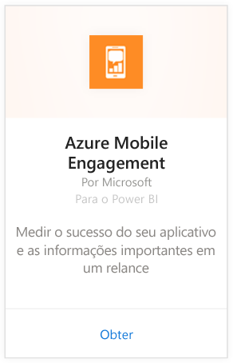
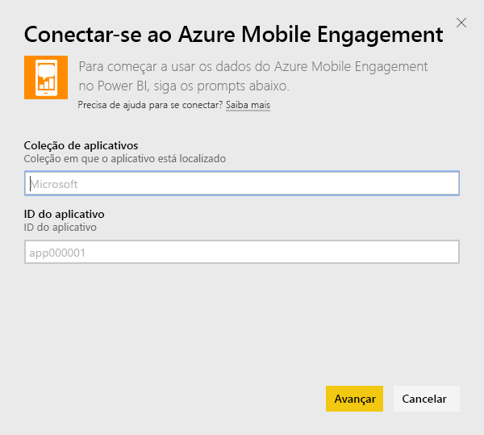
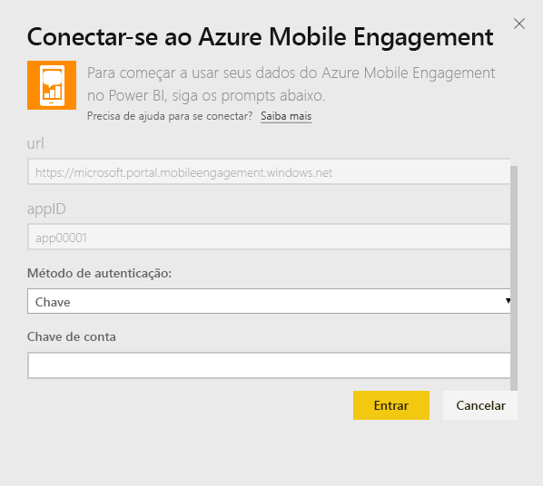
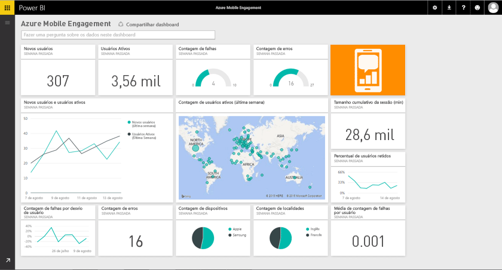

# Conectar-se ao Azure Mobile Engagement com o Power BI
O pacote de conteúdo do Engajamento Móvel do Azure para o Power BI permite que você obtenha informações rapidamente sobre os dados de seu aplicativo.

Conecte-se ao [pacote de conteúdo do Engajamento Móvel do Azure](https://app.powerbi.com/groups/me/getdata/services/azme) para o Power BI.

## Como se conectar
1. Selecione **Obter Dados** na parte inferior do painel de navegação esquerdo.
   
    
2. Na caixa **Serviços** , selecione **Obter**.
   
    
3. Selecione **Engajamento Móvel do Azure**\>**Obter**.
   
     
4. Especifique a Coleção de Aplicativos e o Nome do Aplicativo. Essas informações podem ser encontradas em sua conta do Engajamento Móvel do Azure.
   
     
5. Como o Método de Autenticação, forneça a Chave e clique em Entrar.
   
    
6. Após o Power BI importar os dados, você verá novos elementos (painel, relatório e conjunto de dados) no painel de navegação esquerdo. Novos itens são marcados com um asterisco amarelo \* que desaparece quando selecionado:
   
    

 **E agora?**

* Tente [fazer uma pergunta na caixa de P e R](power-bi-q-and-a.md) na parte superior do dashboard
* [Altere os blocos](service-dashboard-edit-tile.md) no dashboard.
* [Selecione um bloco](service-dashboard-tiles.md) para abrir o relatório subjacente.
* Enquanto seu conjunto de dados será agendado para ser atualizado diariamente, você pode alterar o agendamento de atualização ou tentar atualizá-lo sob demanda usando **Atualizar Agora**

## Próximas etapas
[Introdução ao Power BI](service-get-started.md)

[Obter dados no Power BI](service-get-data.md)

