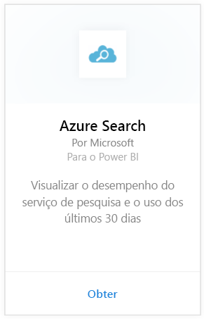
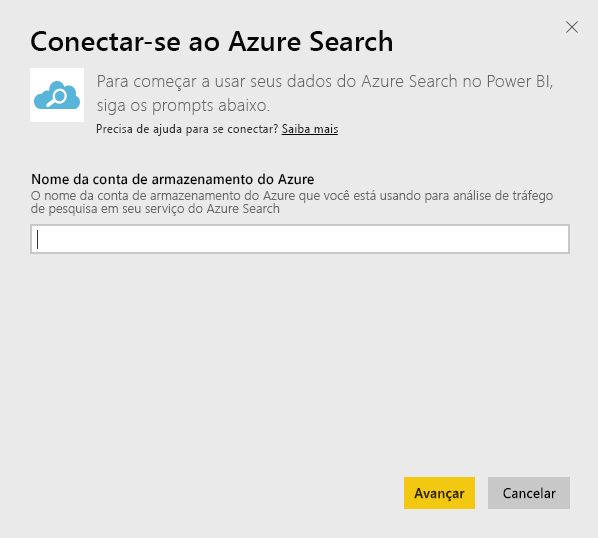
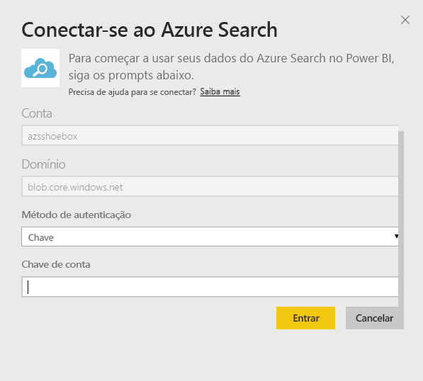
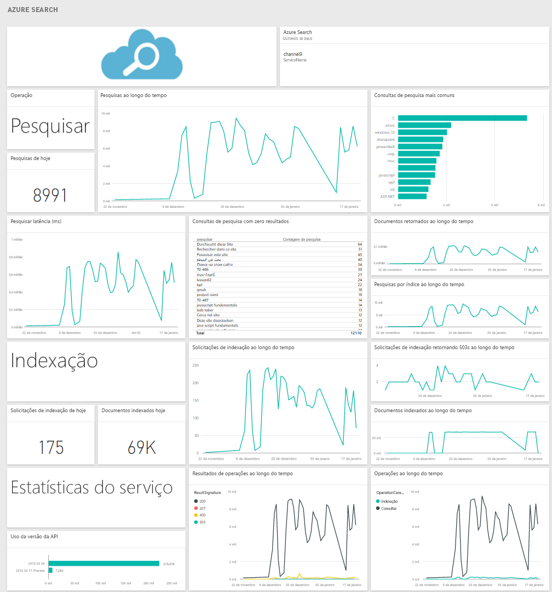

# Conectar-se ao Azure Search com o Power BI
A Análise de Tráfego do Azure Search permite que você monitore e entenda o tráfego para o serviço de Azure Search. O pacote de conteúdo de Azure Search para o Power BI fornece informações detalhadas sobre seus dados de pesquisa, incluindo Search, Indexação, Status do Serviço e a Latência dos últimos 30 dias. Mais detalhes podem ser encontrados na [postagem do blog do Azure](https://azure.microsoft.com/blog/analyzing-your-azure-search-traffic/).

Conectar-se ao [pacote de conteúdo do Azure Search](https://app.powerbi.com/getdata/services/azure-search) para o Power BI.

## Como se conectar
1. Selecione **Obter Dados** na parte inferior do painel de navegação esquerdo.
   
    
2. Na caixa **Serviços** , selecione **Obter**.
   
    
3. Selecione **Azure Search**\>**Obter**.
   
   
4. Forneça o nome da conta de armazenamento de tabela na qual sua análise do Azure Search está armazenada.
   
   
5. Selecione **Chave** como Mecanismo de Autenticação e forneça sua chave de conta de armazenamento. Clique em **Entrar** para iniciar o processo de carregamento.
   
   
6. Quando o carregamento for concluído, um novo painel, relatório e modelo aparecerão no Painel de Navegação. Selecione o painel para exibir os dados importados por você.
   
    

**E agora?**

* Tente [fazer uma pergunta na caixa de P e R](power-bi-q-and-a.md) na parte superior do dashboard
* [Altere os blocos](service-dashboard-edit-tile.md) no dashboard.
* [Selecione um bloco](service-dashboard-tiles.md) para abrir o relatório subjacente.
* Enquanto seu conjunto de dados será agendado para ser atualizado diariamente, você pode alterar o agendamento de atualização ou tentar atualizá-lo sob demanda usando **Atualizar Agora**

## Requisitos de sistema
O pacote de conteúdo de Azure Search exige que a Análise de Tráfego do Azure Search esteja habilitada na conta.

## Solução de problemas
Certifique-se de que o nome da conta de armazenamento seja fornecido corretamente com a chave de acesso completo. O nome da conta de armazenamento deve corresponder à conta configurada com a Análise de Tráfego do Azure Search.

## Próximas etapas
[Introdução ao Power BI](service-get-started.md)

[Power BI – conceitos básicos](service-basic-concepts.md)

