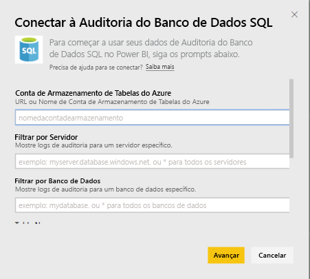
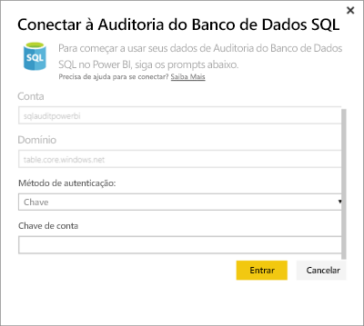
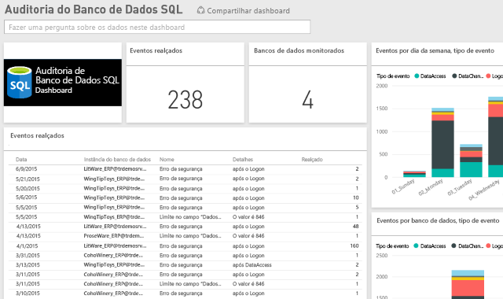

# Pacote de conteúdo de Auditoria de Banco de Dados SQL para o Power BI
O pacote de conteúdo do Power BI para a [Auditoria do Banco de Dados SQL](http://azure.microsoft.com/documentation/articles/sql-database-auditing-get-started/) do Azure permite que você entenda a atividade de seu banco de dados e obtenha informações sobre as discrepâncias e anomalias que podem gerar preocupações comerciais ou suspeitas de violações de segurança. 

Conecte-se ao [pacote de conteúdo da Auditoria do Banco de Dados SQL](https://app.powerbi.com/getdata/services/sql-db-auditing) para o Power BI.

>[!NOTE]
>O pacote de conteúdo importa dados de todas as tabelas que contêm “AuditLogs” no nome e acrescenta tudo a uma tabela única de modelo de dados chamada “AuditLogs”. Os últimos 250 mil eventos serão incluídos e os dados serão atualizados diariamente.

## Como se conectar
1. Selecione **Obter Dados** na parte inferior do painel de navegação esquerdo.
   
    
2. Na caixa Serviços, selecione Obter.
   
    
3. Selecione **Auditoria do Banco de Dados SQL** \> **Obter**.
   
   
4. Na janela Conectar à Auditoria do Banco de Dados SQL:
   
   - Insira o nome da conta de Armazenamento de Tabelas do Azure ou a URL em que os logs são armazenados.
   
   - Insira o nome do SQL Server desejado. Digite “\*” para carregar os logs de auditoria para todos os servidores.
   
   - Insira o nome do banco de dados SQL desejado. Digite “\*” para carregar os logs de auditoria para todos os bancos de dados.
   
   - Insira o nome da tabela do Azure que contém os logs desejados. Digite “\*” para carregar os logs de auditoria de todas as tabelas que contêm “AuditLogs” no nome.
   
   >[!IMPORTANT]
   >Por questões de desempenho, é recomendável sempre especificar um nome de tabela explícita, mesmo que todos os logs de auditoria sejam armazenados em uma única tabela.
   
   - Insira a data de início dos logs de auditoria desejados. Digite “\*” para carregar os logs de auditoria sem um tempo limite inferior ou “1d” para carregar os logs de auditoria do último dia.
   
   - Insira a data de término dos logs de auditoria desejados. Digite “\*” para carregar os logs de auditoria sem um tempo limite superior.
   
   
5. Como Método de Autenticação, selecione **Chave**, insira sua **Chave de Conta** \> **Entrar**.
   
   
6. Depois que o Power BI importar os dados, você verá um novo painel, relatório e conjunto de dados no painel de navegação esquerdo. Novos itens são marcados com um asterisco amarelo \*.
   
   

**E agora?**

* Tente [fazer uma pergunta na caixa de P e R](power-bi-q-and-a.md) na parte superior do dashboard
* [Altere os blocos](service-dashboard-edit-tile.md) no dashboard.
* [Selecione um bloco](service-dashboard-tiles.md) para abrir o relatório subjacente.
* Enquanto seu conjunto de dados será agendado para ser atualizado diariamente, você pode alterar o agendamento de atualização ou tentar atualizá-lo sob demanda usando **Atualizar Agora**

## Próximas etapas
[Obter dados do Power BI](service-get-data.md)
[Introdução ao Power BI](service-get-started.md)