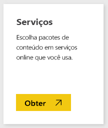
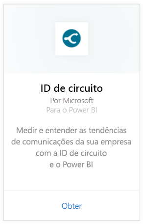
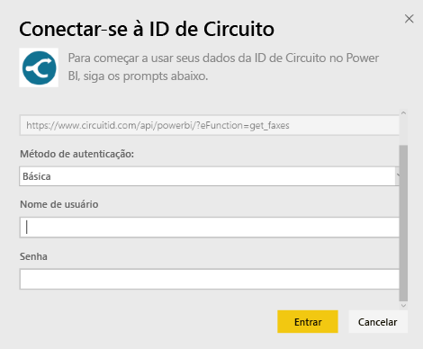
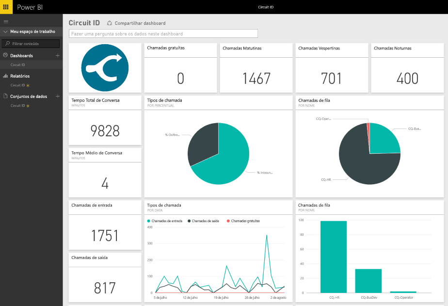

# Conectar-se à ID do Circuito com o Power BI
É fácil analisar os dados de comunicação da ID de Circuito com o Power BI. O Power BI recupera seus dados e cria um painel padrão e relatórios relacionados com base nesses dados. Após ter criado a conexão, você pode explorar os dados e personalizar o painel para atender às suas necessidades. Os dados são atualizados automaticamente todos os dias.

Conecte-se ao [pacote de conteúdo da ID de Circuito](https://app.powerbi.com/getdata/services/circuitid) para o Power BI.

## Como se conectar
1. Selecione **Obter Dados** na parte inferior do painel de navegação esquerdo.
   
    
2. Na caixa **Serviços** , selecione **Obter**.
   
    
3. Selecione **ID de Circuito** \> **Obter**.
   
    
4. Como o Método de Autenticação, selecione Básico e forneça seu nome de usuário e senha. Em seguida, pressione Entrar.
   
    
5. Após o Power BI importar os dados, você verá novos elementos (painel, relatório e conjunto de dados) no painel de navegação esquerdo. Os itens novos são marcados com um asterisco amarelo.
   
    

**E agora?**

* Tente [fazer uma pergunta na caixa de P e R](power-bi-q-and-a.md) na parte superior do dashboard
* [Altere os blocos](service-dashboard-edit-tile.md) no dashboard.
* [Selecione um bloco](service-dashboard-tiles.md) para abrir o relatório subjacente.
* Enquanto seu conjunto de dados será agendado para ser atualizado diariamente, você pode alterar o agendamento de atualização ou tentar atualizá-lo sob demanda usando **Atualizar Agora**

## Próximas etapas
[Introdução ao Power BI](service-get-started.md)

[Obter dados para o Power BI](service-get-data.md)

