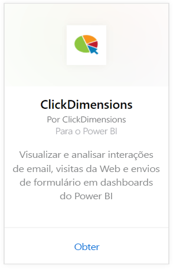
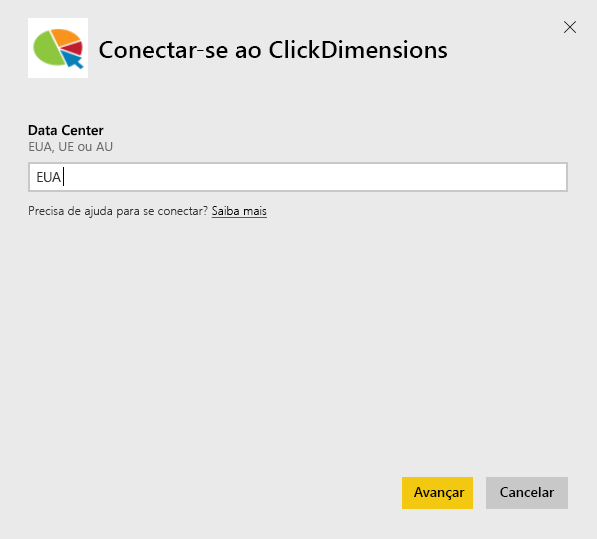
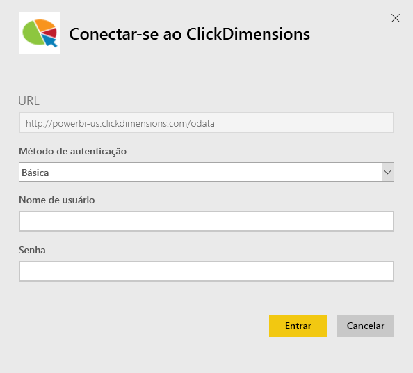
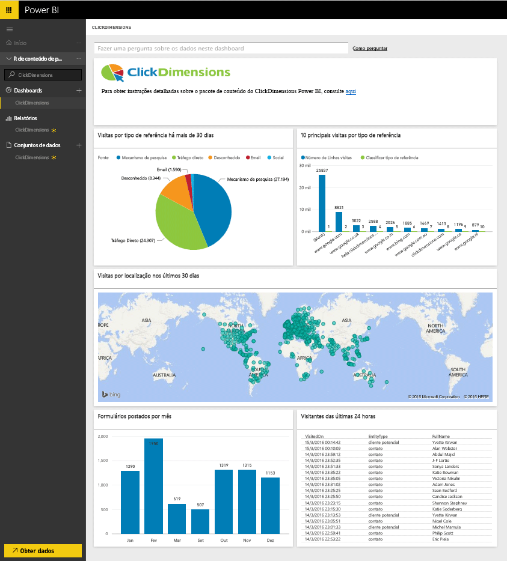
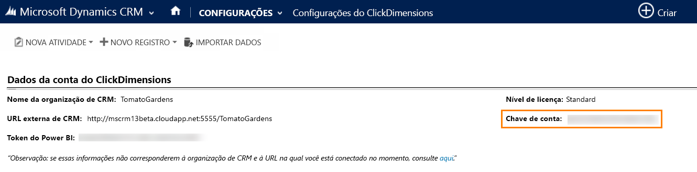
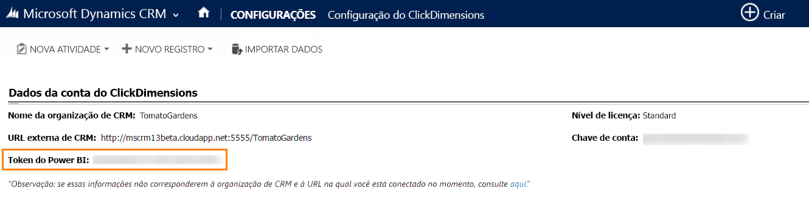

# Conectar-se ao ClickDimensions com o Power BI
O pacote de conteúdo do ClickDimensions para o Power BI permite que os usuários utilizem os dados de marketing do ClickDimensions no Power BI, fornecendo às equipes de gerenciamento mais informações sobre o sucesso de seus esforços de vendas e marketing. Visualize e analise as interações de email, as visitas na Web e os envios de formulário nos relatórios e dashboards do Power BI.

Conecte-se ao [pacote de conteúdo do ClickDimensions](https://app.powerbi.com/getdata/services/click-dimensions) para o Power BI.

## Como se conectar
1. Selecione **Obter Dados** na parte inferior do painel de navegação esquerdo.
   
   
2. Na caixa **Serviços** , selecione **Obter**.
   
   
3. Selecione **ClickDimensions** \>  **Obter**.
   
   
4. Forneça o local de seu datacenter (EUA, UE ou Austrália) e selecione **Avançar**.
   
   
5. Como o **Método de Autenticação**, selecione **Básico** \> **Entrar**. Quando solicitado, insira suas credenciais do ClickDimensions. Veja detalhes sobre como [encontrar esses parâmetros](#FindingParams) abaixo
   
    
6. Após a aprovação, o processo de importação será iniciado automaticamente. Quando concluído, um novo painel, relatório e modelo aparecerão no Painel de Navegação. Selecione o painel para exibir os dados importados por você.
   
     

**E agora?**

* Tente [fazer uma pergunta na caixa de P e R](power-bi-q-and-a.md) na parte superior do dashboard
* [Altere os blocos](service-dashboard-edit-tile.md) no dashboard.
* [Selecione um bloco](service-dashboard-tiles.md) para abrir o relatório subjacente.
* Enquanto seu conjunto de dados será agendado para ser atualizado diariamente, você pode alterar o agendamento de atualização ou tentar atualizá-lo sob demanda usando **Atualizar Agora**

## Requisitos de sistema
Para se conectar ao pacote de conteúdo do Power BI, é necessário fornecer o datacenter correspondente à sua conta e fazer logon com sua conta do ClickDimensions. Se não tiver certeza de qual datacenter fornecer, entre em contato com o administrador.

## Localizando parâmetros
A Chave de Conta é encontrada nas configurações de CRM \> Configurações do ClickDimensions. Faça uma cópia da Chave de Conta encontrada em Configurações do ClickDimensions e cole-a no campo Nome de usuário.  

  

Faça uma cópia do Token do Power BI encontrado nas Configurações do ClickDimensions e cole-a no campo Senha. O Token do Power BI pode ser encontrado nas Configurações de CRM \> Configurações do ClickDimensions.  

  

## Próximas etapas
[Introdução ao Power BI](service-get-started.md)

[Obter dados no Power BI](service-get-data.md)

