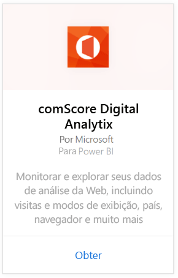
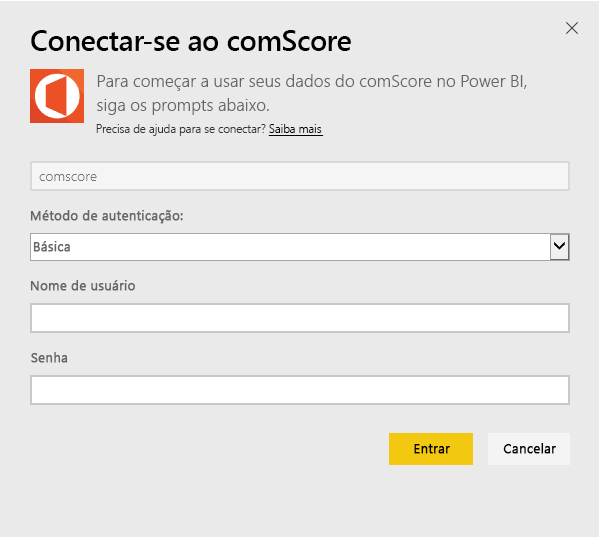
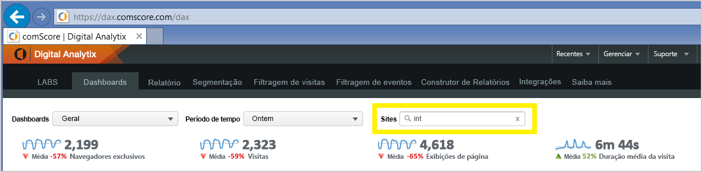

# Conectar-se ao comScore Digital Analytix com o Power BI
Visualize e explore seus dados do comScore Digital Analytix no Power BI com o pacote de conteúdo do Power BI. Os dados serão atualizados automaticamente uma vez por dia.

Conecte-se ao [pacote de conteúdo do comScore para o Power BI.](https://app.powerbi.com/getdata/services/comscore)

>[!NOTE]
>Para se conectar ao pacote de conteúdo, você precisa de uma conta de usuário do comScore DAx e ter acesso à API do comScore. Mais [detalhes](#Requirements) abaixo.

## Como se conectar
1. Selecione Obter Dados na parte inferior do painel de navegação esquerdo.
   
   
2. Na caixa **Serviços** , selecione **Obter**.
   
   
3. Selecione **comScore Digital Analytix** \> **Obter**.
   
   
4. Forneça o data center, a ID do Cliente do comScore e o Site aos quais gostaria de se conectar. Para obter mais detalhes sobre como encontrar esses valores, confira [Encontrando os parâmetros do comScore](#FindingParams) abaixo.
   
   
5. Forneça seu nome de usuário e senha do comScore para se conectar. Veja detalhes sobre como encontrar este valor abaixo.
   
   
6. O processo de importação será iniciado automaticamente. Quando concluído, um novo painel, relatório e modelo aparecerão no Painel de Navegação. Selecione o painel para exibir os dados importados por você.

**E agora?**

* Tente [fazer uma pergunta na caixa de P e R](power-bi-q-and-a.md) na parte superior do dashboard
* [Altere os blocos](service-dashboard-edit-tile.md) no dashboard.
* [Selecione um bloco](service-dashboard-tiles.md) para abrir o relatório subjacente.
* Enquanto seu conjunto de dados será agendado para ser atualizado diariamente, você pode alterar o agendamento de atualização ou tentar atualizá-lo sob demanda usando **Atualizar Agora**

## Requisitos de sistema
Uma conta de usuário de DAx comScore e aceso à API do comScore DAx são necessárias para se conectar. Entre em contato com o administrador do comScore DAx para confirmar sua conta.

## Localizando parâmetros
Veja abaixo detalhes sobre como encontrar cada um dos parâmetros do comScore.

**Data Center**

O data center ao qual você se conecta é determinado pela URL para a qual você navega no comScore.

Se você usar https://dax.comscore.com, digite "EUA", se você usar https://dax.comscore.eu, digite: "EU".

 

**Cliente**

O Cliente é o mesmo que você forneceu ao entrar no DAx do comScore.

 

**Site**

O site do comScore determina de qual site você gostaria de ver os dados. É possível encontrar a lista de sites em sua conta do comScore.

## Próximas etapas
[Introdução ao Power BI](service-get-started.md)

[Obter dados no Power BI](service-get-data.md)

