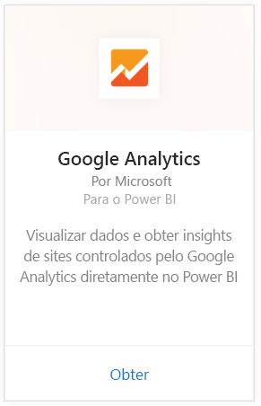
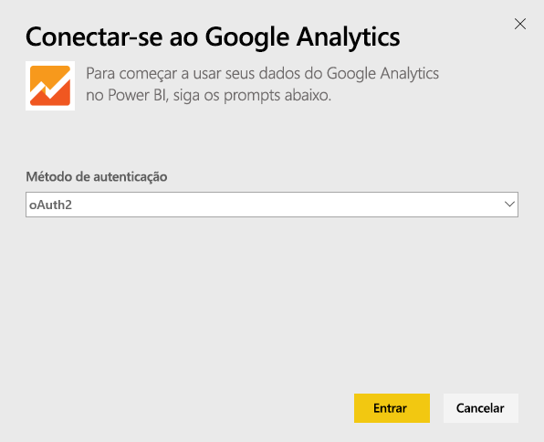
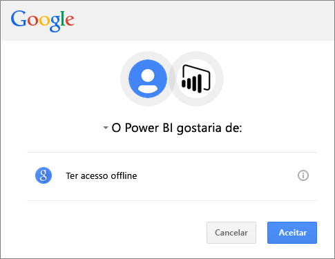
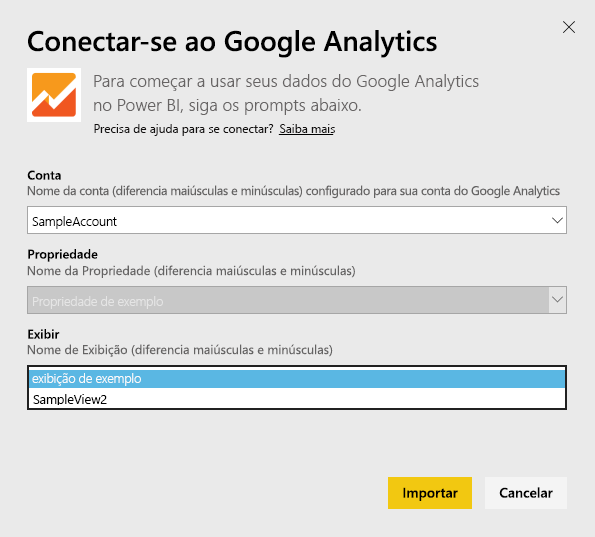
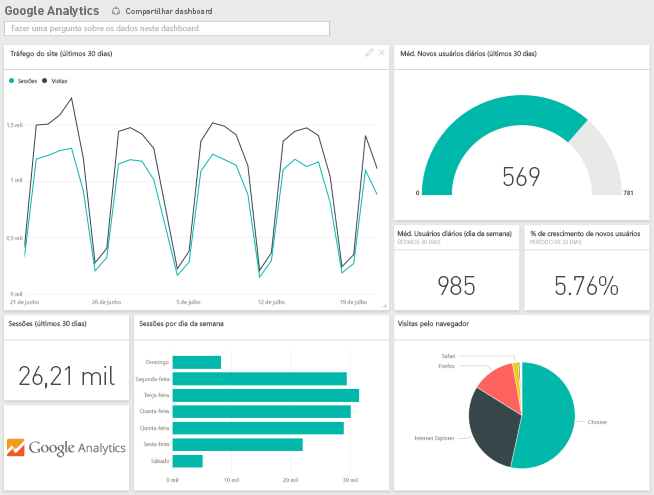
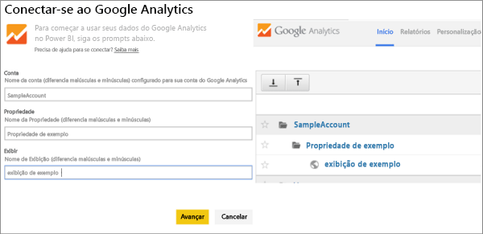

# Conectar-se ao Google Analytics com o Power BI
A conexão ao Google Analytics por meio do Power BI começa conectando-se à sua conta do Google Analytics. Você obterá um painel e um conjunto de relatórios do Power BI que fornecem informações sobre as medidas de tráfego e usuários de seu site. Você pode interagir com o dashboard e os relatórios, mas não pode salvar as alterações. Os dados serão atualizados automaticamente uma vez por dia.

Conecte-se ao [Google Analytics](https://app.powerbi.com/getdata/services/google-analytics) para o Power BI. Leia mais sobre a [integração do Google Analytics](https://powerbi.microsoft.com/integrations/google-analytics) com o Power BI.

Crie dashboards e relatórios personalizados por meio do [conector do Google Analytics](service-google-analytics-connector.md) no Power BI Desktop. Basta se conectar à sua conta do Google Analytics e criar relatórios personalizados, que também podem ser publicados no serviço do Power BI.

## Como se conectar
[!INCLUDE [powerbi-service-apps-get-more-apps](./includes/powerbi-service-apps-get-more-apps.md)]

1. Selecione **Google Analytics** \> **Obter**.
   
   
2. Quando solicitado, insira suas credenciais do Google Analytics. Selecione **oAuth 2** como o Mecanismo de Autenticação e clique em **Entrar**. Siga o fluxo de autenticação do Google, que pode incluir a autenticação de 2 fatores se você tiver configurado essa opção.
   
   
3. Clique em **Aceitar** para permitir que o Power BI acesse seus dados do Google Analytics.
   
   
4. O Power BI se conecta a uma Exibição específica do Google Analytics. Forneça o nome da conta, o nome da propriedade e nome do modo de exibição aos quais você gostaria de se conectar. Essas informações podem ser encontradas em sua conta do Google Analytics, no canto superior esquerdo ou na guia **Página Inicial** . Veja os detalhes abaixo. 
   
   
5. Clique em **Conectar** para iniciar o processo de importação. 

## Exibir o dashboard e os relatórios do Google Analytics
[!INCLUDE [powerbi-service-apps-open-app](./includes/powerbi-service-apps-open-app.md)]

      

[!INCLUDE [powerbi-service-apps-open-app](./includes/powerbi-service-apps-what-now.md)]

## Requisitos de sistema
Para se conectar por meio do Power BI, você precisa ter uma conta do [Google Analytics](https://www.google.com/analytics/). Outras contas do Google que não têm uma conta do Google Analytics conectada a ele encontrarão um erro de autenticação.

## Solução de problemas
**Credenciais** Caso você tenha várias contas do Google, use uma janela de navegador incógnita ou privada durante a conexão para garantir que a conta correta é usada.

Se estiver recebendo um erro indicando que as credenciais são inválidas, mas conseguiu entrar no Google, confirme se você tem uma conta do [Google Analytics](https://www.google.com/analytics/).

**Parâmetros** No momento, são necessários nomes exclusivos para os parâmetros. Se receber um erro indicando que o valor selecionado está duplicado, selecione outro valor ou altere os nomes no Google Analytics para torná-los exclusivos. Estamos trabalhando ativamente para resolver esse problema.

>[!NOTE]
>Os parâmetros diferenciam maiúsculas de minúsculas. Insira-os exatamente como aparecem na sua conta do Google Analytics.

Ainda está tendo problemas? Abra um tíquete de suporte para entrar em contato com a equipe do Power BI:

* No aplicativo do Power BI, selecione o ponto de interrogação \> **Entrar em Contato com o Suporte.**
* No site de Suporte do Power BI (em que você está lendo este artigo), selecione **Entrar em contato com o Suporte** no lado direito da página.

## Próximas etapas
* [O que são aplicativos no Power BI?](service-install-use-apps.md)
* [Obter dados no Power BI](service-get-data.md)
* Mais perguntas? [Experimente perguntar à Comunidade do Power BI](http://community.powerbi.com/)

