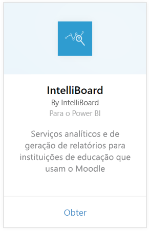
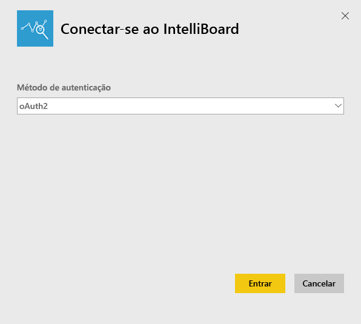
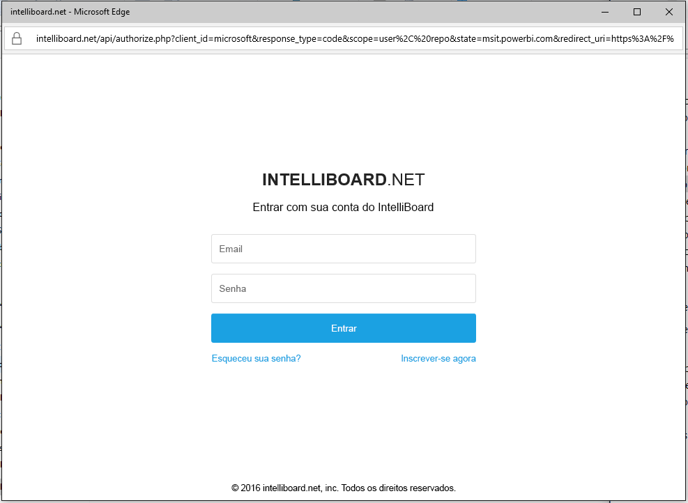
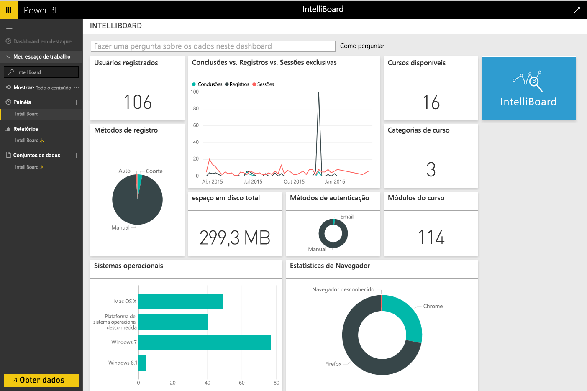

# Conectar-se ao IntelliBoard com o Power BI
O IntelliBoard oferece acesso simplificado aos dados do sistema de gerenciamento de aprendizado Moodle por meio do Reporting Services. O pacote de conteúdo do IntelliBoard para o Power BI oferece análises adicionais, incluindo métricas sobre cursos, usuários registrados, desempenho geral e atividade de LMS.

Conecte-se ao [pacote de conteúdo do IntelliBoard](https://app.powerbi.com/getdata/services/intelliboard) para o Power BI.

## Como se conectar
1. Selecione **Obter Dados** na parte inferior do painel de navegação esquerdo.  
   
    
2. Na caixa **Serviços** , selecione **Obter**.  
   
    
3. Selecione **IntelliBoard** e, em seguida, **Obter**.  
   
    
4. Selecione **OAuth 2** e **Entrar**. Quando solicitado, forneça suas credenciais do IntelliBoard.
   
    
   
    
5. Depois que você estiver conectado, um dashboard, relatório e conjunto de dados serão carregados automaticamente. Após a conclusão, os blocos serão atualizados com dados de sua conta do IntelliBoard.
   
    

**E agora?**

* Tente [fazer uma pergunta na caixa de P e R](power-bi-q-and-a.md) na parte superior do dashboard
* [Altere os blocos](service-dashboard-edit-tile.md) no dashboard.
* [Selecione um bloco](service-dashboard-tiles.md) para abrir o relatório subjacente.
* Enquanto seu conjunto de dados será agendado para ser atualizado diariamente, você pode alterar o agendamento de atualização ou tentar atualizá-lo sob demanda usando **Atualizar Agora**

## O que está incluído
O pacote de conteúdo inclui dados das seguintes tabelas:  

    - Atividade  
    - Agentes  
    - Autenticação  
    - Países  
    - CoursesProgress  
    - Registros
    - Idioma  
    - Plataforma  
    - Totais  
    - UsersProgress    

## Requisitos de sistema
É necessário ter uma conta do IntelliBoard com permissões de acesso às tabelas acima para criar uma instância deste pacote de conteúdo.

## Próximas etapas
[Introdução ao Power BI](service-get-started.md)

[Power BI – conceitos básicos](service-basic-concepts.md)

