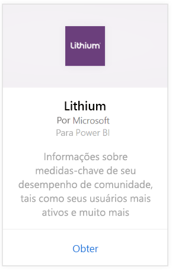
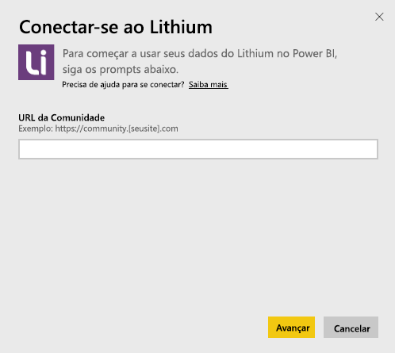
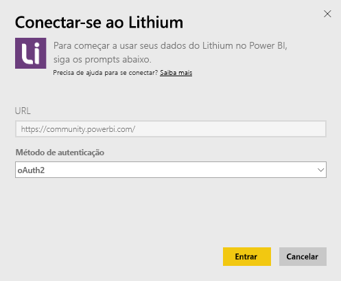
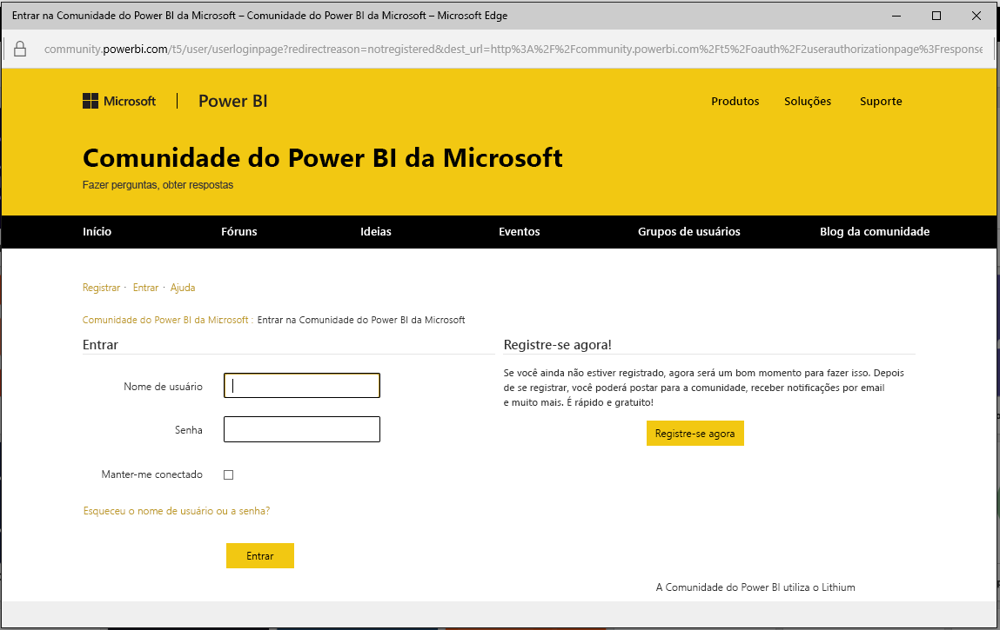
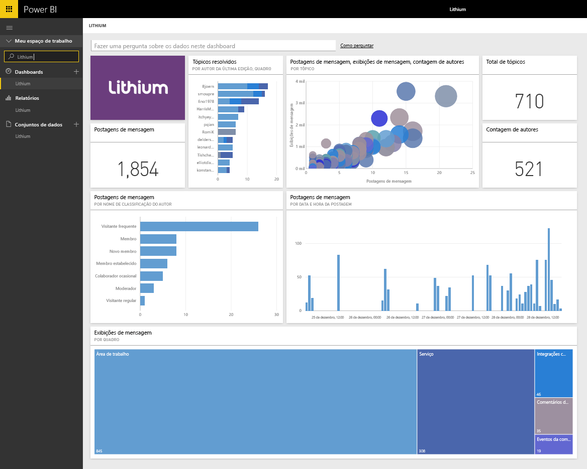

# Conectar-se ao Lithium com o Power BI
O Lithium cria relações de confiança entre marcas melhor do mundo e seus clientes, ajudando as pessoas a obter respostas e compartilhar suas experiências. Conectando o pacote de conteúdo do Lithium para o Power BI, você pode medir métricas-chave sobre sua comunidade online para ajudar a estimular as vendas, reduzir os custos de serviço e aumentar a fidelidade. 

Conecte-se ao [pacote de conteúdo do Lithium](https://app.powerbi.com/getdata/services/lithium) para o Power BI.

>[!NOTE]
>O pacote de conteúdo do Power BI usa a API do Lithium. Excesso chamadas para a API podem resultar em encargos adicionais do Lithium, confirme com seu administrador do Lithium.

## Como se conectar
1. Selecione **Obter Dados** na parte inferior do painel de navegação esquerdo.
   
    
2. Na caixa **Serviços** , selecione **Obter**.
   
    
3. Selecione **Lithium** \> **Obter**.
   
   
4. Forneça a URL de sua comunidade do Lithium. Ela estará no formato *https://community.yoursite.com*.
   
   
5. Quando solicitado, insira suas credenciais do Lithium. Selecione **oAuth 2** como o mecanismo de autenticação, clique em **Entrar** e siga o fluxo de autenticação do Lithium.
   
   
   
   
6. Quando o fluxo de logon estiver concluído, o processo de importação será iniciado. Quando concluído, um novo painel, relatório e modelo aparecerão no Painel de Navegação. Selecione o painel para exibir os dados importados por você.
   
    

**E agora?**

* Tente [fazer uma pergunta na caixa de P e R](power-bi-q-and-a.md) na parte superior do dashboard
* [Altere os blocos](service-dashboard-edit-tile.md) no dashboard.
* [Selecione um bloco](service-dashboard-tiles.md) para abrir o relatório subjacente.
* Enquanto seu conjunto de dados será agendado para ser atualizado diariamente, você pode alterar o agendamento de atualização ou tentar atualizá-lo sob demanda usando **Atualizar Agora**

## Requisitos de sistema
O pacote de conteúdo do Lithium exige uma comunidade do Lithium v15.9 ou superior. Entre em contato com seu administrador do Lithium para confirmar.

## Próximas etapas
[Introdução ao Power BI](service-get-started.md)

[Power BI – conceitos básicos](service-basic-concepts.md)

