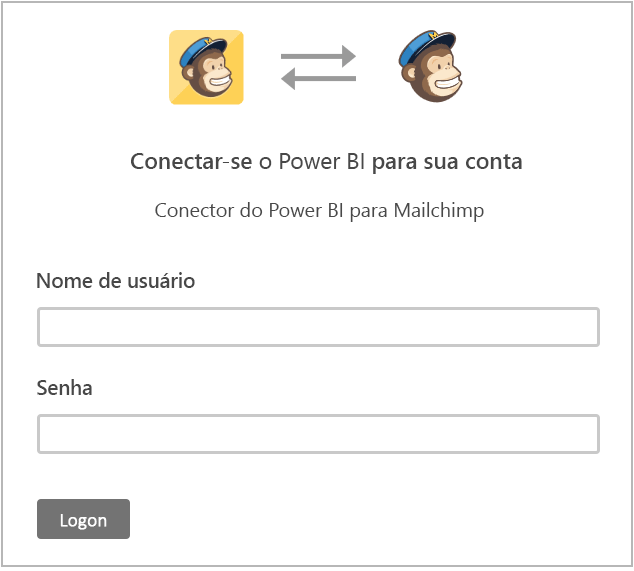
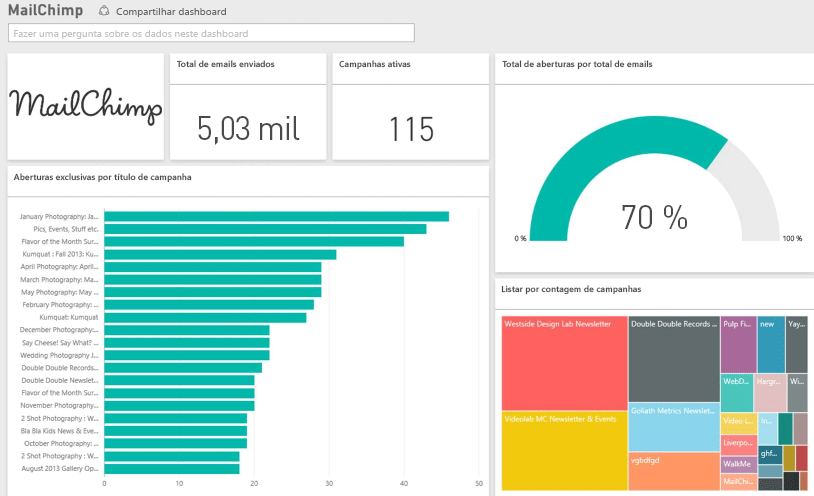

# Conectar-se ao MailChimp com o Power BI
O pacote de conteúdo do Power BI extrai dados de sua conta do MailChimp e gera um painel, um conjunto de relatórios e um conjunto de dados para permitir que você explore seus dados. Use a análise dos [painéis do MailChimp](https://powerbi.microsoft.com/integrations/mailchimp) para identificar rapidamente as tendências existentes em suas campanhas, seus relatórios e seus assinantes individuais. Os dados são configurados para serem atualizados diariamente, garantindo que os dados que você está monitorando são atuais.

Conecte-se ao [pacote de conteúdo do MailChimp](https://app.powerbi.com/getdata/services/mailchimp) para o Power BI.

## Como se conectar
1. Selecione **Obter Dados** na parte inferior do painel de navegação esquerdo.
   
    
2. Na caixa **Serviços** , selecione **Obter**.
   
   
3. Selecione **MailChimp** \> **Obter**.
   
   
4. Para o Método de Autenticação, selecione **oAuth2** \> **Entrar**.
   
    Quando solicitado, insira suas credenciais do MailChimp e siga o processo de autenticação.
   
    Na primeira vez que você se conectar, o Power BI solicitará a você o acesso somente leitura à sua conta. Selecione **Permitir** para iniciar o processo de importação, que pode levar alguns minutos dependendo do volume de dados em sua conta.
   
    
5. Após o Power BI importar os dados, você verá novos elementos (painel, relatório e conjunto de dados) no painel de navegação esquerdo. Esse é o painel padrão criado pelo Power BI para exibir seus dados. Você pode alterar esse painel para exibir seus dados de qualquer modo que desejar.
   
   

**E agora?**

* Tente [fazer uma pergunta na caixa de P e R](power-bi-q-and-a.md) na parte superior do dashboard
* [Altere os blocos](service-dashboard-edit-tile.md) no dashboard.
* [Selecione um bloco](service-dashboard-tiles.md) para abrir o relatório subjacente.
* Enquanto seu conjunto de dados será agendado para ser atualizado diariamente, você pode alterar o agendamento de atualização ou tentar atualizá-lo sob demanda usando **Atualizar Agora**

## Próximas etapas
[Introdução ao Power BI](service-get-started.md)

[Power BI – conceitos básicos](service-basic-concepts.md)

