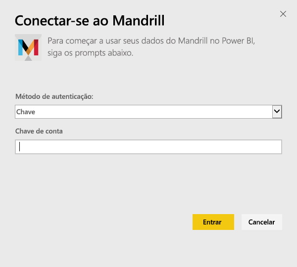
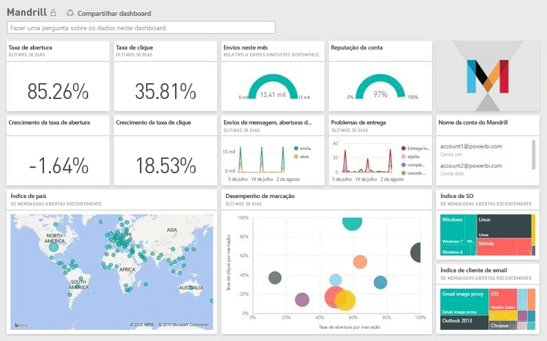

# Conectar-se ao Mandrill com o Power BI
O pacote de conteúdo do Power BI extrai dados de sua conta do Mandrill e gera um painel, um conjunto de relatórios e um conjunto de dados para permitir que você explore seus dados. Use a análise do Mandrill para obter informações rapidamente sobre sua campanha de boletim informativo e de marketing. Os dados são configurados para serem atualizados diariamente, garantindo que os dados que você está monitorando são atuais.

Conecte-se ao [pacote de conteúdo do Mandrill para o Power BI.](http://app.powerbi.com/getdata/services/mandrill)

## Como se conectar
1. Selecione **Obter Dados** na parte inferior do painel de navegação esquerdo.
   
    
2. Na caixa **Serviços** , selecione **Obter**.
   
    
3. Selecione **Mandrill** > **Obter**.
   
    
4. Como o **Método de Autenticação**, selecione **Chave** e forneça sua chave de API. Você pode encontrar a chave na guia **Configurações** no painel do Mandrill. Selecione **Entrar** para iniciar o processo de importação, que pode levar alguns minutos dependendo do volume de dados em sua conta.
   
    
5. Após o Power BI importar os dados, você verá novos elementos (painel, relatório e conjunto de dados) no painel de navegação esquerdo. Esse é o painel padrão criado pelo Power BI para exibir seus dados.
   
    

**E agora?**

* Tente [fazer uma pergunta na caixa de P e R](power-bi-q-and-a.md) na parte superior do dashboard
* [Altere os blocos](service-dashboard-edit-tile.md) no dashboard.
* [Selecione um bloco](service-dashboard-tiles.md) para abrir o relatório subjacente.
* Enquanto seu conjunto de dados será agendado para ser atualizado diariamente, você pode alterar o agendamento de atualização ou tentar atualizá-lo sob demanda usando **Atualizar Agora**

## Próximas etapas
[Introdução ao Power BI](service-get-started.md)

[Power BI – conceitos básicos](service-basic-concepts.md)

