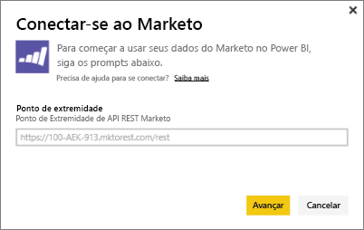
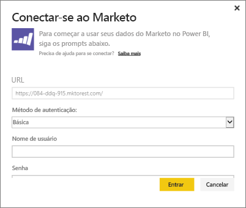
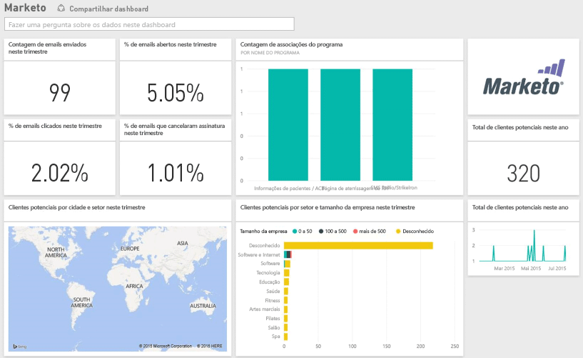

# Conectar-se ao Marketo com o Power BI
O pacote de conteúdo do Power BI para o Marketo permite que você obtenha informações sobre sua conta do Marketo com dados sobre clientes potenciais e suas atividades. A criação dessa conexão recupera seus dados e fornece automaticamente um painel e relatórios relacionados com base nesses dados.

Conecte-se ao [Pacote de conteúdo do Marketo](https://app.powerbi.com/getdata/services/marketo) para o Power BI.

## Como se conectar
1. Selecione **Obter Dados** na parte inferior do painel de navegação esquerdo.
   
   
2. Na caixa **Serviços** , selecione **Obter**.
   
    
3. Selecione **Marketo** \> **Obter**.
   
   
4. Insira o ponto de extremidade REST do Marketo, fornecido a você pelo próprio Marketo ou pelo administrador deste, e selecione Avançar.
   
   
   
   Leia mais sobre o ponto de extremidade REST do Marketo: [http://developers.marketo.com/documentation/rest/endpoint-url/ ](http://developers.marketo.com/documentation/rest/endpoint-url/).
5. Usando o Método de Autenticação **Básico** , insira a ID do Cliente como o **Nome de Usuário** e o Segredo do Cliente como a **Senha**. A ID do cliente e o Segredo do Cliente estão disponíveis no Marketo por meio do administrador do marketo ([http://developers.marketo.com/documentation/rest/custom-service/](http://developers.marketo.com/documentation/rest/custom-service/)). 
   
   
   
   Isso fornece ao pacote de conteúdo do *Marketo para Power BI* acesso aos seus dados de [análise do Marketo](https://powerbi.microsoft.com/integrations/marketo), além de permitir analisar esses dados no Power BI. Os dados são atualizados uma vez por dia.
6. Uma vez conectado à sua conta do Marketo, um painel com todos os seus dados é carregado:
   
   

**E agora?**

* Tente [fazer uma pergunta na caixa de P e R](power-bi-q-and-a.md) na parte superior do dashboard
* [Altere os blocos](service-dashboard-edit-tile.md) no dashboard.
* [Selecione um bloco](service-dashboard-tiles.md) para abrir o relatório subjacente.
* Enquanto seu conjunto de dados será agendado para ser atualizado diariamente, você pode alterar o agendamento de atualização ou tentar atualizá-lo sob demanda usando **Atualizar Agora**

## O que está incluído
Os dados a seguir estão disponíveis no Marketo no Power BI em que a atividade ocorreu entre hoje e um ano atrás:

| Nome da tabela | Descrição |
| --- | --- |
| EmailActivities |Dados de email enviados aos clientes potenciais/contatos, com detalhes sobre dispositivos, categorias, contagem e percentual retornados, contagem e percentual clicados, contagem e percentual abertos e nome do programa. As Atividades de Email, como mostrado no Power BI, tratam-se de um relatório absoluto de entrega de emails, que não aplica nenhuma lógica adicional aos dados. Por conta disso, você pode ver alguns resultados diferentes entre o cliente do Marketo e o Power BI. |
| ProgramActivites |Dados em programas que tiveram uma alteração de Status. Isso inclui detalhes como: Razão, Sucesso, Percentual e contagem de aquisição de programa, Percentual e contagem de êxito do programa. |
| WebPageActivities |Dados de visitas do usuário a páginas da Web, incluindo agente de pesquisa, agente do Usuário, página da Web e hora do dia. |
| Datetable |Datas do ano passado e atuais.  Permite que você analise seus dados do Marketo por data. |
| Clientes potenciais |Informações de clientes potenciais como empresa, tamanho da receita, número de funcionários, país, setor, pontuação e status de Cliente Potencial. Os clientes potenciais são coletados com base na sua presença nos dados de atividades de email, programas e páginas da Web. |

Todas as datas são em formato UTC. Dependendo de qual fuso horário sua conta está, as datas podem variar (semelhante ao que é visto no cliente do Marketo)

## Requisitos de sistema
* A conta do Marketo que você utiliza para conectar-se tem permissão para acessar clientes potenciais e atividades.
* Chamadas à API suficientes disponíveis para se conectar aos dados.  O Marketo tem uma API para cada conta.  Quando o limite for atingido, você não poderá carregar dados no Power BI. 

**Detalhes de limites de API**

Importar dados do Marketo faz uso de APIs do Marketo. Todo cliente do Marketo tem um limite total de 10.000 chamadas de API por dia, que são compartilhadas entre todos os aplicativos que usam as APIs do Marketo. Você pode usar as APIs para outras integrações, bem como a integração do Power BI. Para obter mais informações sobre as APIs, veja: <http://developers.marketo.com/documentation/rest/>.

A quantidade de chamadas de API que o Power BI realiza para o Marketo depende da quantidade de dados na sua conta do Marketo. O Power BI importa todos os Clientes Potenciais e Atividades do último ano. Eis aqui está um exemplo de dados do Marketo e a quantidade de chamadas de API que são usadas pelo Power BI durante a importação:  

| Tipo de dados | Número de Linhas | Chamadas à API |
| --- | --- | --- |
| Informações de clientes potenciais |15.000 |50 |
| Atividades de email |150.000 |1.000 |
| Atividades de programa |15.000 |100 |
| Atividades da Web |150.000 |1.000 |
| Alterações no programa |7.500 |50 |
| **Total de chamadas à API** | |**2,200** |

## Próximas etapas
[Introdução ao Power BI](service-get-started.md)

[Obter dados para o Power BI](service-get-data.md)

[Blog do Power BI: Monitore e analise os dados do Marketo com o Power BI](http://blogs.msdn.com/b/powerbi/archive/2015/03/19/monitor-and-analyze-your-marketo-data-with-power-bi.aspx)

