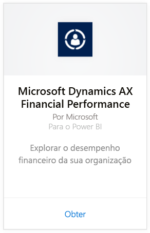
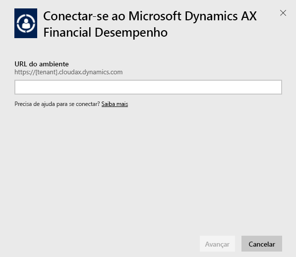
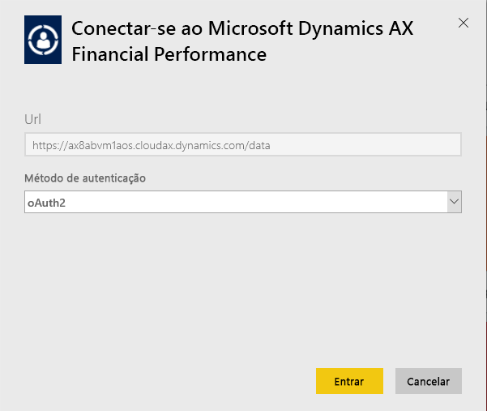
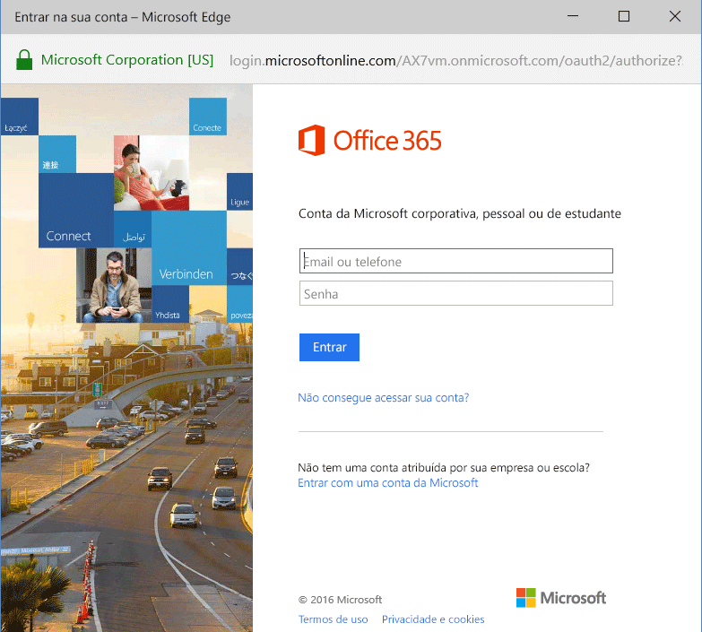
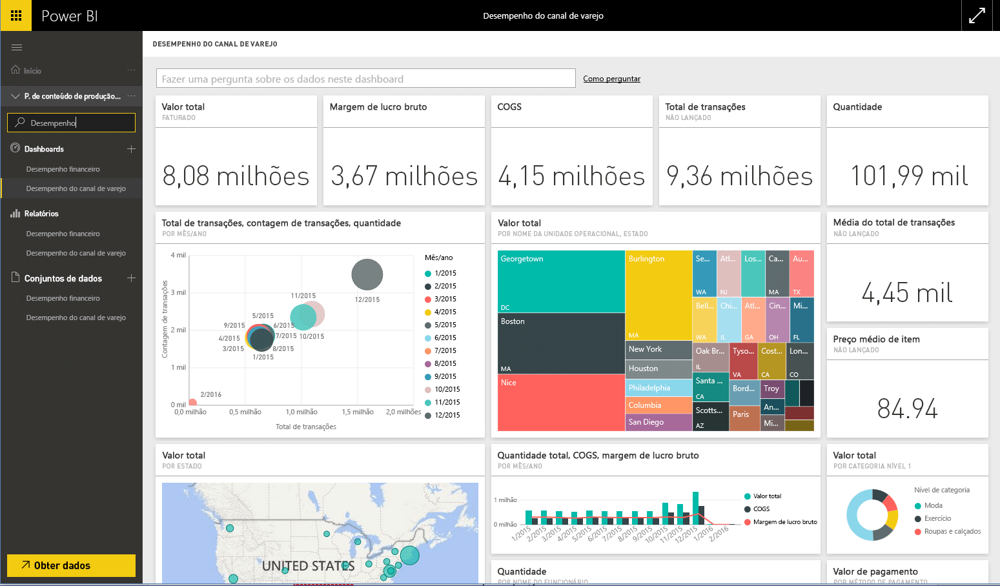

# Conectar-se ao pacote de conteúdo do Microsoft Dynamics AX com o Power BI
O Microsoft Dynamics AX tem três pacotes de conteúdo do Power BI destinados a usuários empresariais diferentes. O pacote de conteúdo de Desempenho Financeiro, projetado especificamente para CFOs, fornece acesso a insights sobre o desempenho financeiro da sua organização. O pacote de conteúdo de Desempenho do Canal de Varejo é destinado aos gerentes de canal com foco no desempenho de vendas para prever tendências e descobrir insights traçando diretamente dos dados de Varejo e Comércio. O Gerenciamento de Custos foi projetado para COOs e CFOs e fornece detalhes sobre o desempenho da operação.

Conecte-se ao [Desempenho do Canal de Varejo](https://app.powerbi.com/getdata/services/dynamics-ax-retail-channel-performance) do Microsoft Dynamics AX, ao [Desempenho Financeiro](https://app.powerbi.com/getdata/services/dynamics-ax-financial-performance) ou ao pacote de conteúdo de [Gerenciamento de Custo](https://app.powerbi.com/getdata/services/dynamics-ax-cost-management) para o Power BI.

## Como se conectar
1. Selecione **Obter Dados** na parte inferior do painel de navegação esquerdo.
   
   
2. Na caixa **Serviços** , selecione **Obter**.
   
   
3. Selecione um dos pacotes de conteúdo do Dynamics AX e escolha **Obter**.
   
   
4. Especifique a URL (Uniform Resource Locator) do seu ambiente do Dynamics AX 7. Veja detalhes sobre como [encontrar esses parâmetros](#FindingParams) abaixo.
   
   
5. Para o **Método de Autenticação**, selecione **oAuth2** \> **Entrar**. Quando solicitado, insira suas credenciais do Dynamics AX.
   
    
   
    
6. Após a aprovação, o processo de importação será iniciado automaticamente. Quando concluído, um novo painel, relatório e modelo aparecerão no Painel de Navegação. Selecione o painel para exibir os dados importados por você.
   
     

**E agora?**

* Tente [fazer uma pergunta na caixa de P e R](power-bi-q-and-a.md) na parte superior do dashboard
* [Altere os blocos](service-dashboard-edit-tile.md) no dashboard.
* [Selecione um bloco](service-dashboard-tiles.md) para abrir o relatório subjacente.
* Enquanto seu conjunto de dados será agendado para ser atualizado diariamente, você pode alterar o agendamento de atualização ou tentar atualizá-lo sob demanda usando **Atualizar Agora**

## O que está incluído
O pacote de conteúdo utiliza o feed OData do Dynamics AX 7 para importar dados relacionados ao desempenho do Canal de Varejo, do Financeiro e do Gerenciamento de Custos, respectivamente.

## Requisitos de sistema
Este pacote de conteúdo requer uma URL de ambiente do Dynamics AX 7 e o usuário deve ter acesso ao feed OData.

## Localizando parâmetros

A URL de ambiente do Dynamics AX 7 pode ser encontrada no navegador quando o usuário faz logon. Apenas copie a URL do ambiente do Dynamics AX raiz para a caixa de diálogo do Power BI.

## Solução de problemas
Os dados podem levar algum tempo para carregar dependendo do tamanho da sua instância. Se você estiver vendo relatórios vazios no Power BI, confirme se tem acesso às tabelas OData necessárias para os relatórios.

## Próximas etapas
[Introdução ao Power BI](service-get-started.md)

[Obter dados no Power BI](service-get-data.md)

