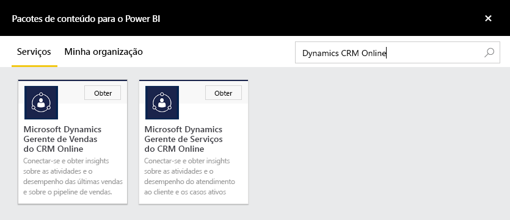
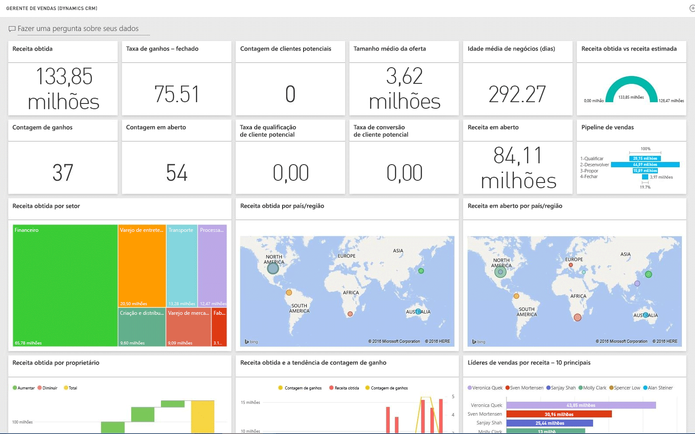

# Conectar-se ao Microsoft Dynamics CRM com o Power BI
O Microsoft Dynamics CRM Online para o Power BI permite que você acesse e analise seus dados com facilidade. O Power BI usa o feed OData para criar um modelo descritivo, com todas as entidades e medidas necessárias como Contas, Atividades, Oportunidades, Produtos, Clientes Potenciais, Usuários e muito mais. Depois de instalar o aplicativo, exiba o dashboard e os relatórios no serviço do Power BI ([https://powerbi.com](https://powerbi.com)) e nos aplicativos móveis do Power BI. 

Conecte-se ao [Gerente de Vendas](https://msit.powerbi.com/groups/me/getdata/services/dynamics-crm-sales-manager) ou [Gerente de Serviço](https://msit.powerbi.com/groups/me/getdata/services/dynamics-crm-customer-service) do Dynamics CRM Online. Leia mais sobre a [integração do Dynamics CRM Online](https://powerbi.microsoft.com/integrations/microsoft-dynamicscrm) com o Power BI.

Esta conexão exige o **Microsoft Dynamics CRM Online 2016 ou posterior**. Mais detalhes sobre os [requisitos](#Requirements) abaixo.

## Como se conectar
[!INCLUDE [powerbi-service-apps-get-more-apps](./includes/powerbi-service-apps-get-more-apps.md)]

1. Selecione **Gerente de Vendas do Microsoft Dynamics CRM** ou **Gerenciador de Serviço do Microsoft Dynamics CRM** e clique em **Conectar**.
   
   
2. Forneça a URL de serviço associada à sua conta.  Isso estará no formato `https://company.crm.dynamics.com`, veja mais detalhes [abaixo](#FindingParams).
   
   
3. Quando solicitado, forneça suas credenciais (essa etapa pode ser ignorada se você já tiver entrado com seu navegador). Como o Método de Autenticação, digite **oAuth2** e clique em **Entrar**:
   
   
4. Após a conexão, você verá um dashboard personalizado para um Gerente de Vendas ou Gerente de Serviços, preenchido com seus próprios dados:
   
   

## Exibir o dashboard e os relatórios do Microsoft Dynamics CRM
[!INCLUDE [powerbi-service-apps-open-app](./includes/powerbi-service-apps-open-app.md)]

[!INCLUDE [powerbi-service-apps-open-app](./includes/powerbi-service-apps-what-now.md)]

## O que está incluído
As seções abaixo fornecem detalhes do que é incluído nas personas [Gerente de Vendas](#Sales) e [Gerente de Serviço](#Service).

Observe que, além disso, os dados são limitados de acordo com a função de segurança atribuída ao usuário do Dynamics CRM Online.

O dashboard e os relatórios destinam-se a fornecer relatórios operacionais sobre os dados de curto prazo com foco em uma equipe ou um grupo. Cada consulta é limitada a recuperar um máximo de 100 mil registros do Dynamics CRM Online. Se esse limite for excedido devido ao alto volume de dados em sua organização, o provisionamento falhará, pois a atualização de dados do Dynamics CRM Online será encerrada. Caso sua conta seja muito grande, considere a possibilidade de se conectar por meio do Power BI Desktop para criar uma solução personalizada.

### Gerente de Vendas
O dashboard e os relatórios contêm métricas-chave, como:  

* Receita Obtida   
* Taxa de Ganhos   
* Receita em aberto   
* Receita perdida   
* Previsão de Receita  
* Tamanho Médio da Oferta e muito mais.  

Eles também contém gráficos-chave, como:  

* Tendência de Receita Obtida e Perdida, Tendência de Receita Obtida Vs Receita Estimada  
* Receita Obtida por várias dimensões, como Setor e Região   
* Líderes de Vendas por Receita, Atividades,   
* Principais Contas, Principais Ofertas Obtidas/Perdidas,    
* Tendência de Novos Clientes Potenciais, Pipeline de Vendas e muito mais.   

Essas métricas e esses gráficos ajudam a entender o desempenho de sua organização de vendas e analisar o pipeline de vendas em sua equipe de vendas.

A tabela a seguir lista as entidades do CRM disponíveis para esse serviço e também fornece detalhes dos filtros aplicados a cada um dos registros de entidade.

| Entidade do CRM | Filtros aplicados |
| --- | --- |
| Account |Todas as contas que têm oportunidades relacionadas que foram modificadas nos últimos 365 dias. |
| Atividade |Todas as atividades modificadas nos últimos 90 dias   [modifiedon] > hoje – 90 dias |
| Unidade de Negócios |Todas as unidades de negócios que não estão desabilitadas   [isdisabled] = false |
| Cliente Potencial |Todos os clientes potenciais modificados nos últimos 180 dias   [modifiedon] > hoje – 180 dias |
| Oportunidade |Todas as oportunidades modificadas nos últimos 365 dias   [modifiedon] > hoje – 365 dias |
| Produtos de Oportunidade |Todos os produtos de oportunidade modificados nos últimos 365 dias   [modifiedon] > hoje – 365 dias |
| Product |Todos os produtos ativos   [statecode] <> 1 |
| Região |Todas as regiões |
| Usuário |Todos os usuários ativos e administradores não delegados    [isdisabled] = false e [accessmode] <> 4 |

### Gerente de Serviço
Esse dashboard e relatórios contêm métricas-chave, como:  

* Percentual de CSAT   
* Percentual de SLAs Atendidos   
* Percentual de Casos Escalonados   
* Tempo de Processamento Médio   
* Total de Casos Resolvidos  
* Total de Casos Ativos  
* Número de Vezes que o Artigo da Base de Dados foi Usado em Casos e muito mais.    

Eles também contém gráficos-chave, como:   

* Tendências de Volume de Casos para Casos de Entrada, Casos Resolvidos, Casos Escalonados   
* Volume de Casos por várias dimensões, como Origem, Localização, Prioridade, Tipo  
* Líderes por percentual de CSAT, percentual de SLAs atendidos, Atividades, Casos resolvidos  
* Artigos da Base de Dados Mais Usados e Mais Visualizados e muito mais.  
    Essas métricas e esses gráficos ajudam a entender o desempenho de sua organização de suporte e analisar a carga de trabalho de casos ativos em sua equipe de serviços e em suas filas de serviço.

A tabela a seguir lista as entidades do CRM disponíveis para esse serviço, além de detalhes dos filtros aplicados a cada um dos registros de entidade.

| Entidade do CRM | Filtros aplicados |
| --- | --- |
| Account |Todas as contas que têm casos relacionados que foram modificados nos últimos 90 dias. |
| Atividade |Todas as atividades modificadas nos últimos 90 dias   [modifiedon] > hoje – 90 dias |
| Caso |Todos os casos modificados nos últimos 90 dias   [modifiedon] > hoje – 90 dias |
| Atividade de Resolução do Caso |Todas as atividades de resolução do caso modificadas nos últimos 90 dias   [modifiedon] > hoje – 90 dias |
| Contato |Todos os contatos que têm casos relacionados que foram modificados nos últimos 90 dias. |
| Artigo de Conhecimento |Todas as versões mais recentes dos artigos de conhecimento    [islatestversion] = true |
| Incidente de Artigo de Conhecimento |Todos os incidentes de artigo de conhecimento modificados nos últimos 90 dias   [modifiedon] > hoje – 90 dias |
| Fila |Todas as filas ativas    [statecode] = 0 |
| Item da Fila |Todos os itens da fila relacionados criados nos últimos 365 dias    [createdon] > hoje – 365 dias e   [objecttypecode] = 112 |
| Usuário |Todos os usuários ativos    [isdisabled] = false |

## Requisitos de sistema
* Uma instância válida do Dynamics CRM Online 2016 ou posterior (o Power BI não funcionará com uma versão do CRM local). Caso você não tenha a versão 2016 ou posterior:
* Um administrador deve habilitar o ponto de extremidade OData nas configurações do site.
* Uma conta com menos de 100 mil registros em qualquer uma das tabelas. Observe que se a conta tiver acesso a mais de 100 mil registros, a importação falhará.

## Localizando parâmetros
O endereço da instância pode ser encontrado na barra de URL do seu navegador. Normalmente, ela tem o formato: `https://[instance_name].crm.dynamics.com`.

O Power BI só dá suporte a pontos de extremidade do Dynamics CRM 2016. A conexão não funcionará com versões anteriores do CRM Online. Use o Power BI Desktop para se conectar diretamente à sua conta.

## Solução de problemas
Caso você esteja tendo problemas para se conectar, confirme se:  

* você está fornecendo a URL de instância correta (verifique com seu administrador)  
* a instância é o CRM Online 2016  
* o ponto de extremidade OData está habilitado  

Além disso, tente se conectar diretamente no Power BI Desktop, com a URL do OData `https://[instance_name].crm.dynamics.com/api/data/v8.0/`.

Se você confirmar que tem o Dynamics CRM Online 2016, mas ainda estiver com problemas para se conectar, contate o Administrador do CRM para confirmar que você tem todas as atualizações disponíveis.

Se você não tiver o CRM Online 2016 ou posterior, use o Power BI Desktop para se conectar diretamente à sua conta.

Se você receber um erro “A atualização de dados falhou porque a consulta excedeu o limite máximo de 100.000 registros”, considere a possibilidade de se conectar diretamente por meio do Power BI Desktop ou utilizando o modelo de solução do CRM.

## Próximas etapas
* [O que são aplicativos no Power BI?](service-install-use-apps.md)
* [Obter dados no Power BI](service-get-data.md)
* Mais perguntas? [Experimente perguntar à Comunidade do Power BI](http://community.powerbi.com/)

