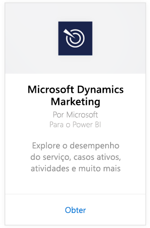
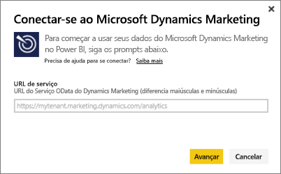
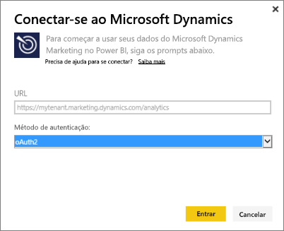
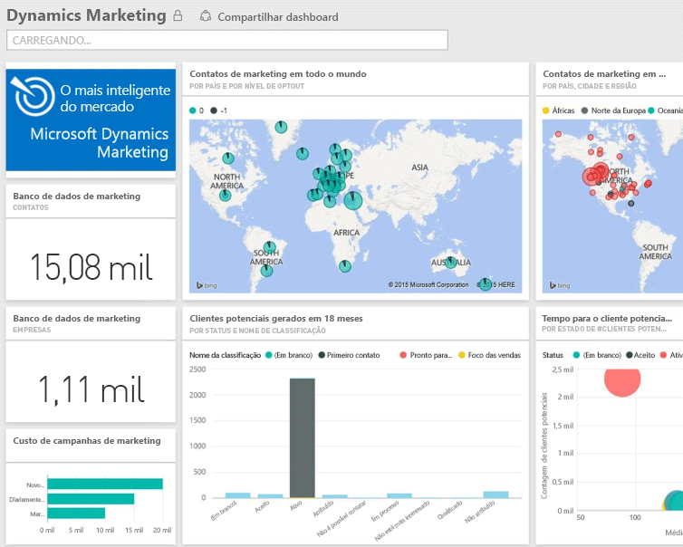

# Conectar-se ao Microsoft Dynamics Marketing com o Power BI
O pacote de conteúdo do Microsoft Dynamics Marketing para o Power BI permite que você acesse e analise seus dados com facilidade no Dynamics Marketing. O pacote de conteúdo usa um modelo descritivo no feed OData, com todas as entidades e as medidas necessárias, como Programas, Campanhas, Empresas e Contatos de Marketing, Clientes Potenciais, Interações de Cliente Potencial e Pontuação de Cliente Potencial, Sites e Mensagens de Marketing por Email, observações comportamentais, orçamentos, transações financeiras, KPIs de desempenho e muito mais. 

Conecte-se ao [pacote de conteúdo do Dynamics Marketing](https://app.powerbi.com/getdata/services/microsoft-dynamics-marketing) para o Power BI.

>[!NOTE]
>Você precisa especificar uma URL do OData válida para uma instância do Dynamics Marketing (o pacote de conteúdo não funcionará com uma versão local do CRM). Consulte abaixo os requisitos adicionais.

## Como se conectar
1. Selecione Obter Dados na parte inferior do painel de navegação esquerdo.
   
    
2. Na caixa **Serviços** , selecione **Obter**.
   
    
3. Selecione **Microsoft Dynamics Marketing** \> **Obter**.
   
   
4. Forneça a URL do OData associada à sua conta.  Ela terá o formato "https://[instance\_name].marketing.dynamics.com/analytics."
   
   
5. Quando solicitado, forneça suas credenciais (essa etapa pode ser ignorada se você já tiver entrado com seu navegador). Como o Método de Autenticação, digite **oAuth2** e clique em **Entrar**:
   
   
6. Após a conexão, você verá um painel do Dynamics Marketing, preenchido com seus próprios dados. Os asteriscos amarelos marcam os novos itens no painel de navegação esquerdo.
   
   

**E agora?**

* Tente [fazer uma pergunta na caixa de P e R](service-q-and-a.md) na parte superior do dashboard
* [Altere os blocos](service-dashboard-edit-tile.md) no dashboard.
* [Selecione um bloco](service-dashboard-tiles.md) para abrir o relatório subjacente.
* Enquanto seu conjunto de dados será agendado para ser atualizado diariamente, você pode alterar o agendamento de atualização ou tentar atualizá-lo sob demanda usando **Atualizar Agora**

## Requisitos de sistema
* Você precisa especificar uma URL do OData válida para uma instância do Dynamics Marketing (o pacote de conteúdo não funcionará com uma versão local do CRM).  
* Um administrador deve habilitar o ponto de extremidade OData nas configurações do site. O endereço do ponto de extremidade OData pode ser encontrado navegando até **Página Inicial \> Configurações \> Configurações de Site** na seção **Serviço de Dados da Organização**.  A URL do OData tem o formato: https://[instance\_name].marketing.dynamics.com/analytics  
* A conta/identidade do usuário usada para acessar o Microsoft Dynamics Marketing deve ser a mesma na qual você se inscreveu para usar o Power BI. Ao fazer logon no Microsoft Dynamics Marketing, sua entrada será realizada automaticamente com a mesma identidade que você usa para o Power BI. Se você quiser entrar no Microsoft Dynamics Marketing com uma conta diferente, registre-se como um usuário do Power BI usando essa outra conta. Esperamos resolver esse problema em uma versão futura.   

## Solução de problemas
Se você receber uma mensagem “Falha no logon” ao tentar se conectar à sua conta do Dynamics CRM, confirme que você está entrando no Power BI com a mesma conta que você usa para acessar o feed OData do CRM Online. Tente fazer logon no feed também pelo seu navegador, para testá-lo lá.

Peça ao seu administrador para confirmar a URL correta do OData e que o ponto de extremidade do OData está habilitado.

Verifique a versão do Dynamic Marketing que você está usando - houve correções adicionais feitas em 18.0 e 18.1, se você ainda estiver com problemas e estiver em uma versão anterior, considere fazer upgrade.

Se você ainda está com problemas, abra um tíquete de suporte para entrar em contato com a equipe do Power BI:

* No aplicativo do Power BI, selecione o ponto de interrogação \> **Entrar em Contato com o Suporte**.
* No site de Suporte do Power BI (em que você está lendo este artigo), selecione **Entrar em contato com o Suporte** no lado direito da página.

## Próximas etapas
[Obter dados para o Power BI](service-get-data.md)

[Introdução ao Power BI](service-get-started.md)

