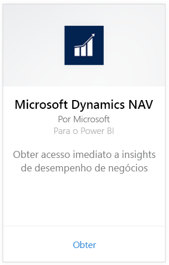
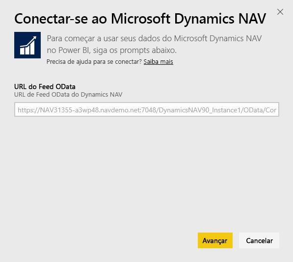
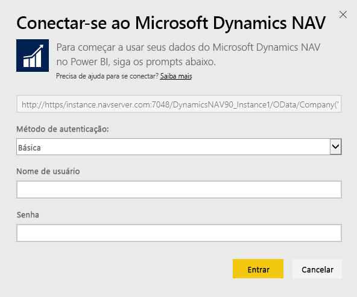
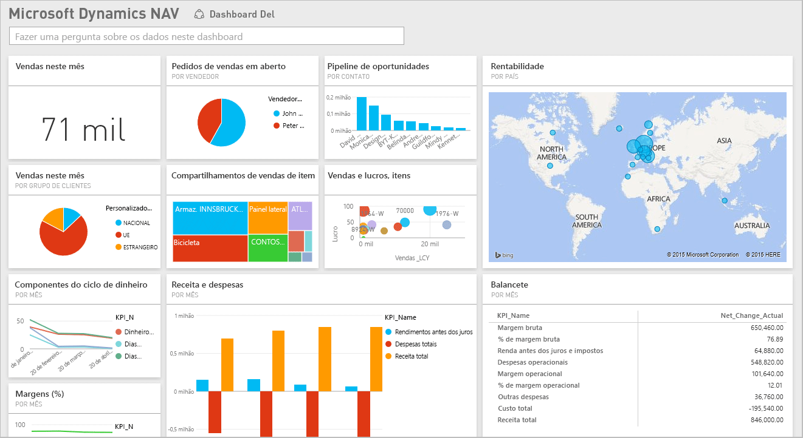

# Conectar-se ao Microsoft Dynamics NAV com o Power BI
É fácil obter insights sobre seus dados do Microsoft Dynamics NAV com o Power BI. O Power BI recupera seus dados de Vendas e Financeiros e, em seguida, cria um aplicativo com um dashboard e relatórios com base nesses dados. O Power BI precisa de suas permissões para as tabelas das quais os dados são recuperados, nesse caso, os dados de vendas e de finanças. Mais detalhes sobre os requisitos abaixo. Depois de instalar o aplicativo, exiba o dashboard e os relatórios no serviço do Power BI ([https://powerbi.com](https://powerbi.com)) e nos aplicativos móveis do Power BI. 

[Conecte-se ao Microsoft Dynamics NAV para o Power BI](https://app.powerbi.com/getdata/services/microsoft-dynamics-nav) ou leia mais sobre a [integração do Dynamics NAV](https://powerbi.microsoft.com/integrations/microsoft-dynamics-nav) com o Power BI.

## Como se conectar
[!INCLUDE [powerbi-service-apps-get-more-apps](./includes/powerbi-service-apps-get-more-apps.md)]

1. Selecione **Microsoft Dynamics NAV** e, em seguida, **Obter**.  
   
2. Quando solicitado, digite sua URL do OData do Microsoft Dynamics NAV. A URL deve corresponder ao seguinte padrão:
   
    `https//instance.navserver.com:7048/DynamicsNAV90_Instance1/OData/Company('CRONUS%20International%20Ltd.')`
   
   * “instance.navserver.com” com o nome do Servidor NAV
   * "DynamicsNAV90\_Instance1" com o nome da Instância do Servidor NAV
   * “Company('CRONUS%20International%20Ltd.')” com o nome da Empresa NAV
     
     Uma maneira fácil de obter essa URL é, no Dynamics NAV, ir até Serviços Web, localizar o serviço Web powerbifinance e copiar a URL do OData, mas omitindo “/powerbifinance” da cadeia de caracteres da URL.  
     
3. Selecione **Básica** e insira suas credenciais do Microsoft Dynamics NAV.
   
    Você precisa de credenciais de administrador (ou, pelo menos, permissões para dados de vendas e financeiros) de sua conta do Microsoft Dynamics NAV.  No momento, há suporte apenas para a autenticação Básica (Nome de Usuário e Senha).
   
    
4. O Power BI recuperará seus dados do Microsoft Dynamics NAV e criará para você um relatório e um painel prontos para o uso.   
   

## Exibir o dashboard e os relatórios
[!INCLUDE [powerbi-service-apps-open-app](./includes/powerbi-service-apps-open-app.md)]

[!INCLUDE [powerbi-service-apps-open-app](./includes/powerbi-service-apps-what-now.md)]

## O que está incluído
O dashboard e os relatórios contêm dados das seguintes tabelas (diferencia maiúsculas de minúsculas):  

* ItemSalesAndProfit  
* ItemSalesByCustomer  
* powerbifinance  
* SalesDashboard  
* SalesOpportunities  
* SalesOrdersBySalesPerson  
* TopCustomerOverview  

## Requisitos de sistema
Para importar dados do Microsoft Dynamics NAV no Power BI, você precisa ter permissões para as tabelas de dados de vendas e financeiros, das quais os dados são recuperados (listadas acima). As tabelas também devem ter dados, pois, no momento, haverá falha na importação de tabelas vazias.

## Solução de problemas
O Power BI usa os serviços Web do Microsoft Dynamics NAV para recuperar os dados. Se você tiver muitos dados em sua instância do Microsoft Dynamics NAV, uma sugestão para minimizar o impacto no uso do serviço Web é alterar a frequência de atualização, dependendo das suas necessidades. Outra sugestão é fazer com que um administrador crie o aplicativo e compartilhe-o, em vez de fazer com que cada administrador crie seu próprio aplicativo.

**“Falha na validação do parâmetro. Verifique se todos os parâmetros são válidos.”**  
Se você receber esse erro depois de digitar a URL do Microsoft Dynamics NAV. Verifique se que os requisitos a seguir forem atendidos:

* A URL segue exatamente este padrão:
  
    `https//instance.navserver.com:7048/DynamicsNAV90_Instance1/OData/Company('CRONUS%20International%20Ltd.')`
  
  * “instance.navserver.com” com o nome do Servidor NAV
  * "DynamicsNAV90\_Instance1" com o nome da Instância do Servidor NAV
  * “Company('CRONUS%20International%20Ltd.')” com o nome da Empresa NAV
* Verifique se todas as letras são minúsculas.  
* Verifique se a URL está em 'https'.  
* Verifique se que não há nenhuma barra invertida no final da URL.

**“Falha no logon.”**  
Se você receber um erro de “falha no logon” depois de usar suas credenciais do Microsoft Dynamics NAV para fazer logon, talvez esteja ocorrendo um dos seguintes problemas:

* A conta que você está usando não tem permissões para recuperar os dados do Microsoft Dynamics NAV da sua conta. Verifique se que ela é uma conta de administrador e tente novamente.
* A instância do Dynamics NAV que você está tentando se conectar não tem um certificado SSL válido. Nesse caso, você verá uma mensagem de erro mais detalhada (“Não é possível estabelecer a relação de confiança SSL”). Observe que não há suporte para os certificados autoassinados.

**"Ops"**  
Se uma caixa de diálogo de erro “Ops!” for exibida depois que você passar pela caixa de diálogo de autenticação, isso significa que o Power BI está tendo um problema ao carregar os dados.

* Verifique se a URL segue o padrão especificado acima. Um erro comum é especificar:
  
    `https//instance.navserver.com:7048/DynamicsNAV90\_Instance1/OData`
  
    No entanto, você precisa incluir a seção “Company('CRONUS%20International%20Ltd.')” com o nome da Empresa do NAV:
  
    `https//instance.navserver.com:7048/DynamicsNAV90\_Instance1/OData/Company('CRONUS%20International%20Ltd.')`

## Próximas etapas
* [O que são aplicativos no Power BI?](service-install-use-apps.md)
* [Obter dados no Power BI](service-get-data.md)
* Mais perguntas? [Experimente perguntar à Comunidade do Power BI](http://community.powerbi.com/)

