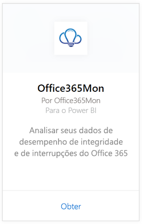
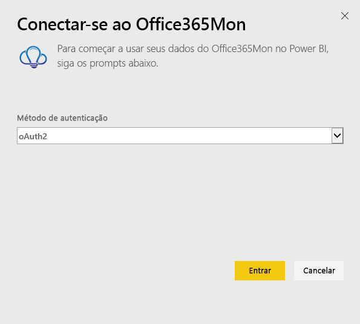
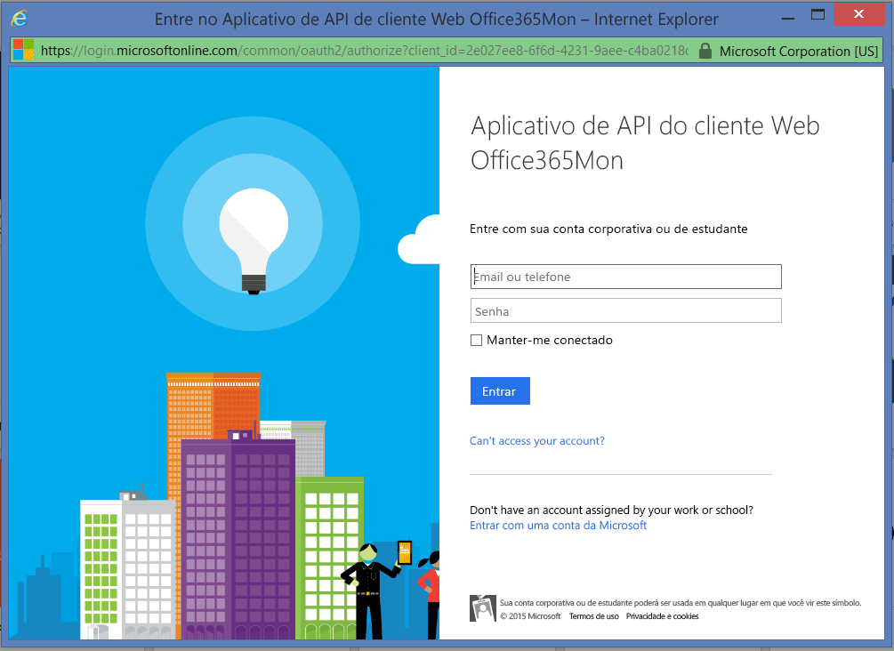
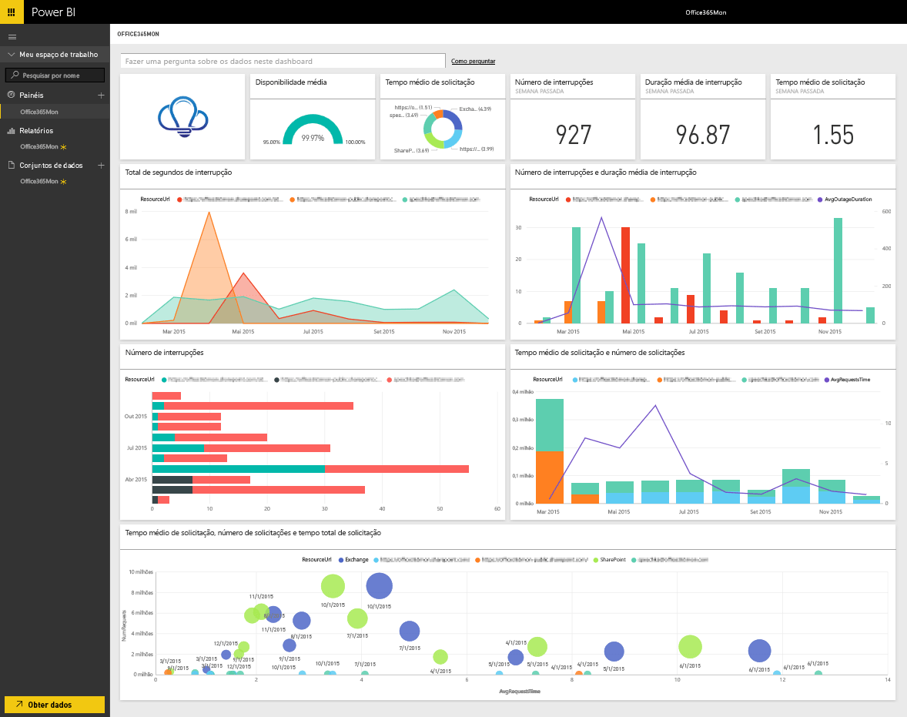

# Conectar-se ao Office365Mon com o Power BI
Analisar seus dados de desempenho de integridade e interrupções do Office 365 é fácil com o Power BI e o pacote de conteúdo Office365Mon. O Power BI recupera seus dados, incluindo investigações de integridade e interrupções e, em seguida, compila um painel e relatórios prontos para uso com base em tais dados.

Conectar-se ao [pacote de conteúdo Office365Mon](https://app.powerbi.com/groups/me/getdata/services/office365mon) para Power BI.

>[!NOTE]
>Uma conta de administrador do Office365Mon é necessária para conectar e carregar o pacote de conteúdo do Power BI.

## Como se conectar
1. Selecione **Obter Dados** na parte inferior do painel de navegação esquerdo.
   
   
2. Na caixa **Serviços** , selecione **Obter**.
   
    
3. Selecione **Office365Mon** \> **Obter**.
   
   
4. Para o Método de Autenticação, selecione **oAuth2** \> **Entrar**.
   
   Quando solicitado, insira suas credenciais de administrador do Office365Mon e siga o processo de autenticação.
   
   
   
   
5. Após o Power BI importar os dados, você verá novos elementos (painel, relatório e conjunto de dados) no painel de navegação esquerdo. Novos itens são marcados com um asterisco amarelo \*; selecione a entrada do Office365Mon.
   
   

**E agora?**

* Tente [fazer uma pergunta na caixa de P e R](power-bi-q-and-a.md) na parte superior do dashboard
* [Altere os blocos](service-dashboard-edit-tile.md) no dashboard.
* [Selecione um bloco](service-dashboard-tiles.md) para abrir o relatório subjacente.
* Enquanto seu conjunto de dados será agendado para ser atualizado diariamente, você pode alterar o agendamento de atualização ou tentar atualizá-lo sob demanda usando **Atualizar Agora**

## Solução de problemas
Se você receber um erro **"falha no logon"** depois de usar suas credenciais de assinatura do Office365Mon para fazer logon, a conta sendo usada não tem permissões para recuperar os dados do Office365Mon de sua conta. Verifique se que ela é uma conta de administrador e tente novamente.

## Próximas etapas
[Introdução ao Power BI](service-get-started.md)

[Obter dados para o Power BI](service-get-data.md)

