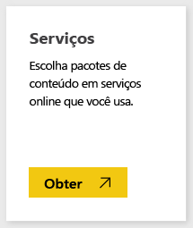
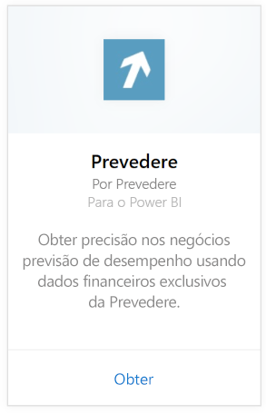
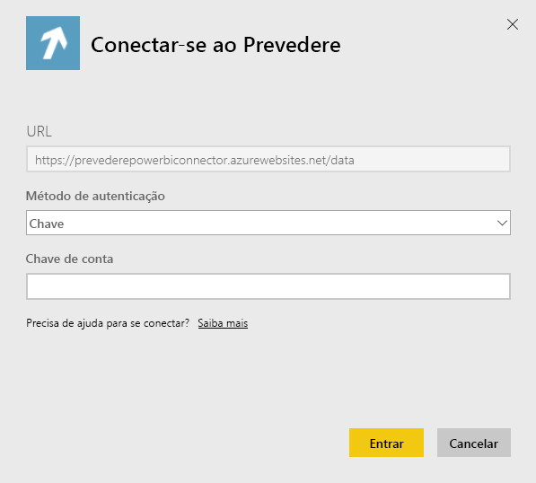

# Conectar-se ao Prevedere com o Power BI
Obtenha acesso a informações financeiras exclusivas e críticas para impulsionar seus negócios com segurança e de forma proativa.

Conecte-se ao [pacote de conteúdo do Prevedere](https://app.powerbi.com/getdata/services/prevedere) para o Power BI.

>[!NOTE]
>Se você ainda não é um usuário do Prevedere, use a [chave de amostra](https://prevederepowerbiconnector.azurewebsites.net/static/learnmore.html) para experimentar.

## Como se conectar
1. Selecione **Obter Dados** na parte inferior do painel de navegação esquerdo.
   
   
2. Na caixa **Serviços** , selecione **Obter**.
   
   
3. Selecione **Prevedere** e **Obter**.
   
   
4. Como o **Método de Autenticação**, selecione **Chave** e digite sua chave de API do Prevedere.
   
    
5. Selecione **Entrar** para iniciar o processo de importação. Quando concluído, um novo painel, relatório e modelo aparecerão no Painel de Navegação. Selecione o painel para exibir os dados importados por você.
   
     

**E agora?**

* Tente [fazer uma pergunta na caixa de P e R](power-bi-q-and-a.md) na parte superior do dashboard
* [Altere os blocos](service-dashboard-edit-tile.md) no dashboard.
* [Selecione um bloco](service-dashboard-tiles.md) para abrir o relatório subjacente.
* Enquanto seu conjunto de dados será agendado para ser atualizado diariamente, você pode alterar o agendamento de atualização ou tentar atualizá-lo sob demanda usando **Atualizar Agora**

## O que está incluído
O pacote de conteúdo obtém ideias sobre suas previsões de varejo, modelos de previsão, principais indicadores e muito mais.

## Requisitos de sistema
Este pacote de conteúdo exige o acesso a uma chave de API do Prevedere ou à chave de exemplo (veja abaixo).

## Localizando parâmetros

Aqueles que já são clientes podem acessar seus dados usando suas chaves de API. Se você ainda não é um cliente, veja uma amostra dos dados e das análises usando a [chave de exemplo](https://prevederepowerbiconnector.azurewebsites.net/static/learnmore.html).

## Solução de problemas
Os dados podem levar algum tempo para carregar dependendo do tamanho da sua instância.

## Próximas etapas
[Introdução ao Power BI](service-get-started.md)

[Obter dados no Power BI](service-get-data.md)

