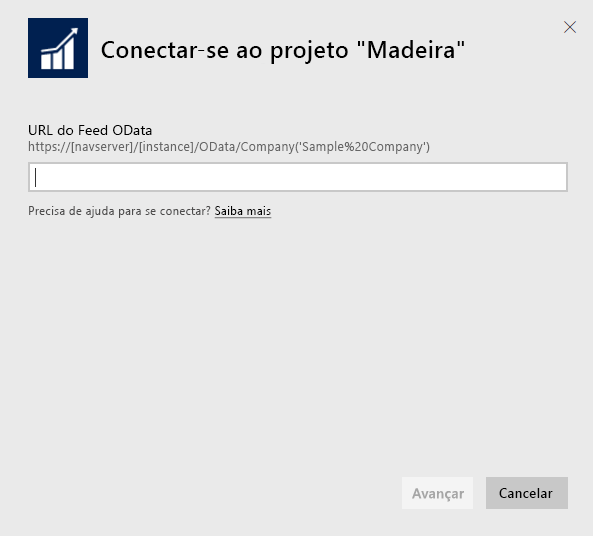
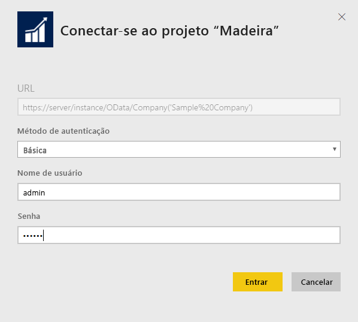
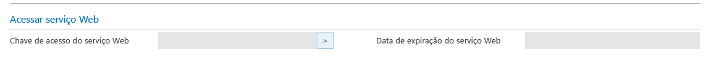
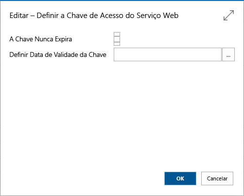
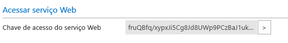

# Conectar-se ao Project “Madeira” com o Power BI
Obter informações para seus dados do Project “Madeira” é fácil com o Power BI e o conteúdo do Project “Madeira”. O Power BI recupera tanto seus dados de Vendas quanto Financeiros e, em seguida, compila um painel inicial e relatórios com base nesses dados.
Conecte-se ao Project "Madeira" para Power BI ou leia mais sobre a integração do Project "Madeira" com o Power BI.

>[!NOTE]
>Este pacote de conteúdo exige permissões para as tabelas das quais os dados são recuperados, nesse caso, dados de vendas e de finanças. Mais detalhes sobre os requisitos [abaixo](#Requirements).

Conecte-se ao [pacote de conteúdo do Project “Madeira” Analytics](https://app.powerbi.com/getdata/services/project-madeira) para o Power BI.

## Como se conectar
1. Selecione **Obter Dados** na parte inferior do painel de navegação esquerdo.  
    
2. Na caixa **Serviços** , selecione **Obter**.  
    
3. Selecione **Project "Madeira"** e, em seguida, selecione **Obter**.  
    
4. Quando solicitado, digite a URL do Project “Madeira”. A URL deve seguir fielmente o seguinte padrão https://mycronusus.projectmadeira.com:7048/NAV/OData/Company('CRONUS%20US') com o nome da empresa do Project “Madeira”. Observe que é importante observar que não há nenhuma barra no final e a conexão está em https. Veja detalhes sobre como encontrar essa URL [abaixo](#FindingParams).  
   
    
5. Quando solicitado, selecione Básico como Método de Autenticação, insira o endereço de email do Project "Madeira" como o nome de usuário de email e, em seguida, insira a chave de acesso do serviço Web na conta do seu Project "Madeira" como a senha. Se você já tiver entrado no Project “Madeira” em seu navegador, talvez suas credenciais não sejam solicitadas. Veja detalhes sobre como gerar essa chave de acesso [abaixo](#FindingParams).  
   
    >[!NOTE]
    >Você deve ser um superusuário no Project “Madeira”.
   
   
6. Depois que você estiver conectado, um dashboard, relatório e conjunto de dados serão carregados automaticamente. Após a conclusão, os blocos serão atualizados com dados de sua conta.  
   
    

**E agora?**

* Tente [fazer uma pergunta na caixa de P e R](power-bi-q-and-a.md) na parte superior do dashboard
* [Altere os blocos](service-dashboard-edit-tile.md) no dashboard.
* [Selecione um bloco](service-dashboard-tiles.md) para abrir o relatório subjacente.
* Enquanto seu conjunto de dados será agendado para ser atualizado diariamente, você pode alterar o agendamento de atualização ou tentar atualizá-lo sob demanda usando **Atualizar Agora**

## Requisitos de sistema
Para importar dados do Project “Madeira” no Power BI, você precisa ter permissões para as tabelas de dados de vendas e finanças, das quais os dados são recuperados. Todas as tabelas (diferenciar maiúsculas de minúsculas ) necessárias para o pacote de conteúdo incluem:  
 
    ´´´ 
    - ItemSalesAndProfit  
    - ItemSalesByCustomer  
    - powerbifinance  
    - SalesDashboard  
    - SalesOpportunities  
    - SalesOrdersBySalesPerson  
    - TopCustomerOverview  
    ´´´ 

## Localizando parâmetros
**Obtendo a URL correta** Uma maneira fácil de obter essa URL é, no Project “Madeira”, ir para os Serviços Web, localizar o serviço Web powerbifinance e copiar a URL do OData (usar o botão direito do mouse e o Atalho para Copiar), mas omitindo “/powerbifinance…” da cadeia de caracteres da URL.

**Chaves de Acesso do Serviço Web** P ara usar dados do Project "Madeira", você precisará criar uma chave de acesso do serviço Web para sua conta de usuário. No Project "Madeira", pesquise a página usuários e, em seguida, abra o cartão para sua conta de usuário. Aqui você pode gerar uma nova chave de acesso de serviços Web e copiá-la para o campo de senha na página de conexão do Power BI.

Quando você começar a usar as Chaves de Acesso do Serviço Web você terá que usá-la no futuro, então selecione OK na mensagem que aparecer.
Ao criar a chave, você poderá selecionar se ele expira em uma data específica ou não.

Quando você escolher OK, uma chave é criada, portanto você pode copiá-la para o campo Senha na página de conexão do Power BI.

## Solução de problemas
O painel do Power BI se baseia em serviços Web publicados que estão listados acima e ele mostrará dados da empresa de demonstração ou de sua empresa, se você importar dados de sua solução atual de finanças. No entanto, se algo der errado, esta seção fornecerá uma solução alternativa para os problemas mais comuns.

**“Falha na validação do parâmetro. Verifique se todos os parâmetros são válidos.”**

Se você vir esse erro depois de digitar a URL do Projeto "Madeira", verifique se os seguintes requisitos foram atendidos:  

   - A URL segue exatamente este padrão https://*mycronusus*.projectmadeira.com:7048/NAV/OData/Company('*CRONUS%20US*')  
   - Exclua qualquer texto após o nome da empresa entre parênteses  
   - Verifique se que não há nenhuma barra invertida no final da URL.  
   - Verifique se a URL está usando uma conexão segura, conforme indicado pela URL começando com https.  

**"Falha no logon"** se você receber um erro de "falha no logon" quando fizer logon no painel usando suas credenciais do Project “Madeira”, isso pode ter sido causado por um dos seguintes problemas:  

   - A conta que você está usando não tem permissões para ler dados do Project "Madeira" de sua conta. Verifique sua conta de usuário no Project "Madeira" e certifique-se de ter usado a chave de acesso do serviço Web correta como senha e, em seguida, tente novamente.  
   - A instancia do Project "Madeira" à qual você está tentando se conectar não tem um certificado SSL válido. Nesse caso, você verá uma mensagem de erro mais detalhada (“Não é possível estabelecer a relação de confiança SSL”). Observe que não há suporte para os certificados autoassinados.  

**"Opa"** Se você vir um diálogo de erro “Opa” depois de passar pelo diálogo de autenticação, isso costuma ser causado por um problema ao se conectar aos dados do pacote de conteúdo. Verifique se a URL segue o padrão especificado anteriormente:  
    https://*mycronusus*.projectmadeira.com:7048/NAV/OData/Company('*CRONUS%20US*')

Um erro comum é especificar a URL completa para um serviço Web específico:  
    https://*mycronusus*.projectmadeira.com:7048/NAV/OData/Company('*CRONUS%20US*')/powerbifinance

Ou você pode ter esquecido de especificar o nome da empresa:   
    https://*mycronusus*.projectmadeira.com:7048/NAV/OData/

## Próximas etapas
[Introdução ao Power BI](service-get-started.md)

[Power BI – conceitos básicos](service-basic-concepts.md)

