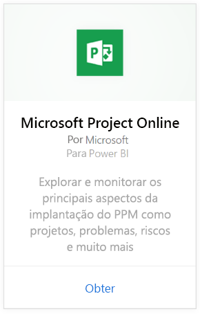
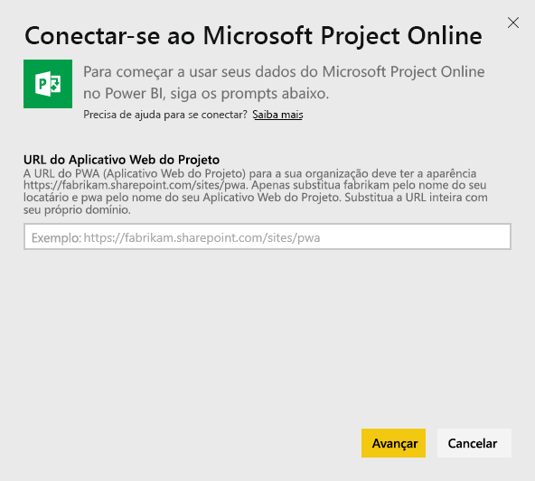
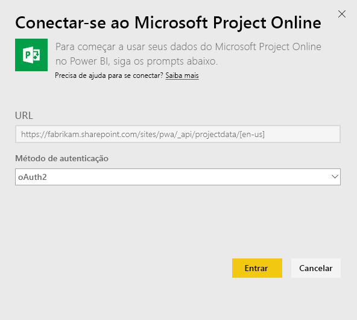
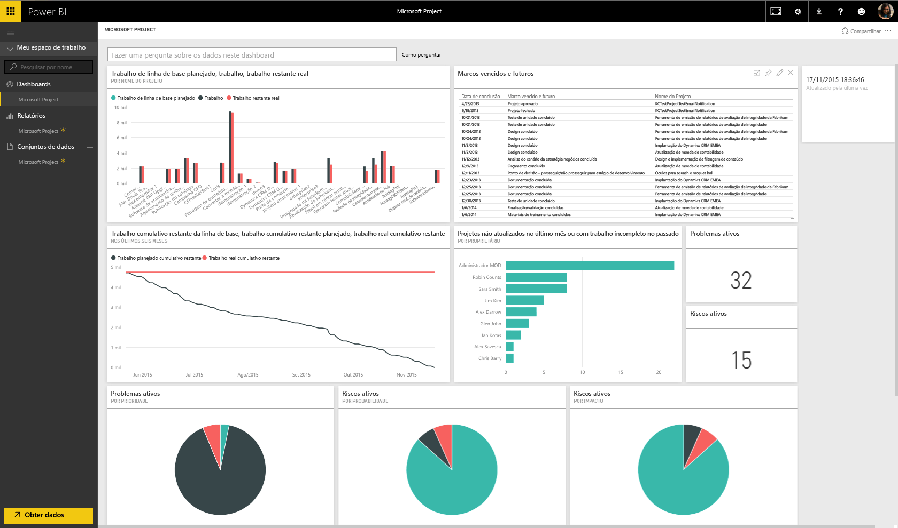

# Conectar-se ao Project Online com o Power BI
Microsoft Project Online é uma solução online flexível para PPM (gerenciamento de portfólio de projetos) e para o trabalho cotidiano. O Project Online permite que as organizações comecem, priorizem investimentos de portfólio de projetos e entreguem o valor comercial pretendido. O pacote de conteúdo do Project Online para o Power BI permite que você explore seus dados de projeto com métricas prontas para uso, como status do portfólio e conformidade do projeto.

Conecte-se ao [pacote de conteúdo do Project Online](https://app.powerbi.com/getdata/services/project-online) para o Power BI.

## Como se conectar
1. Selecione **Obter Dados** na parte inferior do painel de navegação esquerdo.
   
    
2. Na caixa **Serviços** , selecione **Obter**.
   
   
3. Selecione **Microsoft Project Online** \> **Obter**.
   
   
4. Na caixa de texto **URL do Project Web App** , digite a URL para o PWA (Project Web Add) à qual você deseja se conectar e pressione **Avançar**. Observe que isso pode ser diferente do exemplo, caso você tenha um domínio personalizado.
   
    
5. Para o Método de Autenticação, selecione **oAuth2** \> **Entrar**. Quando solicitado, insira suas credenciais do Project Online e siga o processo de autenticação.
   
    
6. Você verá uma notificação indicando que os dados estão sendo carregados. Dependendo do tamanho de sua conta, isso pode levar algum tempo. Após o Power BI importar os dados, você verá novos elementos (painel, relatório e conjunto de dados) no painel de navegação esquerdo. Esse é o painel padrão criado pelo Power BI para exibir seus dados. Você pode alterar esse painel para exibir seus dados de qualquer modo que desejar.
   
   

**E agora?**

* Tente [fazer uma pergunta na caixa de P e R](power-bi-q-and-a.md) na parte superior do dashboard
* [Altere os blocos](service-dashboard-edit-tile.md) no dashboard.
* [Selecione um bloco](service-dashboard-tiles.md) para abrir o relatório subjacente.
* Enquanto seu conjunto de dados será agendado para ser atualizado diariamente, você pode alterar o agendamento de atualização ou tentar atualizá-lo sob demanda usando **Atualizar Agora**

## Próximas etapas
[Introdução ao Power BI](service-get-started.md)

[Obter dados no Power BI](service-get-data.md)

