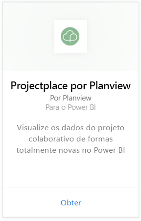
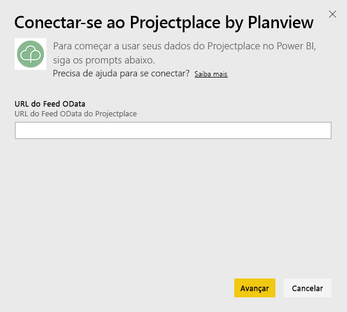
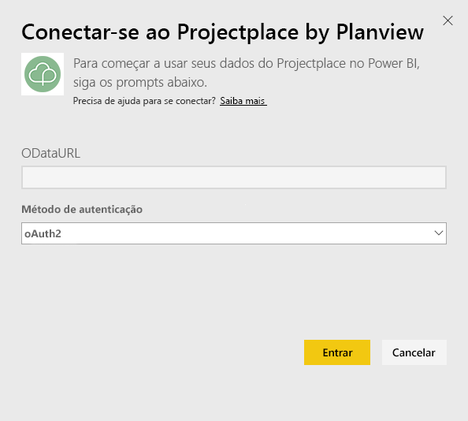
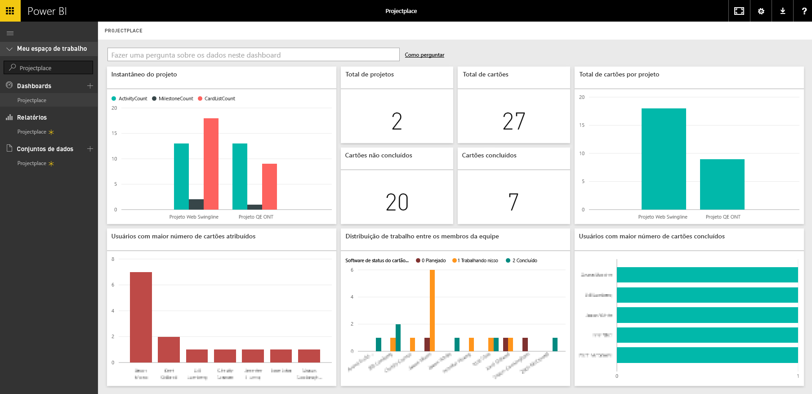

# Conectar-se ao Projectplace by Planview com o Power BI
Com o pacote de conteúdo do Projectplace by Planview, é possível visualizar os dados do projeto colaborativo de formas totalmente novas diretamente no Power BI. Use suas credenciais de logon do Projectplace para exibir as principais estatísticas do projeto de maneira interativa, descubra quem são os membros da equipe mais ativos e produtivos e identifique atividades e cartões de risco em projetos em sua conta do Projectplace. Também é possível estender o painel e os relatórios prontos para uso para obter as informações mais importantes para você.

[Conectar-se ao pacote de conteúdo do Projectplace no Power BI](https://app.powerbi.com/getdata/services/projectplace)

>[!NOTE]
>Para importar os dados do Projectplace para o Power BI, você deve ser um usuário do Projectplace. Consulte abaixo os requisitos adicionais.

## Como se conectar
1. Selecione **Obter Dados** na parte inferior do painel de navegação esquerdo.
   
    
2. Na caixa **Serviços** , selecione **Obter**.
   
    
3. Na página do Power BI, selecione **Projectplace by Planview**e, em seguida, selecione **Obter**:  
   
    
4. Na caixa de texto URL do Feed OData, insira a URL para o feed OData do Projectplace que você deseja usar, como mostrado na seguinte imagem:
   
    
5. Na lista Método de Autenticação, selecione **OAuth** se essa opção ainda não estiver marcada. Pressione **Entrar** e siga o fluxo de logon.  
   
   
6. No painel esquerdo, selecione **Projectplace** na lista de painéis. O Power BI importa os dados do Projectplace para o painel. Observe que os dados podem levar algum tempo para carregar.  
   
    O painel contém blocos que exibem dados do banco de dados do Projectplace. A imagem a seguir mostra um exemplo do painel padrão do Projectplace no Power BI.
   
    

**E agora?**

* Tente [fazer uma pergunta na caixa de P e R](power-bi-q-and-a.md) na parte superior do dashboard
* [Altere os blocos](service-dashboard-edit-tile.md) no dashboard.
* [Selecione um bloco](service-dashboard-tiles.md) para abrir o relatório subjacente.
* Enquanto seu conjunto de dados será agendado para ser atualizado diariamente, você pode alterar o agendamento de atualização ou tentar atualizá-lo sob demanda usando **Atualizar Agora**

## Requisitos de sistema
Para importar os dados do Projectplace para o Power BI, você deve ser um usuário do Projectplace. Este procedimento pressupõe que você já entrou na home page do Microsoft Power BI com uma conta do Power BI. Se você não tiver uma conta do Power BI, crie uma nova conta gratuita do Power BI na home page do Power BI e clique em Obter Dados.

## Próximas etapas
[Introdução ao Power BI](service-get-started.md)

[Power BI – conceitos básicos](service-basic-concepts.md)

