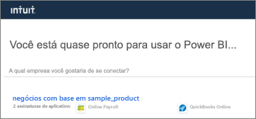
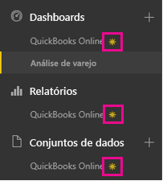
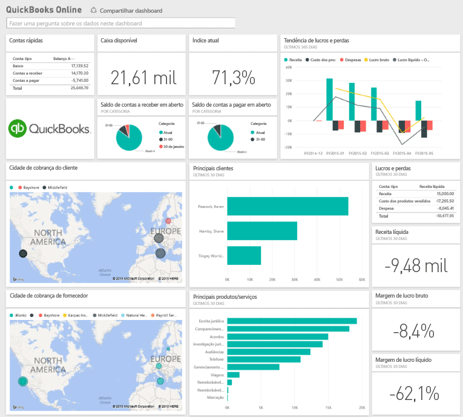

# Conectar-se ao QuickBooks Online com o Power BI
Quando você se conecta aos seus dados do QuickBooks Online por meio do Power BI, você obtém imediatamente um painel e relatórios do Power BI que fornecem informações sobre o fluxo de caixa de sua empresa, rentabilidade, clientes e muito mais. Use o painel e os relatórios como fornecidos, ou então personalize-os para realçar as informações que mais importam a você. Os dados são atualizados automaticamente uma vez por dia.

Conecte-se ao [pacote de conteúdo do QuickBooks Online](https://dxt.powerbi.com/getdata/services/quickbooks-online) para o Power BI.

>[!NOTE]
>Para importar seus dados do QuickBooks Online no Power BI, você precisa ser um administrador em sua conta do QuickBooks Online e entrar com suas credenciais da conta de administrador.

## Como se conectar
1. Selecione **Obter Dados** na parte inferior do painel de navegação esquerdo.
   
    
2. Na caixa **Serviços** , selecione **Obter**.
   
    
3. Selecione **QuickBooks Online**e **Obter**.
   
   
4. Selecione **oAuth2** como o Método de Autenticação e selecione **Entrar**. 
5. Quando solicitado, insira suas credenciais do QuickBooks Online e siga o processo de autenticação do QuickBooks Online. Se você já tiver entrado no QuickBooks Online em seu navegador, talvez suas credenciais não sejam solicitadas.
   >[!NOTE]
   >Você precisa ter credenciais de administrador para a conta do QuickBooks Online.
6. Selecione a empresa que você deseja conectar ao Power BI na próxima tela.
   
   
7. Selecione **Autorizar** na próxima tela para iniciar o processo de importação. Isso pode levar alguns minutos, dependendo do tamanho dos dados de sua empresa. 
   
   
   
   Depois que o Power BI importar os dados, você verá um novo painel, relatório e conjunto de dados no painel de navegação esquerdo. Novos itens são marcados com um asterisco amarelo \*.
   
   
8. Selecione o painel QuickBooks Online. Esse é o painel do Power BI criado automaticamente para exibir os dados importados. Você pode alterar esse painel para exibir seus dados de qualquer modo que desejar. 
   
   

**E agora?**

* Tente [fazer uma pergunta na caixa de P e R](service-q-and-a.md) na parte superior do dashboard
* [Altere os blocos](service-dashboard-edit-tile.md) no dashboard.
* [Selecione um bloco](service-dashboard-tiles.md) para abrir o relatório subjacente.
* Enquanto seu conjunto de dados será agendado para ser atualizado diariamente, você pode alterar o agendamento de atualização ou tentar atualizá-lo sob demanda usando **Atualizar Agora**

## Solução de problemas
**“Opa! Ocorreu um erro.”**

Se você receber essa mensagem depois de selecionar **Autorizar**:

“Ops! Ocorreu um erro.” Feche esta janela e tente novamente.

O aplicativo já foi assinado para esta empresa por outro usuário. Entre em contato com [email do administrador] para fazer alterações a essa assinatura.”

... isso significa que outro administrador em sua empresa já se conectou aos dados da empresa com o Power BI. Peça ao admin que compartilhe o painel com você. Atualmente, apenas um usuário administrador pode se conectar a um determinado conjunto de dados corporativos do QuickBooks Online para o Power BI. Depois que o Power BI cria o painel, o administrador pode compartilhá-lo com vários colegas no mesmos locatários do Power BI.

**"Este aplicativo não está configurado para permitir conexões por meio de seu país"**

Atualmente o Power BI só dá suporte às edições estadunidenses do QuickBooks Online. 

## Próximas etapas
[Introdução ao Power BI](service-get-started.md)

[Power BI – conceitos básicos](service-basic-concepts.md)

