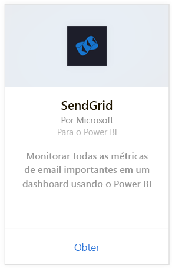
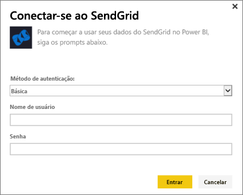
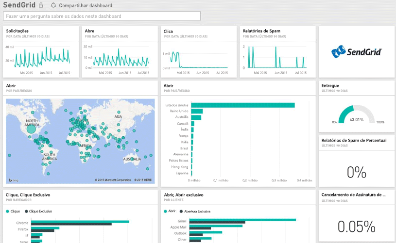

# Conectar-se ao SendGrid com o Power BI
O pacote de conteúdo do SendGrid para o Power BI permite que você extraia informações e estatísticas de sua conta do SendGrid. Com o pacote de conteúdo do SendGrid, é possível visualizar suas estatísticas do SendGrid em um painel.

Conecte-se ao [pacote de conteúdo do SendGrid](https://app.powerbi.com/getdata/services/sendgrid) para o Power BI.

## Como se conectar
1. Selecione **Obter Dados** na parte inferior do painel de navegação esquerdo.
   
    
2. Na caixa **Serviços** , selecione **Obter**.
   
    
3. Selecione o pacote de conteúdo do **SendGrid** e clique em **Obter**.
   
    
4. Quando solicitado, forneça seu nome de usuário e senha do SendGrid. Selecione **Entrar**.
   
   
5. Depois que o Power BI importar os dados, você verá um painel, relatório e conjunto de dados novos no painel de navegação esquerdo, preenchidos com suas estatísticas de email correspondentes aos últimos 90 dias. Novos itens são marcados com um asterisco amarelo \*.
   
   

**E agora?**

* Tente [fazer uma pergunta na caixa de P e R](power-bi-q-and-a.md) na parte superior do dashboard
* [Altere os blocos](service-dashboard-edit-tile.md) no dashboard.
* [Selecione um bloco](service-dashboard-tiles.md) para abrir o relatório subjacente.
* Enquanto seu conjunto de dados será agendado para ser atualizado diariamente, você pode alterar o agendamento de atualização ou tentar atualizá-lo sob demanda usando **Atualizar Agora**

## O que está incluído
As métricas a seguir estão disponíveis no painel do SendGrid:

* Estatísticas globais de email - Solicitações, Entregues, Devolvidos, Bloqueados por Spam, Relatório de Spam, etc.
* Estatísticas de email por categoria
* Estatísticas de email por geografia
* Estatísticas de email por ISP
* Estatísticas de email por dispositivo, cliente ou navegador

## Próximas etapas
[Introdução ao Power BI](service-get-started.md)

[Obter dados](service-get-data.md)

