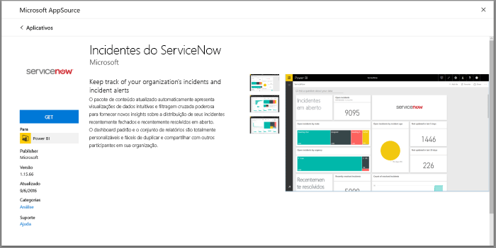
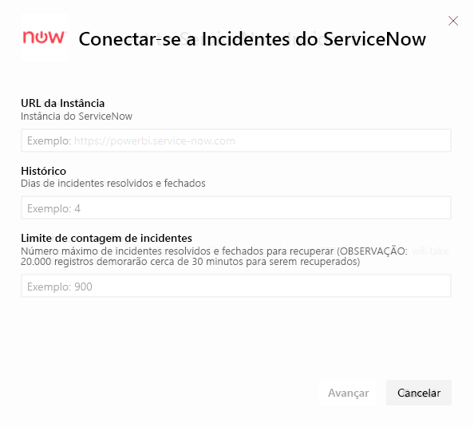
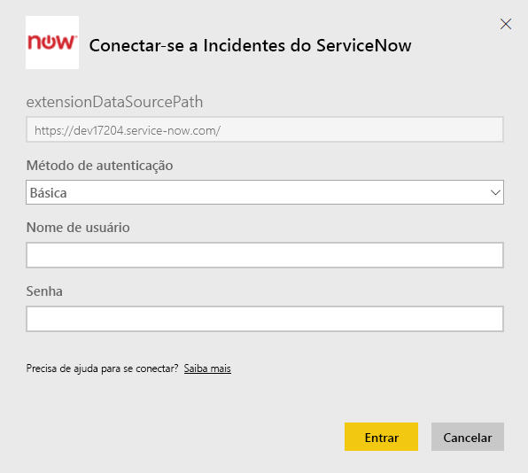
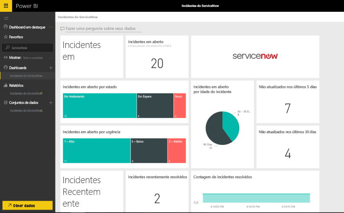

# Conectar-se ao ServiceNow com o Power BI para relatórios de incidentes
O ServiceNow oferece vários produtos e soluções, incluindo negócios, operações e gerenciamento de TI para melhorar os negócios. Este pacote de conteúdo inclui vários relatórios e insights sobre seus incidentes abertos, recentemente resolvidos e fechados recentemente.  

Conectar-se ao pacote de conteúdo do Power BI para [Incidentes do ServiceNow](https://app.powerbi.com/getdata/services/servicenow).

## Como se conectar
1. Selecione **Obter Dados** na parte inferior do painel de navegação esquerdo.
   
    
2. Na caixa **Serviços** , selecione **Obter**.
   
    
3. Selecione **Incidentes do ServiceNow** \> **Obter**.
   
   
4. Forneça a URL de sua instância do ServiceNow e o intervalo de dias/registros a ser trazido. Observe que quando um limite for atingido a importação será interrompida.
   
   
5. Quando solicitado, insira as credenciais **básicas** do ServiceNow. Observe que o logon único não tem suporte atualmente, obtenha mais detalhes sobre os requisitos de sistema abaixo.
   
   
6. Quando o fluxo de logon estiver concluído, o processo de importação será iniciado. Quando concluído, um novo painel, relatório e modelo aparecerão no Painel de Navegação. Selecione o painel para exibir os dados importados por você.
   
    

**E agora?**

* Tente [fazer uma pergunta na caixa de P e R](power-bi-q-and-a.md) na parte superior do dashboard
* [Altere os blocos](service-dashboard-edit-tile.md) no dashboard.
* [Selecione um bloco](service-dashboard-tiles.md) para abrir o relatório subjacente.
* Enquanto seu conjunto de dados será agendado para ser atualizado diariamente, você pode alterar o agendamento de atualização ou tentar atualizá-lo sob demanda usando **Atualizar Agora**

## Requisitos de sistema
Para se conectar, você precisará:  

* De uma conta que possa acessar yourorganization.service-now.com com a autenticação Básica (o Logon Único não tem suporte nesta versão)  
* A conta deve ter acesso de leitura e de função rest_service à tabela de incidentes  

## Solução de problemas
Se você estiver acessando um erro de credencial durante o carregamento, examine os requisitos de acesso acima. Se você tiver as permissões corretas e ainda estiver tendo problemas, trabalhe com seu administrador do ServiceNow para garantir que tenha permissões adicionais que podem ser necessárias para sua instância personalizada.

Se você estiver vendo tempos de carregamento longos, examine o número de incidentes e o número de dias especificado durante a conexão e considere reduzi-lo.

## Próximas etapas
[Introdução ao Power BI](service-get-started.md)

[Power BI – conceitos básicos](service-basic-concepts.md)

