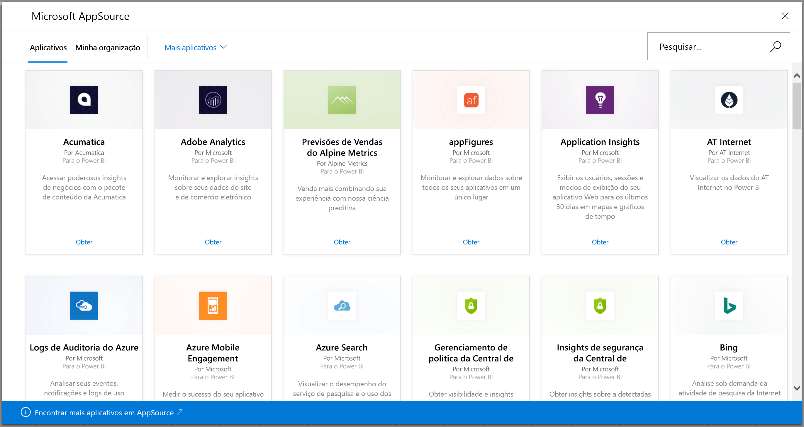
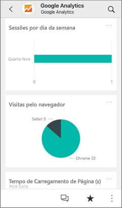
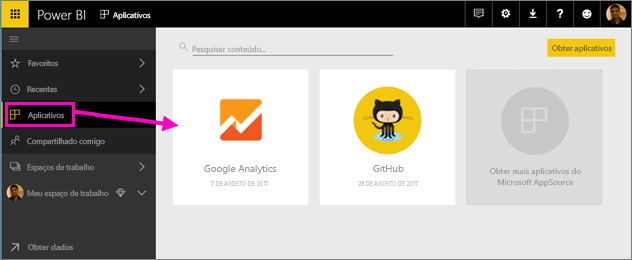
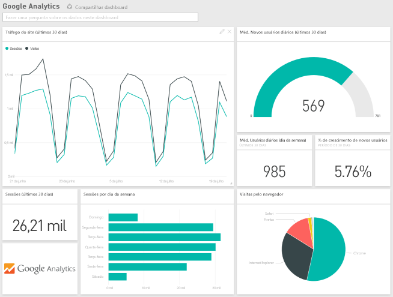
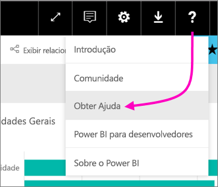

# Conectar-se aos serviços que você usa com o Power BI
Conecte-se aos vários serviços que você usa para administrar sua empresa, como o Salesforce, Microsoft Dynamics e Google Analytics. O Power BI começa usando suas credenciais para se conectar ao serviço e, em seguida, cria um aplicativo do Power BI com um dashboard e um conjunto de relatórios do Power BI que mostram os dados automaticamente e fornecem insights visuais sobre sua empresa. 

Faça logon no Power BI para exibir todos os [serviços aos quais você pode se conectar](https://app.powerbi.com/getdata/services). A equipe do Power BI adiciona novos serviços regularmente.

Depois de instalar o aplicativo, exiba o dashboard e os relatórios no serviço do Power BI ([https://powerbi.com](https://powerbi.com)) e nos aplicativos móveis do Power BI. 

## Introdução
[!INCLUDE [powerbi-service-apps-get-more-apps](./includes/powerbi-service-apps-get-more-apps.md)]

## Exibir o dashboard e os relatórios
Quando a importação for concluída, o novo aplicativo será exibido na página Aplicativos.

1. Selecione **Aplicativos** no painel de navegação à esquerda > selecione o aplicativo.
   
     
2. Faça uma pergunta digitando na caixa de P e R ou clique em um bloco para abrir o relatório subjacente. 
   
    
   
    Você pode filtrar e realçar os dados no relatório, mas não pode salvar as alterações.

## O que está incluído
Depois de se conectar a um serviço, você verá um aplicativo recém-criado com um dashboard, relatórios e um conjunto de dados. Os dados do serviço são voltados para um cenário específico e podem não incluir todas as informações do serviço. Os dados são agendados para serem atualizados automaticamente uma vez por dia. Controle o agendamento selecionando o conjunto de dados.

Também é possível usar o [Power BI Desktop](desktop-get-the-desktop.md) para se conectar a alguns serviços, como o Google Analytics, e criar seus próprios relatórios e dashboards personalizados.  

Para obter mais detalhes sobre como se conectar a serviços específicos, consulte as páginas de ajuda individuais.

## Solução de problemas
**Blocos vazios**  
Embora o Power BI esteja se conectando ao serviço pela primeira vez, você poderá ver um conjunto vazio de blocos no dashboard. Se um dashboard vazio ainda for exibido após 2 horas, provavelmente, a conexão falhou. Se uma mensagem de erro com informações sobre como corrigir o problema não for exibida, registre um tíquete de suporte.

* Selecione o ícone de ponto de interrogação (**?**) no canto superior direito > **Obter ajuda**.
  
    

**Informações ausentes**  
O dashboard e os relatórios incluem o conteúdo do serviço voltado para um cenário específico e não incluem todas as informações do serviço. Se houver uma métrica específica que você não esteja vendo no pacote de conteúdo, adicione uma ideia na página [Suporte do Power BI](https://support.powerbi.com/forums/265200-power-bi).

## Sugestão de serviços
Você usa um serviço que gostaria de sugerir para um aplicativo do Power BI? Vá para a página [Suporte do Power BI](https://support.powerbi.com/forums/265200-power-bi) e envie seus comentários.

Você tem um serviço para o qual gostaria de criar um aplicativo? [Envie sua nomeação](https://azure.microsoft.com/marketplace/programs/certified/apply/) e selecione “Publicar um Pacote de Conteúdo do Power BI” para começar.

## Próximas etapas
* [O que são aplicativos no Power BI?](service-install-use-apps.md)
* [Obter dados no Power BI](service-get-data.md)
* Mais perguntas? [Experimente perguntar à Comunidade do Power BI](http://community.powerbi.com/)

