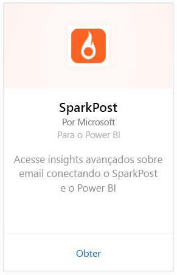
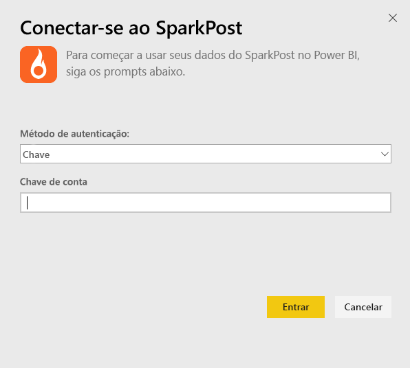
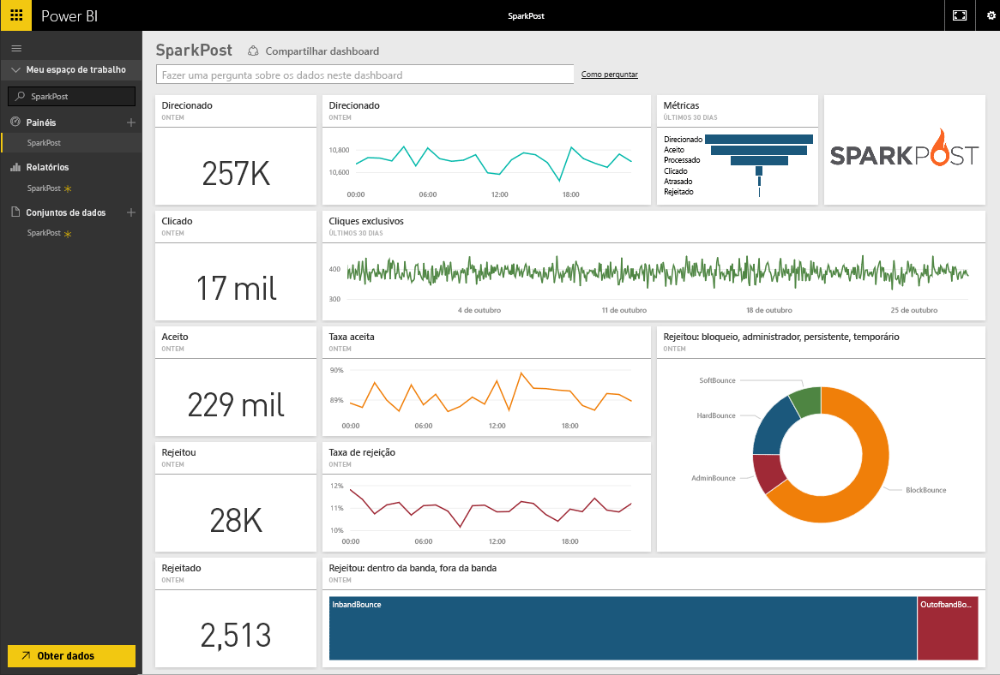
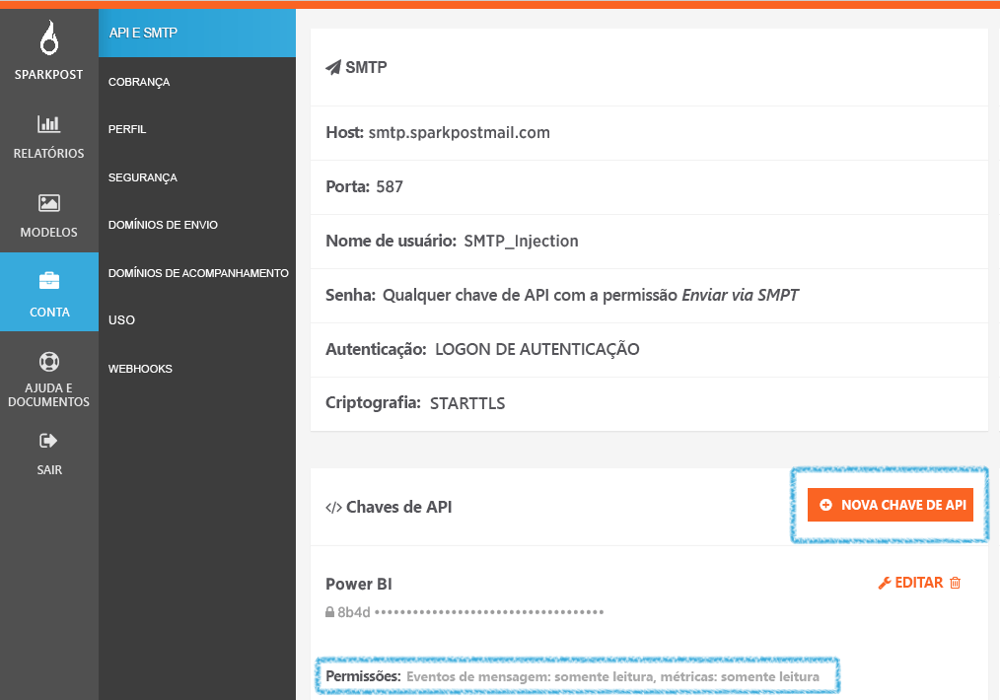

# Conectar-se ao SparkPost com o Power BI
O pacote de conteúdo do Power BI para SparkPost permite extrair conjuntos de dados valiosos de sua conta do SparkPost em um painel interessante. Com o pacote de conteúdo do SparkPost, é possível visualizar as estatísticas gerais de email, incluindo domínios, campanhas e envolvimento por ISP.

Conecte-se ao [pacote de conteúdo do SparkPost para o Power BI](https://app.powerbi.com/getdata/services/spark-post).

## Como se conectar
1. Selecione **Obter Dados** na parte inferior do painel de navegação esquerdo.
   
   
2. Na caixa **Serviços** , selecione **Obter**.
   
   
3. Selecione o pacote de conteúdo do **SparkPost** e clique em **Obter**. 
   
   
4. Quando solicitado, forneça sua chave de API do SparkPost e selecione Entrar. Veja detalhes sobre como [encontrar esses parâmetros](#FindingParams) abaixo.
   
   
5. Seus dados começarão a ser carregados; dependendo do tamanho de sua conta, isso poderá levar algum tempo. Depois que o Power BI importar os dados, você verá o painel, relatório e conjunto de dados padrão no painel de navegação esquerdo, populados com suas estatísticas de email correspondentes aos últimos 90 dias. Novos itens são marcados com um asterisco amarelo \*.
   
   

**E agora?**

* Tente [fazer uma pergunta na caixa de P e R](power-bi-q-and-a.md) na parte superior do dashboard
* [Altere os blocos](service-dashboard-edit-tile.md) no dashboard.
* [Selecione um bloco](service-dashboard-tiles.md) para abrir o relatório subjacente.
* Enquanto seu conjunto de dados será agendado para ser atualizado diariamente, você pode alterar o agendamento de atualização ou tentar atualizá-lo sob demanda usando **Atualizar Agora**

## O que está incluído
O pacote de conteúdo do SparkPost para o Power BI inclui informações como cliques exclusivos, taxas aceitas, taxas de devolução, taxas atrasadas, taxas de rejeição e muito mais.

## Localizando parâmetros
O pacote de conteúdo usa uma chave de API para conectar sua conta do SparkPost ao Power BI. É possível encontrar a chave de API em sua conta em Conta \> API & SMTP (mais detalhes [aqui](https://support.sparkpost.com/customer/portal/articles/1933377-create-api-keys)). Nós sugerimos usar uma chave de API com permissões para `Message Events: Read-only ` e `Metrics: Read-only`

