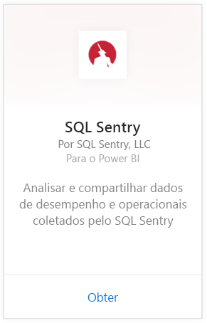
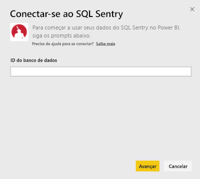
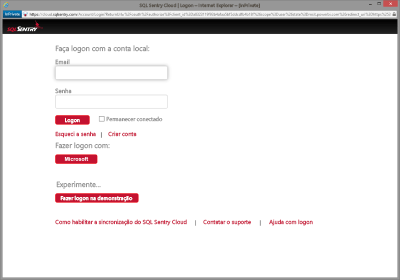
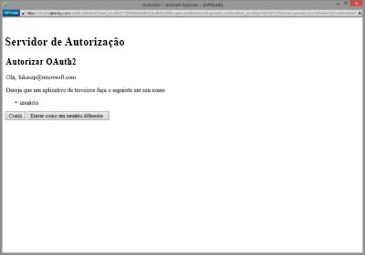
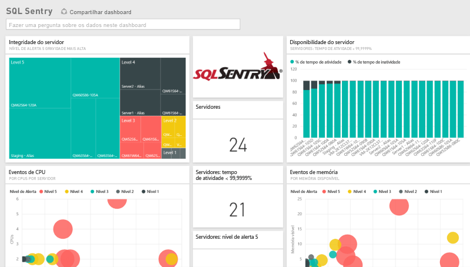
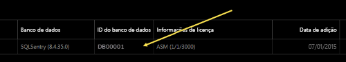
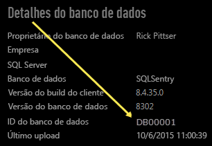

# Conectar-se ao SQL Sentry com o Power BI
É fácil analisar seus dados de desempenho coletados pelo SQL Sentry com o Power BI. O Power BI recupera seus dados e cria um painel padrão e relatórios relacionados com base nesses dados.

Conecte-se ao [pacote de conteúdo do SQL Sentry](https://app.powerbi.com/groups/me/getdata/services/sql-sentry) para o Power BI.

>[!NOTE]
>Para se conectar, será necessário acesso a uma conta do SQL Sentry que você usa para se conectar a http://cloud.sqlsentry.com e uma ID do banco de dados que você vai monitorar.  Veja abaixo instruções sobre onde encontrar a ID de Banco de Dados.

## Como se conectar
1. Selecione **Obter Dados** na parte inferior do painel de navegação esquerdo.
   
   
2. Na caixa **Serviços** , selecione **Obter**.
   
    
3. Selecione **SQL Sentry  \> Obter**.
   
   
4. Forneça a **ID de Banco de Dados** do banco de dados que deseja monitorar no Power BI. Veja mais detalhes sobre como [encontrar isso](#FindingParams) abaixo.
   
   
5. Para o Método de Autenticação, selecione **oAuth2 \> Entrar**.
   
   Quando solicitado, insira suas credenciais do cloud.sqlsentry.com e siga o processo de autenticação do SQL Sentry.
   
   
   
   Na primeira vez que você se conectar, o Power BI solicitará a você o acesso somente leitura à sua conta. Selecione Conceder para iniciar o processo de importação.  O processo de importação pode levar alguns minutos, dependendo do volume de dados em sua conta.
   
   
6. Após o Power BI importar os dados, você verá novos elementos (painel, relatório e conjunto de dados) no painel de navegação esquerdo. Os itens novos são marcados com um asterisco amarelo \*:
   
   
7. Selecione o painel do SQL Sentry.
   
   Esse é o painel padrão criado pelo Power BI para exibir seus dados. Você pode alterar esse painel para exibir seus dados de qualquer modo que desejar.
   
   

**E agora?**

* Tente [fazer uma pergunta na caixa de P e R](service-q-and-a.md) na parte superior do dashboard
* [Altere os blocos](service-dashboard-edit-tile.md) no dashboard.
* [Selecione um bloco](service-dashboard-tiles.md) para abrir o relatório subjacente.
* Enquanto seu conjunto de dados será agendado para ser atualizado diariamente, você pode alterar o agendamento de atualização ou tentar atualizá-lo sob demanda usando **Atualizar Agora**

## O que está incluído
Os seguintes dados estão disponíveis no SQL Sentry no Power BI:

| Nome da tabela | Descrição |
| --- | --- |
| Conexão |Esta tabela fornece informações sobre suas conexões do SQL Sentry definidas. |
| Date  |Esta tabela contém as datas de hoje até a primeira data a partir da qual os dados de desempenho foram coletados e mantidos. |
| Tempo de inatividade  |Esta tabela contém informações relacionadas ao tempo de inatividade e tempo de atividade para cada servidor monitorado em seu ambiente. |
| Uso de memória  |Esta tabela contém dados sobre a quantidade de memória que está disponível ou livre em cada um dos seus servidores.  |
| Servidor  |Esta tabela contém registros para cada servidor em seu ambiente. |
| Integridade do servidor  |Esta tabela contém dados para todos os eventos gerados por condições personalizadas em seu ambiente, incluindo severidade e contagem. |

## Localizando parâmetros
A **ID de Banco de Dados** pode ser encontrada fazendo logon no <https://cloud.sqlsentry.com> em uma nova janela do navegador da Web.  A **ID de Banco de Dados** é listada na principal página de visão geral:

    

A **ID de Banco de Dados** também é mostrada na tela Detalhes do banco de dados:

    

## Solução de problemas
Se os dados de alguns de seus aplicativos não estiverem aparecendo no Power BI, certifique-se de que você está usando a ID de Banco de Dados correta e que tem a autoridade para exibir os dados. 

Se você não é o proprietário do banco de dados do SQL Sentry que está sendo sincronizado para o <https://cloud.sqlsentry.com>, entre em contato com seu administrador para verificar se você tem direitos para exibir os dados coletados.

## Próximas etapas
[Introdução ao Power BI](service-get-started.md)

[Obter dados para o Power BI](service-get-data.md)

