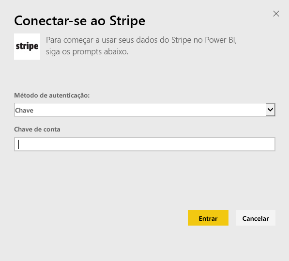
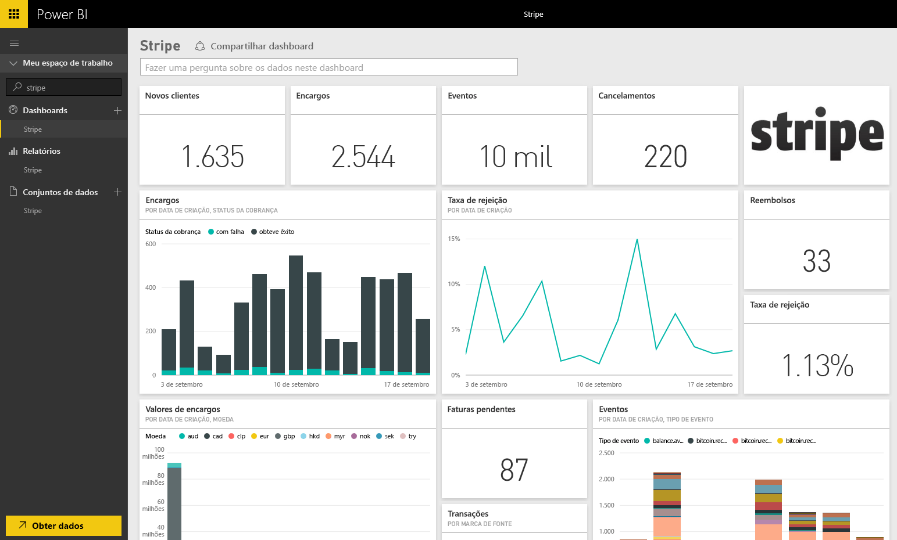

# Conectar-se ao Stripe com o Power BI
Visualize e explore seus dados do Stripe para o Power BI com o pacote de conteúdo para o Power BI. O pacote de conteúdo do Stripe para o Power BI recebe dados por pull sobre Clientes, Encargos, Eventos e Notas Fiscais. Os dados incluem os dez mil eventos e cinco mil encargos mais recentes nos últimos 30 dias. O conteúdo será atualizado automaticamente uma vez por dia em uma agenda sob seu controle. 

Conecte-se ao [pacote de conteúdo do Stripe para o Power BI](https://app.powerbi.com/getdata/services/stripe).

## Como se conectar
1. Selecione Obter Dados na parte inferior do painel de navegação esquerdo.  
   
    
2. Na caixa **Serviços** , selecione **Obter**.  
   
      
3. Selecione **Stripe** &gt; **Obter**.  
   
      
4. Forneça sua [chave de API](https://dashboard.stripe.com/account/apikeys) do Stripe para se conectar.  
   
    
5. O processo de importação será iniciado automaticamente. Quando concluído, um novo painel, relatório e modelo aparecerão no Painel de Navegação, marcados com um asterisco. Selecione o painel para exibir os dados importados por você.
   
    

**E agora?**

* Tente [fazer uma pergunta na caixa de P e R](power-bi-q-and-a.md) na parte superior do dashboard
* [Altere os blocos](service-dashboard-edit-tile.md) no dashboard.
* [Selecione um bloco](service-dashboard-tiles.md) para abrir o relatório subjacente.
* Enquanto seu conjunto de dados será agendado para ser atualizado diariamente, você pode alterar o agendamento de atualização ou tentar atualizá-lo sob demanda usando **Atualizar Agora**

## Próximas etapas
[Introdução ao Power BI](service-get-started.md)

[Obter dados para o Power BI](service-get-data.md)

