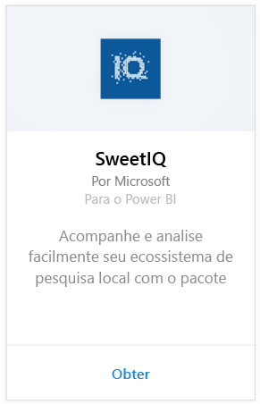
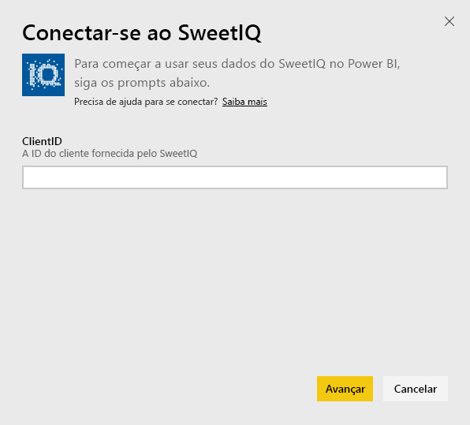
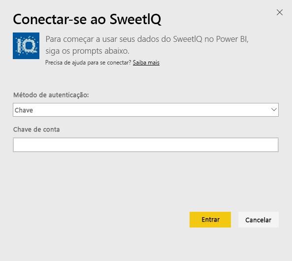
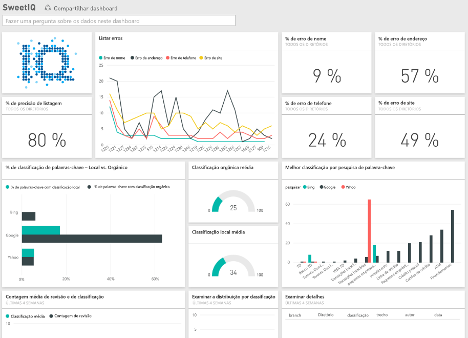

# Conectar-se ao SweetIQ com o Power BI
O pacote de conteúdo para o Power BI extrai dados de sua conta do SweetIQ e gera um conjunto de conteúdo pronto para uso, permitindo que você explore seus dados com facilidade. Use o pacote de conteúdo do SweetIQ para analisar dados sobre seus locais, listas, classificações e análises. Os dados são configurados para serem atualizados diariamente, garantindo que os dados que você está monitorando são atuais.

Conecte-se ao [pacote de conteúdo do SweetIQ](https://app.powerbi.com/groups/me/getdata/services/sweetiq) para o Power BI.

## Como se conectar
1. No painel de navegação à esquerda, clique em **Obter Dados.**
   
    
2. Selecione**SweetIQ** e clique em **Obter.**
   
    
3. Forneça a ID do Cliente do SweetIQ. Isso geralmente é um valor alfanumérico. Para obter mais detalhes sobre como encontrar esse valor, veja abaixo.
   
    
4. Selecione o tipo de autenticação **Chave** e forneça sua Chave de API do SweetIQ. Isso geralmente é um valor alfanumérico. Para obter mais detalhes sobre como encontrar esse valor, veja abaixo.
   
    
5. O Power BI iniciará o carregamento de dados, o que poderá demorar um pouco dependendo do tamanho dos dados em sua conta. Depois de concluído o carregamento, você verá um novo painel, relatório e conjunto de dados no painel de navegação esquerdo.
   
    

**E agora?**

* Tente [fazer uma pergunta na caixa de P e R](power-bi-q-and-a.md) na parte superior do dashboard
* [Altere os blocos](service-dashboard-edit-tile.md) no dashboard.
* [Selecione um bloco](service-dashboard-tiles.md) para abrir o relatório subjacente.
* Enquanto seu conjunto de dados será agendado para ser atualizado diariamente, você pode alterar o agendamento de atualização ou tentar atualizá-lo sob demanda usando **Atualizar Agora**

## Localizando parâmetros
A ID do Cliente e a Chave de API para esse pacote de conteúdo não são as mesmas que seu nome de usuário e senha do SweetIQ.

Selecione uma ID do Cliente de um dos clientes aos quais sua conta tem acesso. Você pode encontrar a lista de clientes em “Gerenciamento de Clientes” em sua conta do SweetIQ.

Fale com seu administrador para obter sua chave de API, para acessar os dados de um cliente específico.

## Próximas etapas
[Introdução ao Power BI](service-get-started.md)

[Obter dados para o Power BI](service-get-data.md)

