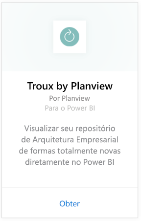
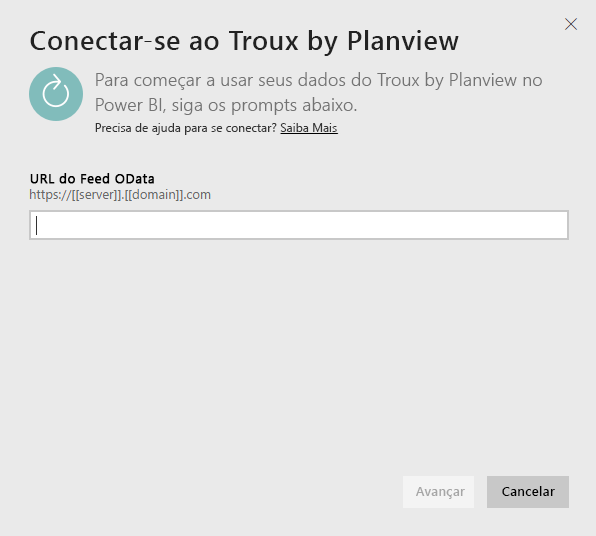
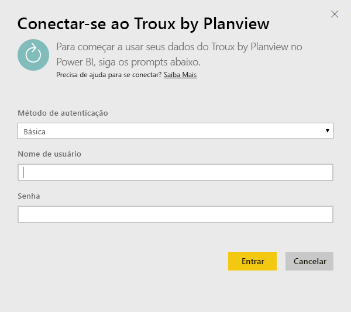

# Conectar-se ao Troux para Power BI
Com o pacote de conteúdo do Troux, você pode visualizar seu repositório de Arquitetura Empresarial de formas totalmente novas diretamente no Power BI. O pacote de conteúdo oferece um conjunto de informações sobre seus recursos de negócios, os aplicativos que fornecem esses recursos e as tecnologias que dão suporte a esses aplicativos que podem ser totalmente personalizadas usando o Power BI.

Conecte-se ao [pacote de conteúdo do Troux](https://app.powerbi.com/getdata/services/troux) para o Power BI.

## Como se conectar
1. Selecione **Obter Dados** na parte inferior do painel de navegação esquerdo.
   
   
2. Na caixa **Serviços** , selecione **Obter**.
   
   
3. Selecione **Troux** \>  **Obter**.
   
   
4. Especifique a URL do OData do Troux. Veja detalhes sobre como [encontrar esses parâmetros](#FindingParams) abaixo.
   
   
5. Para o **Método de Autenticação**, selecione **Básico** e forneça seu nome de usuário e sua senha (diferencia maiúsculas de minúsculas) e selecione **Entrar**.
   
    
6. Após a aprovação, o processo de importação será iniciado automaticamente. Quando concluído, um novo painel, relatório e modelo aparecerão no Painel de Navegação. Selecione o painel para exibir os dados importados por você.
   
     

**E agora?**

* Tente [fazer uma pergunta na caixa de P e R](power-bi-q-and-a.md) na parte superior do dashboard
* [Altere os blocos](service-dashboard-edit-tile.md) no dashboard.
* [Selecione um bloco](service-dashboard-tiles.md) para abrir o relatório subjacente.
* Enquanto seu conjunto de dados será agendado para ser atualizado diariamente, você pode alterar o agendamento de atualização ou tentar atualizá-lo sob demanda usando **Atualizar Agora**

## Requisitos de sistema
É necessário o acesso ao feed OData do Troux e o Troux 9.5.1 ou posterior.

## Localizando parâmetros
Sua equipe de Atendimento a Clientes pode fornecer a URL do feed OData do Troux exclusiva para você

## Solução de problemas
Se vir um erro de tempo limite depois de fornecer as credenciais, tente se conectar novamente.

## Próximas etapas
[Introdução ao Power BI](service-get-started.md)

[Obter dados no Power BI](service-get-data.md)

