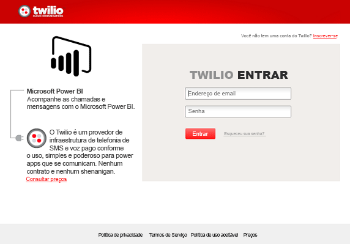
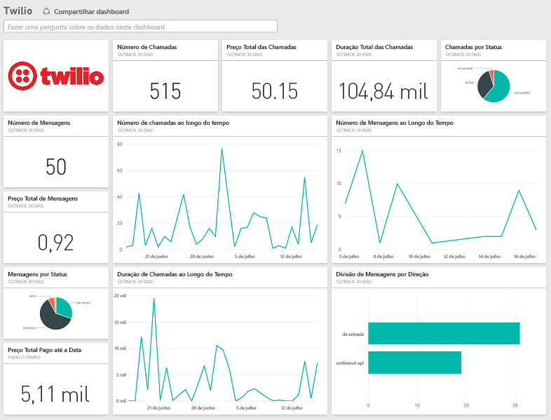

# Conectar-se ao Twilio com o Power BI
O pacote de conteúdo do Microsoft Twilio para o Power BI permite que você efetue pull de seus dados para o Power BI e cria um [painel do Twilio](https://powerbi.microsoft.com/integrations/twilio) e um relatório prontos para uso que mostram informações sobre seus dados. Também é possível criar seus relatórios e painel personalizados com base no conjunto de dados criado pelo Power BI. Os dados serão atualizados uma vez por dia, para que você veja sempre os dados mais recentes.

Conecte-se ao [pacote de conteúdo do Twilio](https://app.powerbi.com/getdata/services/twilio) para o Power BI.

## Como se conectar
1. Selecione **Obter Dados** na parte inferior do painel de navegação esquerdo.
   
    
2. Na caixa **Serviços** , selecione **Obter**.
   
    
3. Selecione **Twilio** \> **Obter**.
   
   
4. Para o **Método de Autenticação**, selecione **oAuth2** \> Entrar. Quando solicitado, forneça suas credenciais do Twilio e autorize o aplicativo Power BI a acessar seus dados.
   
   
5. Isso iniciará a importação de dados de sua conta do Twilio, e você terá seu painel preenchido com sua utilização de chamadas e mensagens dos últimos 30 dias. 
   
   

**E agora?**

* Tente [fazer uma pergunta na caixa de P e R](power-bi-q-and-a.md) na parte superior do dashboard
* [Altere os blocos](service-dashboard-edit-tile.md) no dashboard.
* [Selecione um bloco](service-dashboard-tiles.md) para abrir o relatório subjacente.
* Enquanto seu conjunto de dados será agendado para ser atualizado diariamente, você pode alterar o agendamento de atualização ou tentar atualizá-lo sob demanda usando **Atualizar Agora**

## O que está incluído
Os detalhes de todas as transações de mensagens e chamadas dos últimos 30 dias. Você pode fazer todos os tipos de agregação e análise desses dados.

Um conjunto de estatísticas já agregadas, que talvez você queira monitorar. Esse conjunto inclui:

        All Time Calls Count  
        All Time Calls Duration  
        All Time Calls Price  
        All Time Messages Price  
        All Time Messages Count  
        All Time Count of Phone Numbers  
        All Time Price of Phone Numbers  
        All Time Twilio Client Calls Price  
        All Time Twilio Client Calls Duration  
        All Time Twilio Client Calls Count  
        All Time Total Price  
        All Time Inbound Calls Price  
        All Time Inbound Calls Duration  
        All Time Inbound Calls Count  
        All Time Outbound Calls Price  
        All Time Outbound Calls Duration  
        All Time Outbound Calls Count  
        This Month Calls Price  
        This Month Calls Duration  
        This Month Calls Count  
        This Month Messages Count  
        This Month Messages Price  
        This Month Count of Phone Numbers  
        This Month Price of Phone Numbers  
        This Month Twilio Client Calls Price  
        This Month Twilio Client Calls Duration  
        This Month Twilio Client Calls Count  
        This Month Total Price  
        This Month Inbound Calls Price  
        This Month Inbound Calls Duration  
        This Month Inbound Calls Count  
        This Month Outbound Calls Price  
        This Month Outbound Calls Duration  
        This Month Outbound Calls Count  
        This Month Inbound Messages Price  
        This Month Inbound Messages Count  
        This Month Outbound Messages Price  
        This Month Outbound Messages Count

## Solução de problemas
Se você tem uma grande quantidade de dados nos últimos 30 dias (centenas de milhares de transações), a etapa de coleta de dados pode falhar. Estamos cientes do problema e trabalhando para solucioná-lo. Enquanto isso, se você tiver esse problema, use o link de suporte na parte superior da página do Power BI para nos informar a respeito e vamos contatá-lo para averiguações adicionais.

## Próximas etapas
[Introdução ao Power BI](service-get-started.md)

[Obter dados no Power BI](service-get-data.md)

