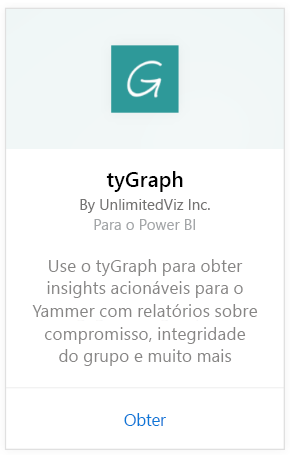
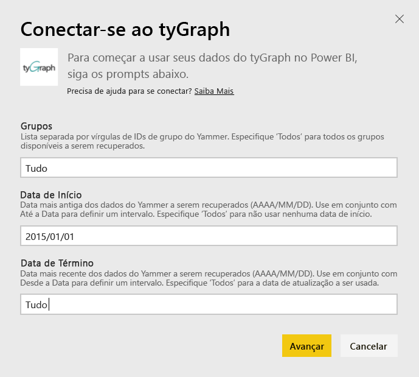
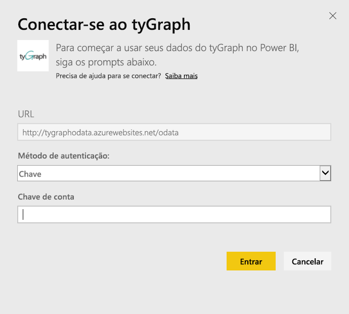
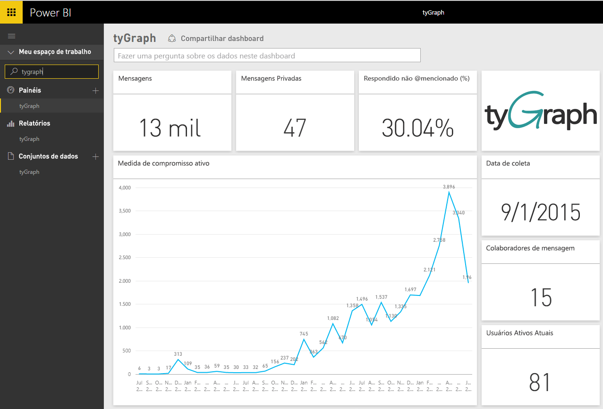
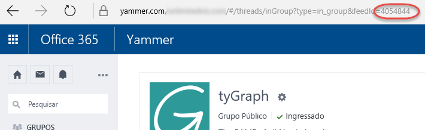

# Conectar-se ao tyGraph com o Power BI
Visualize e explore seus dados do tyGraph no Power BI com o pacote de conteúdo para o Power BI. Comece conectando-se à sua conta do tyGraph e carregando o painel, relatórios e conjunto de dados. O conteúdo pronto para uso inclui informações, como a pontuação MAE (Medida de Envolvimento Ativo) e Principais Colaboradores. Personalize ainda mais para realçar as informações mais importantes para você.  Os dados serão atualizados automaticamente de acordo com um agendamento definido.

Conecte-se ao [tyGraph para o Power BI](https://app.powerbi.com/getdata/services/tygraph).

## Como se conectar
1. Selecione **Obter Dados** na parte inferior do painel de navegação esquerdo.
   
   
2. Na caixa **Serviços** , selecione **Obter**.
   
   
3. Selecione **tyGraph** \> **Obter**.
   
   
4. Especifique os grupos e o intervalo de tempo aos quais deseja se conectar; caso contrário, especifique “Tudo” para exibir todos os dados. Observe o formato de data esperado (AAAA/MM/DD). Veja detalhes sobre [como encontrar os parâmetros](#FindingParams) abaixo.
   
   
5. Forneça a chave do tyGraph para se conectar. Veja detalhes sobre como encontrar este valor abaixo.
   
    **Se você é um Administrador Verificado do Yammer**  
    Sua chave de API será enviada em um email quando sua conta do tyGraph for criada com êxito. Se você não pode mais localizar sua chave, solicite uma nova enviando um email para support@unlimitedviz.com. Se ainda não tiver uma conta do tyGraph, inicie uma versão de avaliação em [http://www.tygraph.com/](http://www.tygraph.com/). 
   
    **Se você não é um Administrador Verificado do Yammer**
   
    O pacote de conteúdo do tyGraph requer uma conta do tyGraph criada por um administrador verificado do Yammer. Depois de criadas, as chaves complementares podem ser emitidas para usuários dentro da mesma organização. Se o seu administrador verificado ainda não tiver criado uma conta do tyGraph, entre em contato com eles solicitando que eles criem uma. Se eles tiverem criado uma conta, será possível solicitar uma chave enviando um email para <mailto:support@unlimitedviz.com>.
   
    
6. Após a autenticação bem-sucedida, o processo de importação será iniciado automaticamente. Quando concluído, um novo painel, relatório e modelo aparecerão no Painel de Navegação. Selecione o painel para exibir os dados importados por você.
   
    

**E agora?**

* Tente [fazer uma pergunta na caixa de P e R](power-bi-q-and-a.md) na parte superior do dashboard
* [Altere os blocos](service-dashboard-edit-tile.md) no dashboard.
* [Selecione um bloco](service-dashboard-tiles.md) para abrir o relatório subjacente.
* Enquanto seu conjunto de dados será agendado para ser atualizado diariamente, você pode alterar o agendamento de atualização ou tentar atualizá-lo sob demanda usando **Atualizar Agora**

## Localizando parâmetros
É possível importar dados em todos os grupos aos quais você tem acesso ou escolher para especificar um subconjunto. Você também pode criar um subconjunto de dados por data. É possível criar vários painéis do tyGraph para monitorar conjuntos específicos de grupos e/ou datas. Veja abaixo os detalhes sobre esses parâmetros.

**Grupos**

A API do tyGraph pode filtrar dados por uma ID de grupo específica. Eles são fornecidos para o pacote de conteúdo em uma lista separada por vírgulas. 

    Example: 2427647,946595,1154464

Você pode identificar a ID de grupo de um grupo específico no Yammer navegando até o feed do grupo e examinando a URL.

No exemplo acima, a ID de Grupo do Yammer é 4054844

**Data de início**

A Data de Início permite restringir o valor mais antigo para os dados retornados. Somente os dados criados nessa data ou após ela será carregados no pacote de conteúdo. O formato da Data de Início é AAAA/MM/DD. 

    Example: 2013/10/29

No exemplo acima, todos os dados de 29 de outubro de 2013 ou após essa data serão carregados no pacote de conteúdo. 

**Data de Término** A Data de Término permite restringir o valor mais recente para os dados retornados. Ela pode ser usada em conjunto com a data de Início para carregar dados de um intervalo de datas. Somente os dados criados nessa data ou antes dela será carregados no pacote de conteúdo. O formato da Data de Término é AAAA/MM/DD. 

    Example: 2014/10/20

No exemplo acima, todos os dados de 20 de outubro de 2014 ou antes dessa data serão carregados no pacote de conteúdo. 

## Próximas etapas
[Introdução ao Power BI](service-get-started.md)

[Obter dados no Power BI](service-get-data.md)

