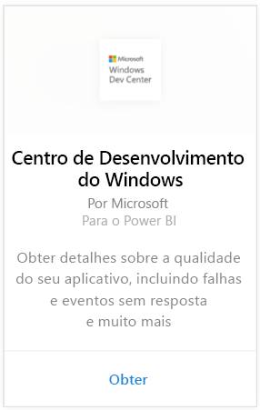
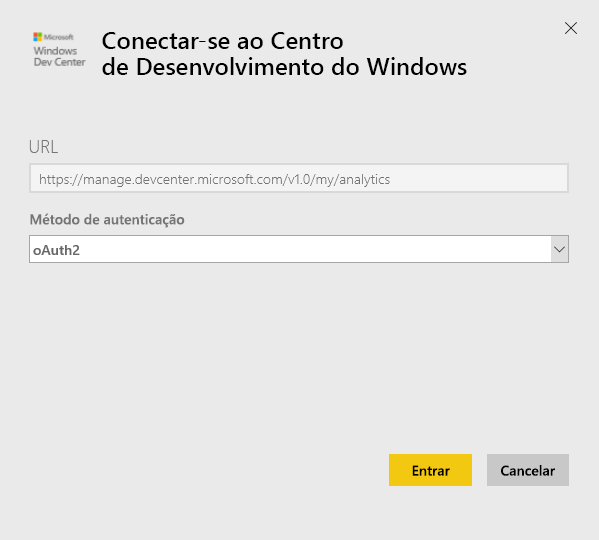
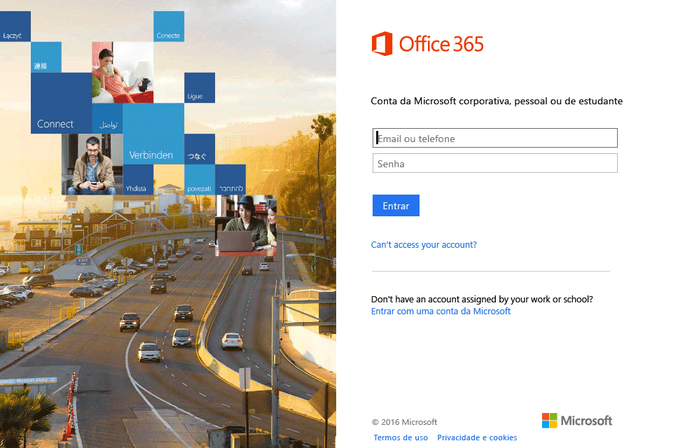
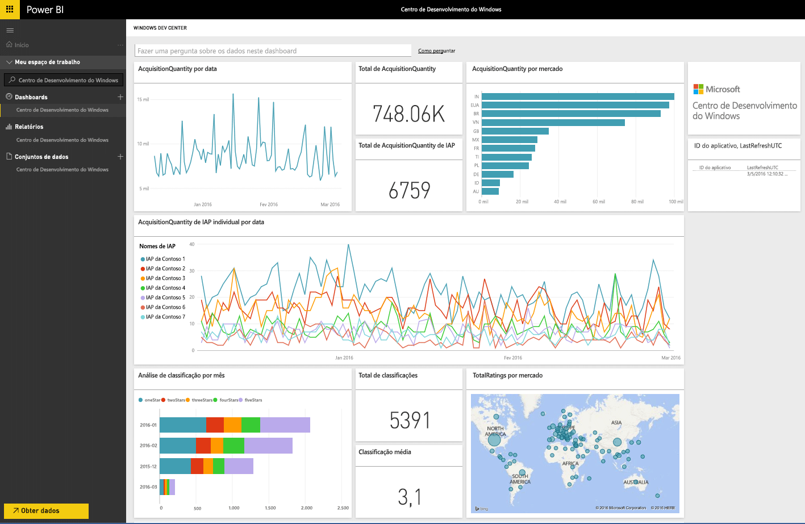
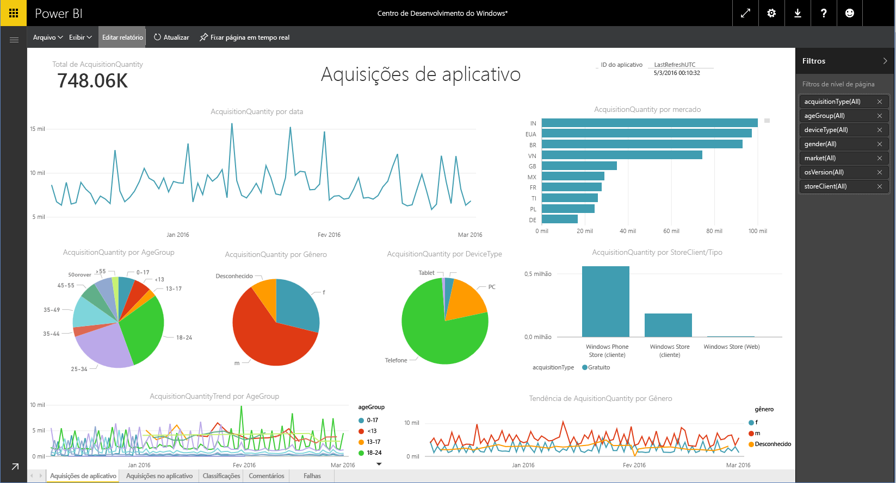

# Conectar-se ao Centro de Desenvolvimento do Windows com o Power BI
Explore e monitore seus dados de análise de aplicativo do Centro de Desenvolvimento do Windows no Power BI com o pacote de conteúdo do Power BI. Os dados serão atualizados automaticamente uma vez por dia.

Conecte-se ao [pacote de conteúdo do Centro de Desenvolvimento do Windows](https://app.powerbi.com/getdata/services/devcenter) para Power BI.

## Como se conectar
1. Selecione **Obter Dados** na parte inferior do painel de navegação esquerdo.
   
   
2. Na caixa **Serviços** , selecione **Obter**.
   
   
3. Selecione **Centro de Desenvolvimento do Windows** \> **Conectar**.
   
   
4. Insira a ID do aplicativo de um aplicativo que você possui e clique em Avançar. Veja detalhes sobre como [encontrar esses parâmetros](#FindingParams) abaixo.
   
   
5. Para o **Método de Autenticação**, selecione **oAuth2** \> **Entrar**. Quando solicitado, insira as credenciais do Azure Active Directory associadas à sua conta do Centro de Desenvolvimento do Windows (mais detalhes em [Requisitos de Sistema](#Requirements)).
   
    
   
    
6. Após a aprovação, o processo de importação será iniciado automaticamente. Quando concluído, um novo painel, relatório e modelo aparecerão no Painel de Navegação. Selecione o painel para exibir os dados importados e escolha um bloco para navegar até os relatórios subjacentes.
   
    
   
    

**E agora?**

* Tente [fazer uma pergunta na caixa de P e R](service-q-and-a.md) na parte superior do dashboard
* [Altere os blocos](service-dashboard-edit-tile.md) no dashboard.
* [Selecione um bloco](service-dashboard-tiles.md) para abrir o relatório subjacente.
* Enquanto seu conjunto de dados será agendado para ser atualizado diariamente, você pode alterar o agendamento de atualização ou tentar atualizá-lo sob demanda usando **Atualizar Agora**

## O que está incluído
O pacote de conteúdo do Power BI do Centro de Desenvolvimento inclui dados de análise de seu aplicativo e aquisições de IAP, classificações, resenhas e integridade do aplicativo. Os dados são limitados aos últimos 3 meses e é uma janela móvel, portanto as datas inclusas serão atualizadas à medida que o conjunto de dados for atualizado.

## Requisitos de sistema
Este pacote de conteúdo requer pelo menos um aplicativo publicado na Windows Store e uma conta do Centro de Desenvolvimento do Windows (mais detalhes [aqui](https://msdn.microsoft.com/windows/uwp/publish/manage-account-users)).

## Localizando parâmetros
Você pode encontrar a ID de um aplicativo acessando a página Identidade do aplicativo em Gerenciamento do aplicativo.

A ID do aplicativo está no final de sua URL da Windows 10 Store, https://www.microsoft.com/store/apps/ **{applicationId}**

## Próximas etapas
[Introdução ao Power BI](service-get-started.md)

[Obter dados no Power BI](service-get-data.md)

