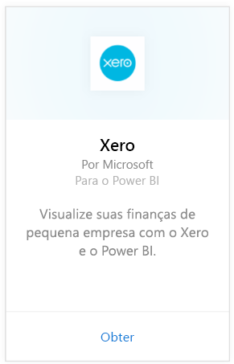
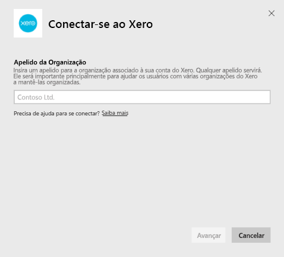
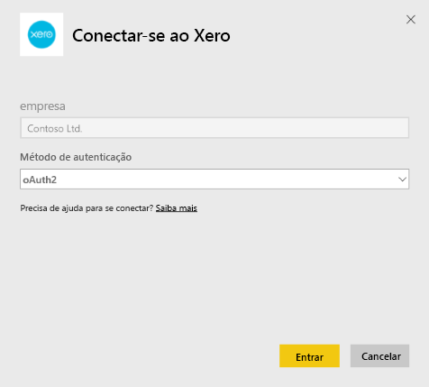
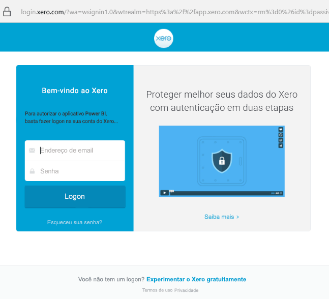
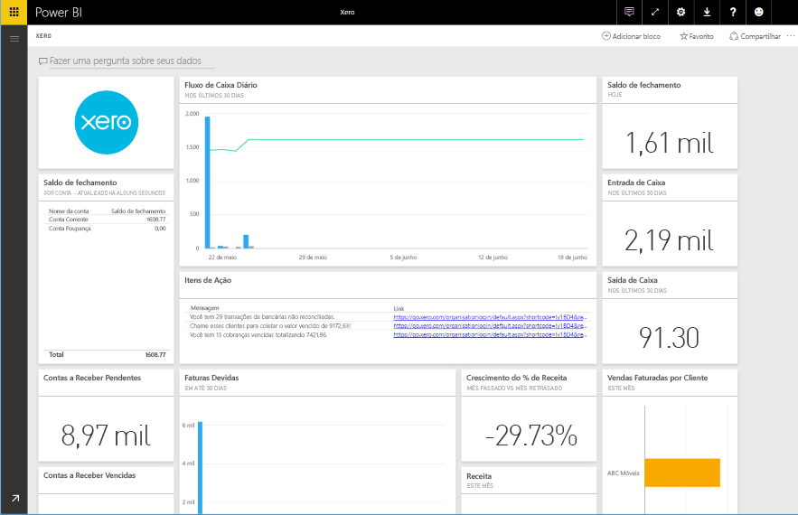

# Conectar-se ao Xero com o Power BI
O Xero é um software de contabilidade online fácil de usar, criado especificamente para pequenas empresas. Crie visualizações interessantes com base em seus dados financeiros do Xero com este pacote de conteúdo do Power BI. O dashboard padrão inclui várias métricas de pequenas empresas, como posição de caixa, receita versus despesas, tendência de perda de lucros, períodos médios de cobrança e retorno sobre o investimento.

Conecte-se ao [pacote de conteúdo do Xero](https://app.powerbi.com/getdata/services/xero) para o Power BI ou saiba mais sobre a integração do [Xero e o Power BI](https://help.xero.com/Power-BI).

## Como se conectar
1. Selecione **Obter Dados** na parte inferior do painel de navegação esquerdo.
   
   
2. Na caixa **Serviços** , selecione **Obter**.
   
   
3. Selecione **Xero** \> **Obter**.
   
   
4. Insira um apelido para a organização associado à sua conta do Xero. Você poderá usar qualquer um. Ele servirá principalmente para ajudar os usuários com várias organizações do Xero a mantê-las organizadas. Veja detalhes [abaixo](#FindingParams).
   
   
5. Como o **Método de Autenticação**, selecione **OAuth**, quando solicitado, faça logon em sua conta do Xero e selecione a organização à qual você deseja se conectar. Após a conclusão do logon, selecione **Entrar** para iniciar o processo de carregamento.
   
    
   
    
6. Após a aprovação, o processo de importação será iniciado automaticamente. Quando concluído, um novo painel, relatório e modelo aparecerão no Painel de Navegação. Selecione o painel para exibir os dados importados por você.
   
     

**E agora?**

* Tente [fazer uma pergunta na caixa de P e R](power-bi-q-and-a.md) na parte superior do dashboard
* [Altere os blocos](service-dashboard-edit-tile.md) no dashboard.
* [Selecione um bloco](service-dashboard-tiles.md) para abrir o relatório subjacente.
* Enquanto seu conjunto de dados será agendado para ser atualizado diariamente, você pode alterar o agendamento de atualização ou tentar atualizá-lo sob demanda usando **Atualizar Agora**

## O que está incluído
O dashboard do pacote de conteúdo inclui blocos e métricas que abrangem uma variedade de áreas, com relatórios correspondentes para saber mais:  

| Área | Blocos do Dashboard | Relatório |
| --- | --- | --- |
| Caixa |Fluxo de caixa diário  Entrada de caixa  Saída de caixa  Saldo de fechamento por conta  Saldo de fechamento hoje |Contas Bancárias |
| Cliente |Vendas faturadas  Vendas faturadas por cliente  Tendência de crescimento das vendas faturadas  Faturas devidas  Contas a receber pendentes  Contas a receber vencidas |Cliente  Inventário |
| Fornecedor |Compras cobradas  Compras cobradas por fornecedor  Tendência de crescimento das compras cobradas   Cobranças devidas  Contas a pagar pendentes  Contas a pagar vencidas |Fornecedores  Inventário |
| Inventário |Quantidade de vendas mensais por produto |Inventário |
| Lucros e perdas |Lucros e perdas mensais  Lucro líquido neste ano fiscal  Lucro líquido neste mês  Principais contas de despesas |Lucros e perdas |
| Balanço |Total de ativos  Total de passivos  Capital próprio |Balanço |
| Integridade |Índice atual  Percentual de lucro bruto   Retorno sobre o total de ativos  Índice total de passivos/capital próprio |Integridade  Glossário e Observações técnicas |

O conjunto de dados também inclui as seguintes tabelas para personalizar seus relatórios e dashboards:  

* Endereços  
* Alertas  
* Saldo Diário do Extrato Bancário  
* Extratos Bancários  
* Contatos  
* Declarações de despesas  
* Itens de linha da fatura  
* Faturas  
* Itens  
* Final do Mês  
* Organização  
* Balancete  
* Contas do Xero

## Requisitos de sistema
As seguintes funções são necessárias para acessar o pacote de conteúdo do Xero: “Padrão + Relatórios” ou “Supervisor”.

## Localizando parâmetros
Forneça um nome para sua organização para acompanhá-la no Power BI. Isso permite que você se conecte a várias organizações diferentes. Observe que não é possível se conectar à mesma empresa várias vezes, pois isso afeta a atualização agendada.   

## Solução de problemas
* Os usuários do Xero devem ter as funções a seguir para acessar o pacote de conteúdo do Xero para o Power BI: “Padrão + Relatórios” ou “Supervisor”. O pacote de conteúdo depende das permissões baseadas no usuário para acessar os dados de relatórios por meio do Power BI.  
* Se você receber uma falha após o carregamento por algum tempo, verifique quanto tempo demorou para ver a mensagem de erro. Observe que o token de acesso fornecido pelo Xero só é válido por 30 minutos. Portanto, as contas com mais dados do que pode ser carregado no período de tempo apresentarão falha. Estamos trabalhando ativamente para resolver esse problema.
* Durante o carregamento, os blocos no dashboard estarão em um estado de carregamento genérico. Isso não deve alterar até que o carregamento completo seja concluído. Se você receber uma notificação de que o carregamento foi concluído, mas os blocos ainda estão carregando, tente atualizar os blocos do dashboard usando ... na parte superior direita do dashboard.
* Caso seu pacote de conteúdo não seja atualizado, verifique se você se conectou à mesma organização mais de uma vez no Power BI. O Xero permite apenas uma única conexão ativa a uma organização e você pode ver um erro indicando que suas credenciais serão inválidas se você se conectar à mesma organização mais de uma vez.  
* Em caso de problemas ao se conectar ao pacote de conteúdo do Xero para o Power BI como mensagens de erro ou tempos de carregamento muito lentos, primeiro limpe o cache e os cookies e reinicie o navegador. Em seguida, reconecte-se ao Power BI.  

Caso tenha outras dúvidas, envie um tíquete em http://support.powerbi.com se o problema persistir.

## Próximas etapas
[Introdução ao Power BI](service-get-started.md)

[Obter dados no Power BI](service-get-data.md)

