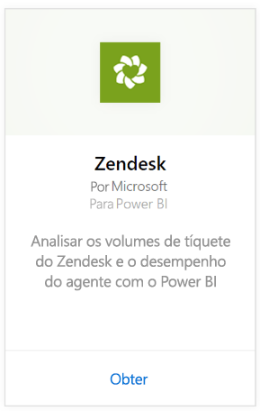
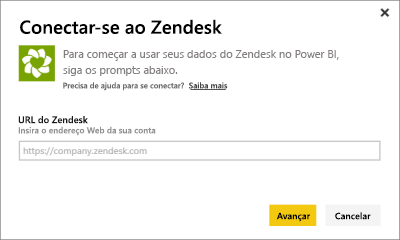
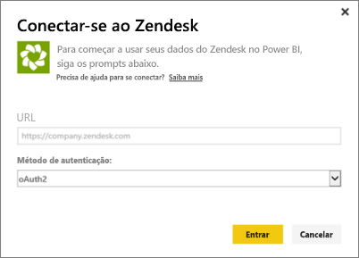
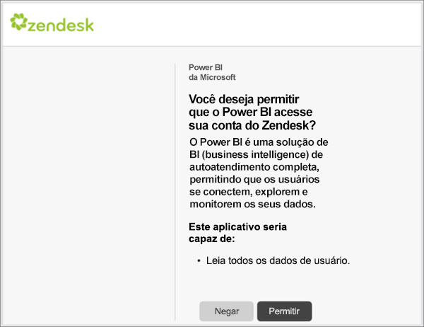

# Conectar-se ao Zendesk com o Power BI
O pacote de conteúdo do Zendesk oferece um painel e um conjunto de relatórios do Power BI que fornecem informações sobre os volumes de tíquetes e o desempenho do agente. Você pode usar o painel e os relatórios como fornecidos, ou então personalizá-los para realçar as informações que mais importam a você.  Os dados serão atualizados automaticamente uma vez por dia. 

Conecte-se ao [pacote de conteúdo do Zendesk](https://app.powerbi.com/getdata/services/zendesk) ou leia mais sobre a [Integração do Zendesk](https://powerbi.microsoft.com/integrations/zendesk) com o Power BI.

>[!NOTE]
>Uma conta de administrador do Zendesk é necessária para se conectar. Mais detalhes sobre os [requisitos](#Requirements) abaixo.

## Como se conectar
1. Selecione **Obter Dados** na parte inferior do painel de navegação esquerdo.
   
   
2. Na caixa **Serviços** , selecione **Obter**.
   
    
3. Selecione **Zendesk** \> **Obter.**
   
   
4. Forneça a URL associada à sua conta. Isso terá o formato **https://company.zendesk.com**; veja detalhes sobre como [encontrar esses parâmetros](#FindingParams) abaixo.
   
   
5. Quando solicitado, insira suas credenciais do Zendesk.  Selecione **oAuth 2** como o Mecanismo de Autenticação e clique em **Entrar**. Siga o fluxo de autenticação do Zendesk. (Se você já tiver entrado no Zendesk em seu navegador, talvez suas credenciais não sejam solicitadas.)
   
   > [!NOTE]
   > Esse pacote de conteúdo requer conexão com uma conta de administrador do Zendesk. 
   > 
   > 
   
   
6. Clique em **Permitir** para permitir que o Power BI acesse seus dados do Zendesk.
   
   
7. Clique em **Conectar** para iniciar o processo de importação. Depois que o Power BI importar os dados, você verá um novo painel, relatório e conjunto de dados no painel de navegação esquerdo. Novos itens são marcados com um asterisco amarelo \*.
   
   

**E agora?**

* Tente [fazer uma pergunta na caixa de P e R](power-bi-q-and-a.md) na parte superior do dashboard
* [Altere os blocos](service-dashboard-edit-tile.md) no dashboard.
* [Selecione um bloco](service-dashboard-tiles.md) para abrir o relatório subjacente.
* Enquanto seu conjunto de dados será agendado para ser atualizado diariamente, você pode alterar o agendamento de atualização ou tentar atualizá-lo sob demanda usando **Atualizar Agora**

## O que está incluído
O pacote de conteúdo do Power BI inclui dados sobre o seguinte:  

* Usuários (usuários finais e agentes)  
* Organizações  
* Grupos  
* Tíquetes  

Há também um conjunto de medidas que foram calculadas, como tempo médio de espera e tíquetes resolvidos nos últimos sete dias. Uma lista completa está incluída no pacote de conteúdo.

## Requisitos de sistema
Uma conta de administrador do Zendesk é necessária para acessar o pacote de conteúdo do Zendesk. Se você é um agente ou um usuário final e estiver interessado em ver seus dados no Zendesk, adicione uma sugestão e examine o conector do Zendesk no [Power BI Desktop](desktop-connect-to-data.md).

## Localizando parâmetros
A URL do Zendesk será igual à URL que você usa para se conectar em sua conta do Zendesk. Se você não lembrar da URL do Zendesk, use a [ajuda de logon](https://www.zendesk.com/login/) do Zendesk.

## Solução de problemas
Se você estiver com problemas para se conectar, verifique a URL do Zendesk e confirme que está usando uma conta de administrador do Zendesk.

## Próximas etapas
* [Introdução ao Power BI](service-get-started.md)
* [Obter dados](service-get-data.md)

