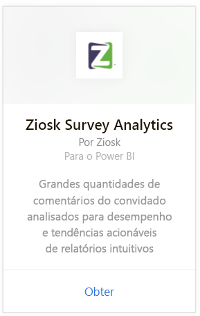
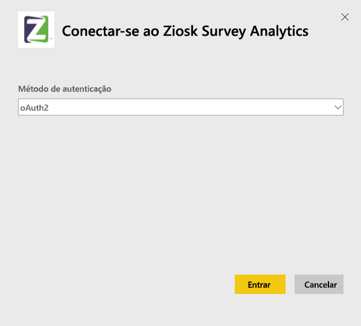
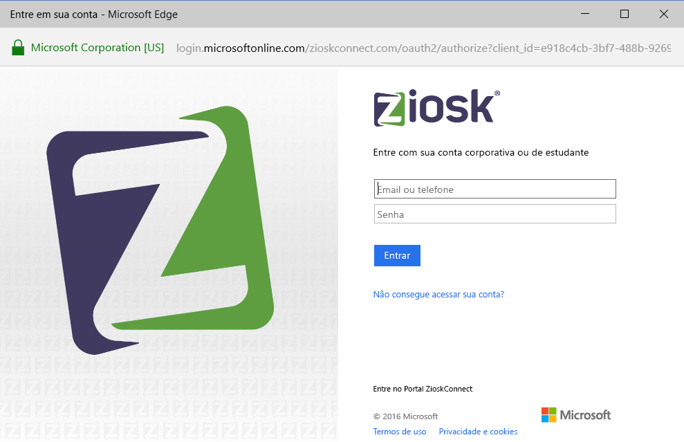
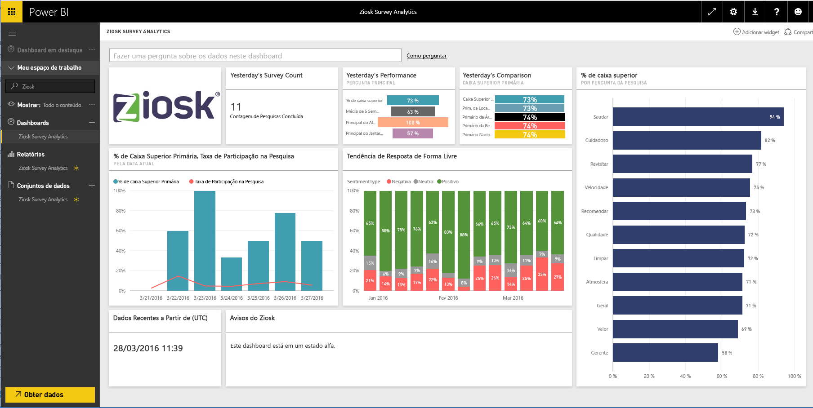

# Conectar-se ao Ziosk Survey Analytics com o Power BI
O pacote de conteúdo do Ziosk Survey Analytics para o Power BI oferece aos restaurantes que disponibilizam tablets do Ziosk acesso incomparável às informações fornecidas pelos dados de pesquisa do Ziosk, incluindo segmentação por dia, local, funcionário e muito mais.

Conecte-se ao [pacote de conteúdo do Ziosk Survey Analytics](https://app.powerbi.com/getdata/services/ziosk-survey-analytics) para o Power BI.

## Como se conectar
1. Selecione **Obter Dados** na parte inferior do painel de navegação esquerdo.  
   
    
2. Na caixa **Serviços** , selecione **Obter**.  
   
    
3. Selecione **Ziosk Survey Analytics** e **Obter**.  
   
    
4. Selecione **OAuth 2** e **Entrar**. Quando solicitado, forneça suas credenciais do Ziosk.
   
    
   
    
5. Depois que você estiver conectado, um dashboard, relatório e conjunto de dados serão carregados automaticamente. Após a conclusão, os blocos serão atualizados com dados de sua conta do Ziosk.
   
    

**E agora?**

* Tente [fazer uma pergunta na caixa de P e R](power-bi-q-and-a.md) na parte superior do dashboard
* [Altere os blocos](service-dashboard-edit-tile.md) no dashboard.
* [Selecione um bloco](service-dashboard-tiles.md) para abrir o relatório subjacente.
* Enquanto seu conjunto de dados será agendado para ser atualizado diariamente, você pode alterar o agendamento de atualização ou tentar atualizá-lo sob demanda usando **Atualizar Agora**

## O que está incluído
O pacote de conteúdo inclui dados das seguintes tabelas:  

    - Categoria dos álcoois  
    - Categoria de aperitivos  
    - CommentKeywords  
    - Date  
    - Período do dia  
    - Categoria de sobremesas  
    - Forma livre  
    - Categoria infantil  
    - Mensagens  
    - Categoria de conteúdo Premium  
    - Pergunta  
    - Repositório  
    - Pesquisas  
    - Dia da semana  

## Requisitos de sistema
É necessário ter uma conta do Ziosk com permissões de acesso às tabelas acima para criar uma instância deste pacote de conteúdo.

## Próximas etapas
[Introdução ao Power BI](service-get-started.md)

[Power BI – conceitos básicos](service-basic-concepts.md)

