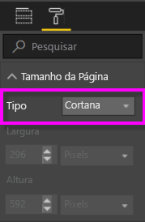
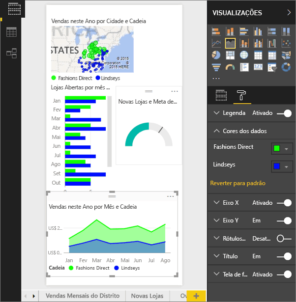
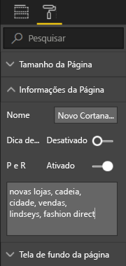
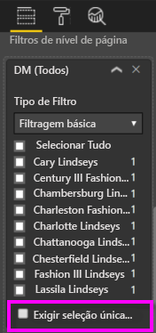

# Use o serviço do Power BI Desktop para criar uma Página de Resposta personalizada para a Cortana
Use os recursos completos do Power BI para criar páginas de relatório especiais chamadas *Páginas de respostas da Cortana* (e, às vezes, chamadas de *Cartões de respostas da Cortana*) projetadas especialmente para responder perguntas sobre a Cortana.

> [!IMPORTANT]
> Se estiver experimentando a versão prévia da Cortana e do **dashboard** do Power BI, você poderá ignorar o restante deste artigo. Não há nenhum requisito de instalação para a Cortana poder pesquisar dashboards do Power BI.
> 
> 

## Antes de começar
Há quatro documentos para orientá-lo durante a configuração e o uso da Cortana para o Power BI. Comece lendo o artigo 1, caso ainda não tenha lido. O artigo 2 é importante principalmente porque descreve algumas etapas que você precisará seguir antes de começar a usar as páginas de respostas da Cortana.

**Artigo 1**: [Saiba como a Cortana e o Power BI funcionam juntos](service-cortana-intro.md)

**Artigo 2**: [Para pesquisar nos relatórios do Power BI: habilitar a integração entre Cortana – Power BI – Windows](service-cortana-enable.md)

**Artigo 3**: Este artigo

**Artigo 4**: [Solucionar problemas](service-cortana-troubleshoot.md)

## Criar uma página de respostas da Cortana desenvolvida especialmente para a Cortana
Uma *Página de respostas da Cortana* em um relatório é dimensionada especificamente para a Cortana, para que ela possa mostrá-la na tela como uma resposta à pergunta. Para criar uma página de resposta para a Cortana:

1. É recomendável começar com uma [página de relatório em branco](power-bi-report-add-page.md).
2. No painel **Visualizações**, selecione o ícone de rolo de pintura e escolha **Tamanho da Página** > **Tipo** > **Cortana**.
   
    
3. Crie um visual ou um conjunto de visuais que você deseja que apareça no Cortana em resposta a uma pergunta específica (ou a um conjunto de perguntas).
4. Certifique-se de que todos os visuais se ajustem dentro das bordas da página. Opcionalmente, modifique as configurações de exibição, os rótulos de dados, cores e planos de fundo.  
   
    
5. Nomeie a página e adicione nomes alternativos. O Cortana usa esses nomes ao pesquisar resultados. No painel **Visualizações**, selecione o ícone de pincel e escolha **Informações da Página**. Habilite a P e R neste visual movendo o controle deslizante para **Ativado**.
   
    
   
   > [!TIP]
   > Para melhorar os resultados, evite usar palavras que também sejam nomes de coluna.
   > 
   > 
6. Opcionalmente, se o relatório tiver filtros de nível de página, você poderá querer definir **Exigir a seleção única**. O Cortana só exibirá este relatório como uma resposta se um, e somente um, dos itens do filtro for especificado na pergunta. **Exigir a seleção única** pode ser encontrado na parte inferior do painel **Filtros**.
   
   > [!NOTE]
   > Você não precisa definir **Exigir seleção única** para pedir para a Cortana exibir um relatório com filtros de nível de página. Por exemplo “Mostrar as vendas de Charlotte Lindseys” exibirá a página de resposta, independentemente da configuração Requer Seleção Única.
   > 
   > 
   
     
   
      Por exemplo, se você perguntar ao Cortana:
   
   * “mostrar vendas por nome da loja”, essa página de resposta não aparecerá porque você não incluiu nenhum dos itens do filtro no nível da página necessário.
   * “mostrar vendas para Clara Barbosa e Lara Cardoso”, essa página de resposta não aparecerá porque você especificou mais de um item do filtro no nível da página necessário.
   * “mostrar vendas de Lara Cardoso”, essa página de resposta aparecerá.
     
     = “mostrar vendas”, essa página de resposta não aparecerá porque você não incluiu nenhum dos itens do filtro no nível da página necessário.

> [!IMPORTANT]
> Antes que a página de resposta da Cortana possa ser acessada pela Cortana, você precisará [Habilitar o conjunto de dados para a Cortana](service-cortana-enable.md).
> 
> 

## Como o Cortana ordena os resultados?
Os resultados com respostas com pontuação alta (como uma correspondência completa de um nome de página especificado) aparecerão primeiro como uma *melhor correspondência* na Cortana. Várias melhores correspondências poderão aparecer se houver várias páginas de respostas da Cortana no Power BI. As respostas com pontuação média ou baixa, como respostas que não se baseiam no nome de uma página de respostas ou uma pergunta com palavras que o Power BI não entendeu, são listadas como links abaixo das melhores correspondências na Cortana.

> [!NOTE]
> Quando um novo conjunto de dados ou uma nova página de respostas personalizada da Cortana é adicionada ao Power BI e habilitada para a Cortana, pode levar até 30 minutos para que os resultados comecem a aparecer na Cortana. Fazer logon e logoff do Windows 10 ou reiniciar de outra forma o processo da Cortana no Windows 10, permitirá que o novo conteúdo seja exibido imediatamente.
> 
> 

## Próximas etapas
[Usando o Cortana com o Power BI](service-cortana-intro.md)

Ainda não consegue fazer com que a Cortana funcione com o Power BI?  Experimente a [solução de problemas da Cortana](service-cortana-troubleshoot.md).

Mais perguntas? [Experimente a Comunidade do Power BI](http://community.powerbi.com/)

