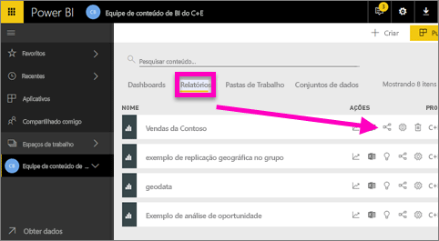
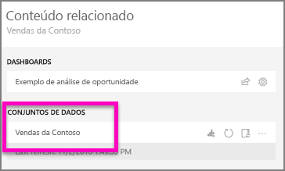
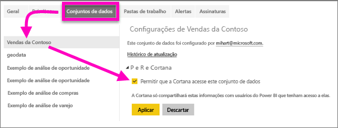
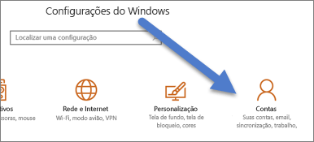
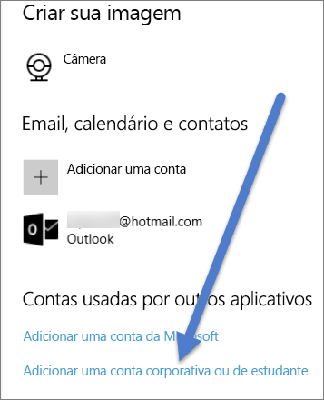

# Habilitar a Cortana para acessar os relatórios do Power BI (e seus conjuntos de dados subjacentes)
Você já leu a [Introdução à Cortana e ao Power BI](service-cortana-intro.md) (se não, convém lê-la primeiro e depois voltar). E agora você deseja testá-la por conta própria.  Antes de fazer perguntas em linguagem natural na Cortana e encontrar respostas nos dados armazenados nos ***relatórios*** do Power BI, há alguns requisitos. Especificamente, você precisará fazer o seguinte.

> [!NOTE]
> Se estiver experimentando a versão prévia da Cortana e do ***dashboard*** do Power BI, você poderá ignorar o restante deste artigo. Não há nenhum requisito de instalação para a Cortana poder pesquisar dashboards do Power BI.
> 
> 

No serviço do Power BI,

* habilitar um ou mais conjuntos de dados para a Cortana (os relatórios são criados sobre os conjuntos de dados, para que a Cortana precise ter acesso a esses conjuntos de dados)

No Microsoft Windows,

* verifique se você está executando o Windows 10 versão 1511 ou posterior
* Confirme se o Power BI e o Windows podem "conversar" um com o outro. Isso significa conectar sua conta com o Windows.

## Usar o serviço do Power BI para permitir que a Cortana acesse as páginas de relatório no Power BI
A habilitação dos relatórios no Power BI para que eles sejam acessados pela Cortana é um processo simples.  Na verdade, tudo o que você precisa fazer é habilitar o conjunto de dados subjacente do relatório selecionando “Habilitar Cortana para acessar este conjunto de dados”. Depois disso, qualquer usuário que tenha acesso ao conjunto de dados no Power BI por meio do compartilhamento regular do Power BI, de aplicativos e recursos do pacote de conteúdo, poderá obter respostas do relatório na Cortana no Windows 10.

Você precisará entrar no serviço do Power BI (não no Power BI Desktop) e repetir essas etapas em cada conjunto de dados para o qual deseja conceder acesso à Cortana.

1. Determine quais conjuntos de dados serão habilitados. Na lista de conteúdo do relatório, selecione o relatório que você deseja que a Cortana acesse e escolha o ícone **Exibir relacionados** .
   
    
2. O conjunto de dados associado a esse relatório é **Vendas da Contoso**.
   
    
3. À direita do nome do conjunto de dados, selecione **reticências (...) > Configurações**.  
   
    
4. Selecione **P e R e Cortana** > **Permitir que a Cortana acesse este conjunto de dados** > **Aplicar**.
   
   
   
   Neste exemplo, habilitamos a Cortana no conjunto de dados Vendas da Contoso.
   
   > [!NOTE]
   > Quando um novo conjunto de dados ou um cartão de respostas da Cortana for adicionado ao Power BI e habilitado na Cortana, poderá levar até 30 minutos para que os resultados comecem a aparecer. O logon e logoff do Windows 10, ou de outra forma reiniciar o processo do Cortana no Windows 10, permitirá que o novo conteúdo seja exibido imediatamente.
   > 
   > Se você habilitar um conjunto de dados para a Cortana e esse conjunto de dados fizer parte de um pacote de conteúdo ou aplicativo seu, você precisará publicar novamente para que seus colegas também possam usá-lo com a Cortana.
   > 
   > 

## Adicionar suas credenciais do Power BI para Windows
Você precisará executar o Windows 10 versão 1511 ou superior.

1. Determine qual versão do Windows 10 você está executando. Abra **Configurações**.
    

    Em seguida, selecione **Sistema > Sobre**. Na parte inferior da tela, você verá **Especificações do Windows > Versão**

   * Se você tiver o Windows 10 versão 1511 (atualização de novembro de 2015 do Windows 10) até a 1607, adicione sua conta corporativa ou de estudante e a conta da Microsoft (conclua as etapas 2 e 3 abaixo).
   * Se você tiver o Windows 10 versão 1607 (atualização de julho de 2016 do Windows 10) ou posterior, adicione sua conta corporativa ou de estudante (conclua apenas a etapa 2 abaixo).
1. Adicione sua conta corporativa ou de estudante da Cortana.
   
   * Abra **Configurações** > **Contas**.
     
       
   * Role para baixo e selecione **Adicionar uma conta corporativa ou de estudante**. Ou, na página **Contas**, selecione **Acessar trabalho ou escola > Conectar**.
     
     

O Cortana usará essa conta corporativa ou de estudante para verificar o Power BI em busca de possíveis respostas para as suas perguntas no Cortana.

## Próximas etapas
[Criar *cartões de respostas* da Cortana no Power BI](service-cortana-answer-cards.md)

[Solucionar problemas de integração da Cortana e do Power BI](service-cortana-troubleshoot.md)

Mais perguntas? [Experimente a Comunidade do Power BI](http://community.powerbi.com/)

