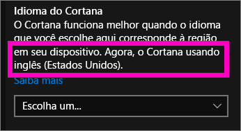
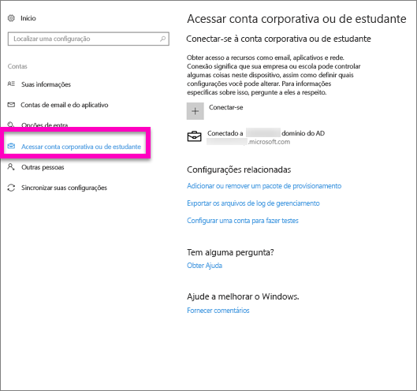
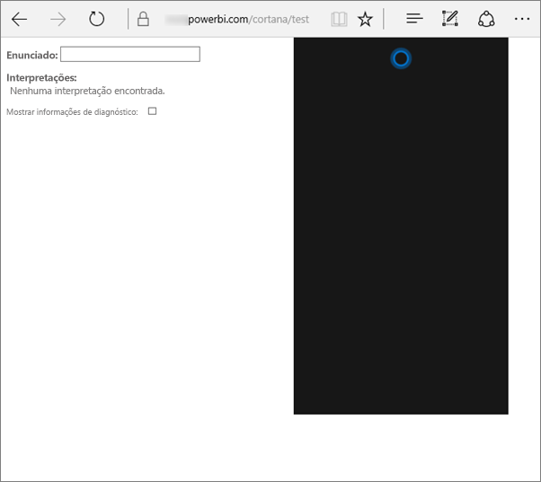
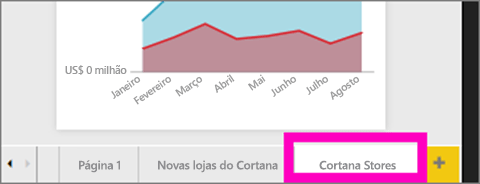
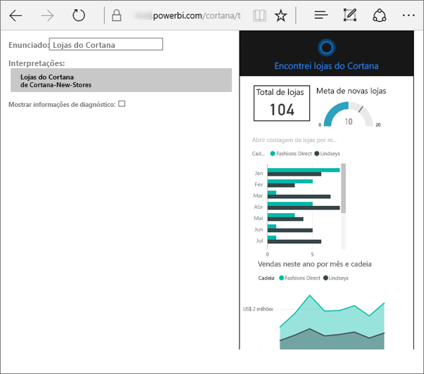
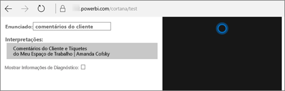

# Solucionar problemas da Cortana para o Power BI
Este artigo faz parte de uma série. Recomendamos que você confira os seguintes artigos, se ainda não os tiver lido.

**Artigo 1**: [Entenda como a Cortana e o Power BI funcionam juntos para pesquisar dashboards e relatórios do Power BI](service-cortana-intro.md)

**Artigo 2**: [Para pesquisar relatórios: habilitar a integração entre Cortana – Power BI – Windows](service-cortana-enable.md)

**Artigo 3**: [Para pesquisar relatórios: criar cartões de respostas especiais da *Cortana*](service-cortana-answer-cards.md)

Se ainda estiver com problemas para integrar a Cortana com o Power BI, você veio ao lugar certo. Siga as etapas abaixo para diagnosticar e corrigir o problema.

## Por que a Cortana não encontra respostas nos meus relatórios ou dashboards do Power BI?
1. Você tem uma conta do Power BI?  Se não tiver, [inscreva-se. É gratuito!](service-self-service-signup-for-power-bi.md).
2. A Cortana está funcionando?  Você vê o ícone da Cortana na barra de tarefas?

    

    Quando você a seleciona, a Cortana abre com um campo no qual você pode digitar?
3. Você usa pelo menos duas palavras na pesquisa? A Cortana precisa de pelo menos duas frases de palavras para encontrar respostas no Power BI. Tente adicionar “mostrar” no início da pergunta.
4. Se o dashboard tiver um título com mais de uma palavra, a Cortana retornará esse dashboard apenas se a pesquisa corresponder a pelo menos duas das palavras. Para um dashboard chamado “Vendas AF16”:

   * “mostrar vendas” *não* retornará um resultado do Power BI.   
   * “mostrar vendas do AF16”, “vendas AF16”, “mostrar vendas AF16” e “mostrar vendas f” *retornarão* um resultado do Power BI.    
   * Adicionar a palavra “powerbi” conta como uma das duas palavras necessárias, portanto “vendas do Power BI” *retornará* resultado do Power BI.
5. Você tem acesso ou permissões para editar os relatórios ou dashboards? Para os relatórios, verifique se o conteúdo que você está tentando pesquisar tem um [cartão de respostas](service-cortana-answer-cards.md).  Para os dashboards, verifique se o conteúdo que você está tentando pesquisar está em **Compartilhado comigo**, um espaço de trabalho do aplicativo ou em **Meu espaço de trabalho**. [Use a ferramenta de solução de problemas](#try-the-cortana-troubleshooting-tool) para ajudar a identificar o problema.
6. Você está usando um dispositivo móvel?  No momento, só há suporte para a integração do Power BI e da Cortana em dispositivos móveis do Windows.
7. A Cortana está configurada para o idioma Inglês?  A integração atual do Power BI com a Cortana tem suporte apenas em inglês. Abra a Cortana e selecione o ícone de engrenagem para exibir as Configurações. Role para baixo até **Idioma da Cortana** e confirme se ela está configurada para uma das opções em Inglês.

   
8. Você tem mais de 100 relatórios habilitados para a Cortana?  A Cortana pesquisa somente até 100 no total.  Para garantir que seu relatório seja incluído, mova ou copie-o para a área **Meu Espaço de Trabalho**, uma vez que a Cortana pesquisará nela primeiro.
9. Talvez você precise esperar um pouco. Na primeira vez que digitar uma consulta, o modelo poderá ficar *inativo*. Aguarde alguns segundos para que os dados possam ser carregado na memória e, então, tente novamente.
10. Para os dashboards, pode levar até 24 horas para que eles se tornem acessíveis à Cortana.    
11. Para os relatórios, quando um novo conjunto de dados ou um cartão de respostas personalizado for adicionado ao Power BI e habilitado para a Cortana, poderá levar até 30 minutos para que os resultados comecem a aparecer na Cortana. Fazer logon e logoff do Windows 10 ou reiniciar o processo da Cortana no Windows 10, permitirá que o novo conteúdo de relatório seja exibido imediatamente.  
12. O administrador do Power BI pode “recusar”. Verifique com seu administrador para ver se este é o caso.

## Somente relatórios: por que a Cortana não encontra respostas nos meus relatórios do Power BI
1. Se estiver procurando por respostas nos relatórios, você tem algum relatório com os **cartões de resposta** da Cortana? Os cartões de respostas são a única maneira que a Cortana pode encontrar respostas nos relatórios do Power BI.  Saiba como criar um cartão de respostas lendo [Create Cortana answer cards in Power BI service and Power BI Desktop](service-cortana-answer-cards.md) (Criar cartões de resposta da Cortana no serviço do Power BI e no Power BI Desktop).
2. Você está executando o Windows versão 1511 ou posterior?  Descubra, abrindo as Configurações do Windows e selecionando **Sistema > Sobre**. Caso contrário, atualize sua versão do Windows.
3. Suas contas do Windows e do Power BI estão conectadas? Isso pode ser confuso. Siga as instruções em [Habilitar a Cortana para o Power BI](service-cortana-enable.md#add-your-power-bi-credentials-to-windows).
4. Os conjuntos de dados subjacentes foram habilitados para a Cortana? Talvez um colega tenha compartilhado um conjunto de dados que já foi habilitado para a Cortana. Mas, se não tiver, [saiba como habilitar os conjuntos de dados para a Cortana por conta própria](service-cortana-enable.md). É rápido e fácil.

## Somente dashboards: por que a Cortana não encontra respostas nos meus dashboards do Power BI
1. Verifique se você está conectado à sua conta corporativa. O Power BI precisa dessa conexão para que possa autenticar suas permissões de acesso aos dados. Para verificar se você está conectado ou não, para conectar sua conta corporativa, use a caixa de pesquisa do Windows para navegar até “Conectar-me à conta escolar ou corporativa”.  

    
2. Você tem acesso à Cortana? Marque a caixa de pesquisa do Windows e conceda permissões de acesso às suas informações para a Cortana.

## Experimente a ferramenta de solução de problemas da Cortana
Ainda está com problemas?  Agora é um bom momento para executar a ferramenta de solução de problemas da Cortana e restringir possíveis problemas.

### Está com problemas para recuperar respostas de um relatório?
1. Para os relatórios, antes de executar a ferramenta de solução de problemas, verifique se você definiu os filtros de **Nível da Página** em seus cartões de respostas da Cortana para **Requerer seleção única**. Para obter ajuda com isso, consulte [Create Cortana answer cards](service-cortana-answer-cards.md) (Criar cartões de respostas da Cortana).
2. Abra a ferramenta de solução de problemas, adicionando "cortana/test" ao final da URL de serviço do Power BI. A URL deve ser semelhante a esta:

   app.powerbi.com/cortana/test

   
3. No campo **Expressão**, para solucionar problemas de relatórios, digite o nome de um cartão de respostas da Cortana ***exatamente como ele aparece na guia Power BI***.

   

    

   
4. Às vezes, na primeira vez que você digitar algo no campo **Expressão**, nada acontecerá. Pense nisso como uma desobstrução do sistema. Você está informando a ferramenta de solução de problemas que é hora de ser ativada. Recorte e cole ou redigite no campo **Expressão** novamente. Neste exemplo, o nome do nosso cartão de respostas é **Armazenamentos da Cortana**. Colar ou digitar **Armazenamentos da Cortana** na ferramenta produz um único resultado que é exibido no campo **Interpretações**. Clique para ver o cartão de respostas exibido na janela da Cortana – neste caso, **Repositórios da Cortana**.

   

   Como temos um resultado, agora sabemos que a Cortana **está** habilitada no Power BI. Isso restringe o problema para algo no lado do Windows, ou na configuração de idioma da Cortana, ou por haver mais de 100 conjuntos de dados habilitados para a Cortana.

### Está com problemas para recuperar respostas de um dashboard?
Procurando por um dashboard que foi compartilhado com você?  Abra o Power BI > **Compartilhado comigo** e localize o nome do dashboard.  Em seguida, digite esse nome no campo **Expressão**.

#### Ferramenta de solução de problemas – Problemas conhecidos
* Se a ferramenta não buscar os resultados da primeira vez, cole a consulta na caixa de texto Expressão.
* A consulta deve ter duas ou mais palavras, intencionalmente.  Se sua consulta for muito curta, adicione a palavra "show".
* Algumas cadeias de consulta com preposições podem não funcionar (por exemplo, vendas por item). Tente termos de consulta diferentes que não utilizam preposições e sejam significativos/exclusivos.

Mais perguntas? [Experimente a Comunidade do Power BI](http://community.powerbi.com/)
