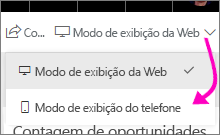
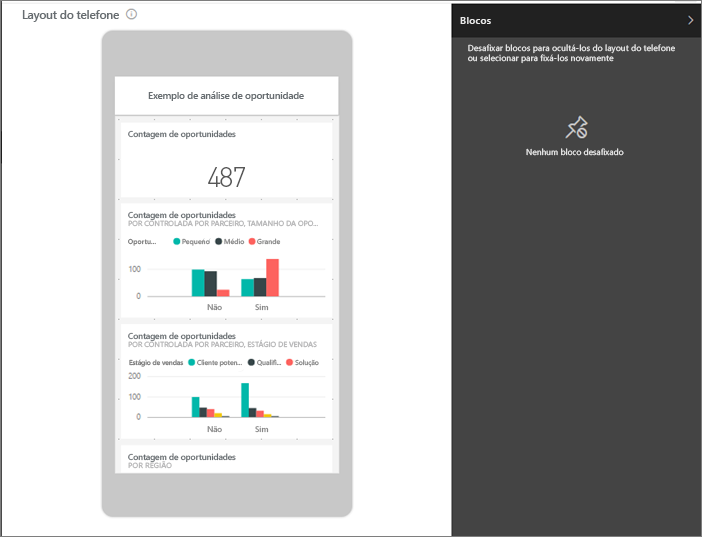
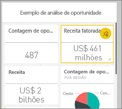
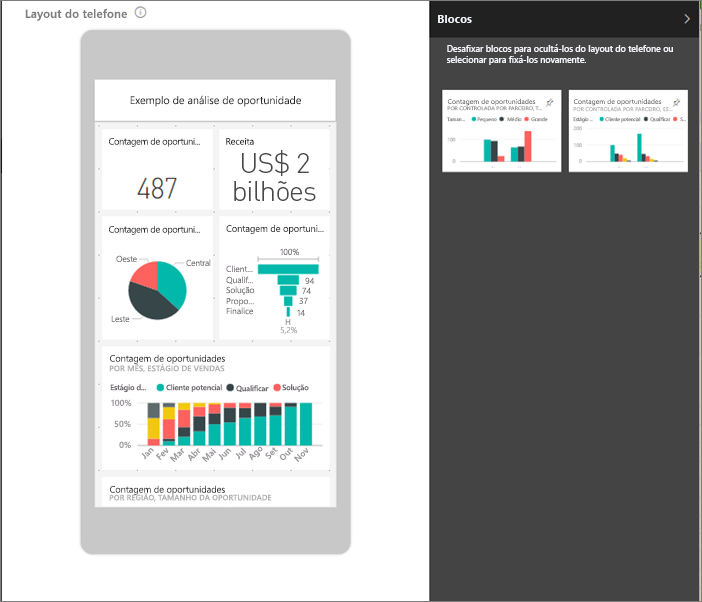
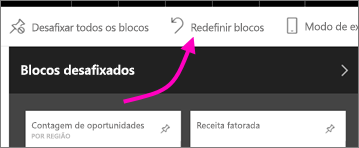

# Criar uma exibição de um dashboard do Power BI otimizado para celulares
Ao exibir painéis no aplicativo móvel do Power BI em um celular, observe que os blocos do painel são dispostos um após o outro, todos com o mesmo tamanho. No serviço do Power BI, você pode criar uma exibição personalizada de qualquer um de seus dashboards, especificamente, para telefones.

Ao virar o telefone para os lados, você verá o dashboard da forma como está disposto no serviço, não como você o projetou para o telefone.

> [!NOTE]
> Durante a edição da exibição de telefone, qualquer pessoa que exibe o dashboard em um telefone pode ver as alterações feitas em tempo real. Por exemplo, se você desafixar todos os blocos na exibição de telefone do dashboard, de repente, o dashboard no telefone não terá nenhum bloco. 
> 
> 

## Criar uma exibição de telefone de um dashboard
1. No serviço do Power BI, abra um dashboard.
2. Selecione a seta ao lado de **Exibição da Web** no canto superior direito > selecione **Exibição de telefone**.

    

    Se você não for o proprietário do dashboard, não verá essa opção.

    

    A exibição de edição do dashboard no telefone será aberta. Aqui você pode desafixar, redimensionar e reorganizar os blocos para que se ajustem à exibição de telefone. A versão da Web do dashboard não é alterada.

1. Selecione um bloco para arrastar, redimensionar ou desafixar. Observe que os outros blocos se movem para abrir caminho enquanto você arrasta um bloco.
   
    
   
    Os blocos desafixados vão para o painel Blocos desafixados, no qual permanecem, a menos que você os adicione novamente.
   
    
2. Se você mudar de ideia, selecione **Redefinir blocos** para colocá-los novamente no tamanho e na ordem anteriores.
   
    
   
    A simples abertura da exibição Edição de Telefone no serviço do Power BI altera ligeiramente o tamanho e a forma dos blocos em um telefone. Portanto, para retornar o dashboard para o estado exato antes da abertura da exibição Edição de Telefone, selecione **Redefinir blocos**.
3. Quando estiver satisfeito com o layout do dashboard no telefone, selecione a seta ao lado de **Exibição de telefone** no canto superior direito > selecione **Exibição da Web**.
   
    O Power BI salva automaticamente o layout do celular.

## Próximas etapas
* [Criar relatórios otimizados para os aplicativos de telefone do Power BI](desktop-create-phone-report.md)
* [Criar visuais responsivos otimizados para qualquer tamanho](desktop-create-responsive-visuals.md)
* Mais perguntas? [Experimente perguntar à Comunidade do Power BI](http://community.powerbi.com/)

