# Criar e distribuir aplicativos com dashboards e relatórios no Power BI

No Power BI, crie *aplicativos* para reunir dashboards e relatórios relacionados em um só local e, em seguida, publicá-los para grandes grupos de pessoas em sua organização. Você também pode conectar-se aos [aplicativos do Power BI para serviços externos,](service-connect-to-services.md) como o Google Analytics e o Microsoft Dynamics CRM.

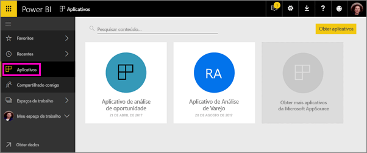

Os usuários empresariais geralmente precisam de vários dashboards e relatórios do Power BI para administrar os negócios. Os aplicativos reúnem tudo isso, de modo que eles não precisam se lembrar de nomes e locais de todos os dashboards.  

Com os aplicativos do Power BI, agora em versão prévia, crie coleções de dashboards e relatórios e distribua esses aplicativos para toda a organização ou para pessoas ou grupos específicos. Para você, como administrador ou criador de relatórios, os aplicativos facilitam o gerenciamento de permissões em coleções de dashboards.

Usuários de negócios obtêm seus aplicativos de algumas maneiras diferentes. Se o administrador do Power BI lhe der permissão, instale-os automaticamente em contas do Power BI de seus colegas. Caso contrário, eles podem instalar seus aplicativos no Microsoft AppSource, ou você pode enviar um link direto. Eles podem facilmente localizar e retornar ao seu conteúdo, porque ele estará em um só lugar. Eles recebem atualizações automaticamente e você pode controlar a frequência com que os dados são atualizados. Leia mais sobre a [experiência de aplicativo para usuários corporativos](service-install-use-apps.md).

### Licenças para aplicativos
Como criador de aplicativos, você precisa de uma licença do Power BI Pro. Para os usuários do aplicativo, há duas opções.

* Opção 1: todos os usuários empresariais precisam de licenças do **Power BI Pro** para exibir seu aplicativo. 
* Opção 2: usuários gratuitos de sua organização podem exibir o conteúdo do aplicativo se o aplicativo residir em uma capacidade do Power BI Premium. Leia [O que é o Power BI Premium?](service-premium.md) para obter detalhes.

### Aplicativos e pacotes de conteúdo organizacional
Os aplicativos são a evolução dos pacotes de conteúdo organizacional. Se você já tem pacotes de conteúdo organizacional, eles continuarão a funcionar lado a lado com os aplicativos.

Agora que você tem uma visão geral sobre os aplicativos, vamos falar sobre os *espaços de trabalho de aplicativo*, nos quais você pode criar aplicativos. 

## Vídeo: Aplicativos e espaços de trabalho de aplicativo
<iframe width="640" height="360" src="https://www.youtube.com/embed/Ey5pyrr7Lk8?showinfo=0" frameborder="0" allowfullscreen></iframe>

## Espaços de trabalho de aplicativo
*Espaços de trabalho de aplicativo* são os locais em que você cria aplicativos. Portanto, para criar um aplicativo, primeiro é necessário criar o espaço de trabalho do aplicativo. Se você já trabalhou em um espaço de trabalho de grupo no Power BI, os espaços de trabalho de aplicativo serão familiares. Eles são a evolução dos espaços de trabalho de grupo – áreas de preparo e contêineres para o conteúdo no aplicativo. 

Você pode adicionar colegas a esses espaços de trabalho como membros ou administradores. Todos os administradores e membros do espaço de trabalho de aplicativo precisam de licenças do Power BI Pro. No espaço de trabalho, todos podem colaborar em painéis, relatórios e outros artigos que queiram distribuir para um público maior ou até mesmo para toda a organização. 

Quando o conteúdo estiver pronto, escolha quais painéis e relatórios você deseja publicar e, em seguida, publique o aplicativo. Você pode enviar um link direto para esse público mais amplo ou eles podem encontrar seu aplicativo na guia Aplicativos acessando **Baixar e explorar mais aplicativos no AppSource**. As pessoas não podem modificar o conteúdo do aplicativo, mas podem interagir com ele no serviço do Power BI ou em um dos aplicativos móveis, filtrando, realçando e classificando os dados. 

## Criar um espaço de trabalho de aplicativo
[!INCLUDE [powerbi-service-create-app-workspace](./includes/powerbi-service-create-app-workspace.md)]

Ele está vazio, portanto, agora você adicionará conteúdo. Observe que, ao criá-lo pela primeira vez, talvez seja necessário aguardar uma hora ou mais para que o espaço de trabalho seja propagado para o Office 365. 

A adição de conteúdo é tão simples como adicionar conteúdo ao Meu Espaço de Trabalho, exceto que outras pessoas também podem ver e trabalhar no espaço de trabalho. Uma grande diferença é que, quando terminar, você poderá publicar o conteúdo como um aplicativo. Enquanto estiver no espaço de trabalho de aplicativo, você poderá carregar ou conectar-se a arquivos ou se conectar a serviços de terceiros, assim como faria em seu próprio Meu Espaço de Trabalho. Por exemplo:

* [Conectar-se a serviços](service-connect-to-services.md) como o Microsoft Dynamics CRM, Salesforce ou Google Analytics.
* [Obter dados de arquivos](service-get-data-from-files.md), como arquivos do Excel, de CSV ou do Power BI Desktop (PBIX).

Quando você exibir o conteúdo em um espaço de trabalho do aplicativo, o proprietário será mostrado como o nome do espaço de trabalho do aplicativo.

## Adicionar uma imagem ao seu aplicativo (opcional)
Por padrão, o Power BI cria um pequeno círculo colorido com as iniciais do seu aplicativo. Mas talvez você queira personalizá-lo com uma imagem. Para adicionar uma imagem, você precisa de uma licença do Exchange Online.

1. Selecione **Espaços de Trabalho**, selecione as reticências (...) ao lado do nome do espaço de trabalho e, em seguida, **Membros**. 
   
     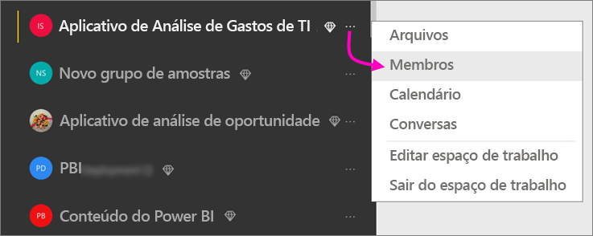
   
    A conta do Office 365 Outlook do espaço de trabalho é aberta em uma nova janela do navegador.
2. Quando você focaliza sobre o círculo colorido na parte superior esquerda, ele se transforma em um ícone de lápis. Selecione-a.
   
     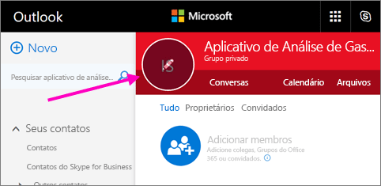
3. Selecione o ícone de lápis novamente e localize a imagem que você deseja usar.
   
     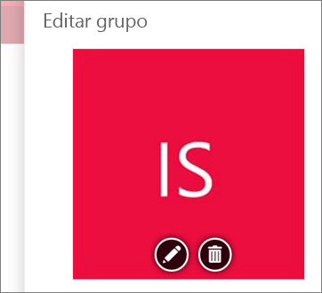
4. Selecione **Salvar**.
   
     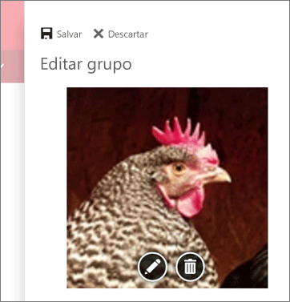
   
    A imagem substitui o círculo colorido na janela do Office 365 Outlook. 
   
     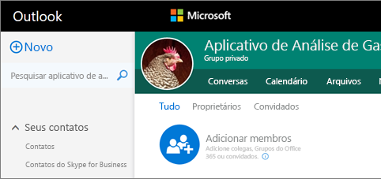
   
    Em alguns minutos, ela também será exibida no aplicativo do Power BI.
   
     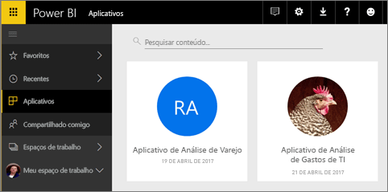

## Publicar seu aplicativo
Quando os dashboards e relatórios no espaço de trabalho do aplicativo estiverem prontos, você poderá publicá-los como um aplicativo. Lembre-se, você não precisa publicar relatórios e dashboards no espaço de trabalho. Pode publicar apenas os que estão prontos.

1. Na exibição da lista no espaço de trabalho, decida quais dashboards e relatórios você quer incluir no aplicativo.

     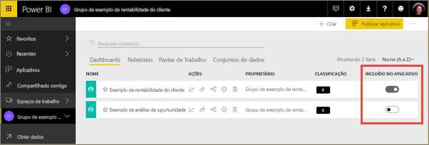

     Se você optar por não publicar um relatório, verá um aviso ao lado do relatório e seu dashboard relacionado. Você ainda pode publicar o aplicativo, mas no dashboard relacionado faltarão blocos do relatório.

     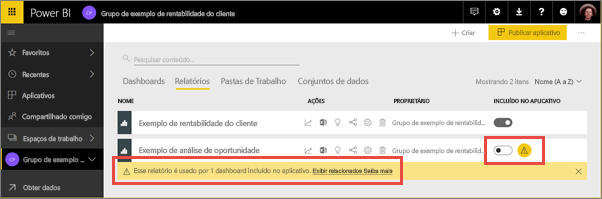

2. Selecione o botão **Publicar aplicativo** no canto superior direito para iniciar o processo de compartilhamento de todo o conteúdo desse espaço de trabalho.
   
     

3. Em **Detalhes**, preencha a descrição para ajudar as pessoas a localizar o aplicativo. Você pode definir uma cor da tela de fundo para personalizá-la.
   
     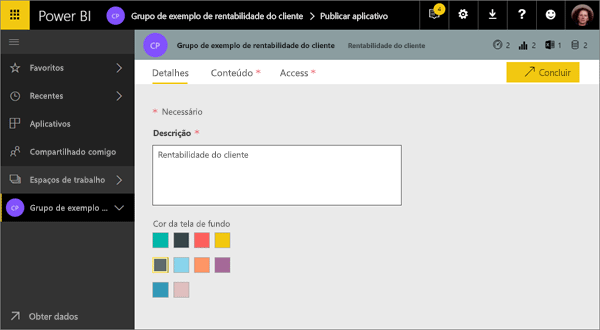

4. Em **Conteúdo**, você vê o conteúdo que será publicado como parte do aplicativo, ou seja, tudo o que você selecionou nesse espaço de trabalho. Você também pode definir a página de aterrissagem do aplicativo – que é o dashboard ou relatório que as pessoas verão primeiro ao acessarem o aplicativo. Você pode escolher **Nenhuma**. Então, as pessoas entrarão em uma lista de todo o conteúdo do aplicativo. 
   
     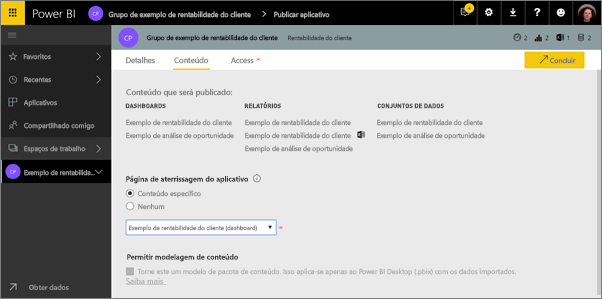

5. Em **Acesso**, decida quem tem acesso ao aplicativo: todos em sua organização, pessoas específicas, grupos de segurança do Active Directory. Se você tiver permissões, instale o aplicativo automaticamente para os destinatários. É possível habilitar essa configuração no [Portal de Administração do Power BI](#how-to-enable-pushing-apps). É possível saber mais considerações para [enviar um aplicativo por push](#how-to-enable-pushing-apps).

    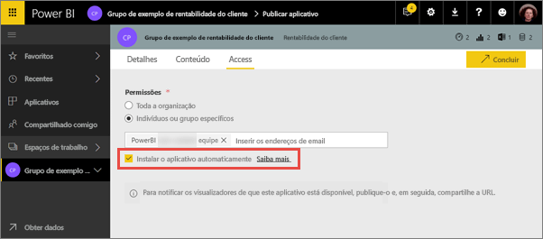

6. Ao selecionar **Concluir**, você verá uma mensagem confirmando que ele está pronto para publicar. Na caixa de diálogo de êxito, você pode copiar a URL, que é um link direto para esse aplicativo e enviá-la para as pessoas com as quais você compartilhou.
   
     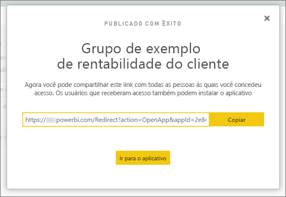

Os usuário empresariais para os quais você publicou o aplicativo podem encontrá-lo de algumas maneiras diferentes. Se você puder instalá-lo automaticamente, ele será exibido em Aplicativos, na conta do Power BI. Você pode enviá-los o link direto para o aplicativo ou eles podem pesquisar no Microsoft AppSource, local em que eles veem todos os aplicativos que eles podem acessar. De qualquer forma, depois disso, sempre que acessarem Aplicativos, eles verão esse aplicativo em sua lista.

Leia mais sobre a [experiência de aplicativo para usuários corporativos](service-install-use-apps.md).

## Alterar o aplicativo publicado
Depois de publicar seu aplicativo, você talvez queira alterá-lo ou atualizá-lo. É fácil atualizar caso você seja um administrador ou membro do espaço de trabalho do aplicativo. 

1. Abra o espaço de trabalho de aplicativo que corresponde ao aplicativo. 
   
     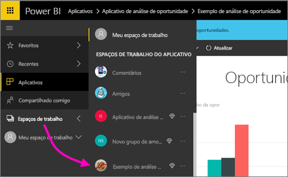
2. Abra o dashboard ou o relatório. Você percebe que agora pode fazer as alterações que desejar.
   
     O espaço de trabalho do aplicativo é a sua área de preparo, portanto as alterações não são enviadas por push ao vivo para o aplicativo até que você o publique novamente. Isso permite que você faça alterações sem afetar os aplicativos publicados.  
 
3. Volte para a lista de conteúdo do espaço de trabalho do aplicativo e selecione **Atualizar aplicativo**.
   
     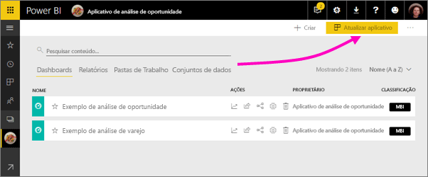

4. Atualize **Detalhes**, **Conteúdo** e **Acesso**, se necessário, e selecione **Atualizar aplicativo**.
   
     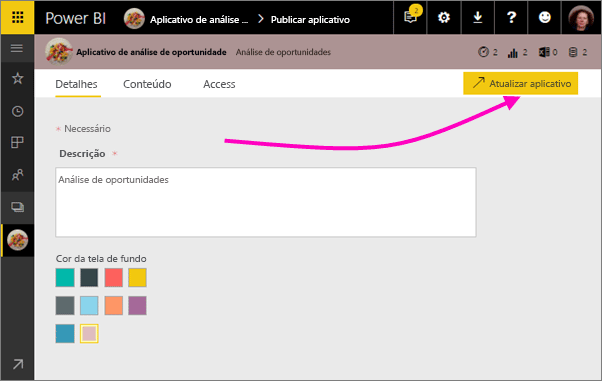

As pessoas para as quais você publicou o aplicativo verão automaticamente a versão atualizada do aplicativo. 

# Instalar aplicativos automaticamente para usuários finais
É possível instalar automaticamente aplicativos para usuários finais, tornando mais fácil distribuir os aplicativos certos para as pessoas ou grupos certos.

Os aplicativos entregam dados de que seus usuários finais precisam para realizar seus trabalhos. Agora é possível instalar automaticamente esses aplicativos na lista de conteúdo de aplicativos, em vez de encontrá-lo no Microsoft AppSource ou seguir um link de instalação. Isso torna mais fácil para você distribuir conteúdo padrão do Power BI para seus usuários.

## Como instalar um aplicativo automaticamente para usuários finais
Depois que o administrador tiver habilitado o recurso, os editores de aplicativo terão uma nova opção disponível para **instalar o aplicativo automaticamente**. Quando a caixa estiver ***marcada*** e o editor de aplicativo selecionar **Concluído** (ou **Atualizar aplicativo**, para aplicativos existentes), o aplicativo será enviado por push a todos os usuários ou grupos definidos na seção **Permissões** do aplicativo na guia **Acesso**.

## Como os usuários obtêm os aplicativos que foram enviados por push a eles
Depois de enviar um aplicativo por push, ele será exibido na Lista de aplicativos automaticamente. É possível coletar os aplicativos que um usuário ou função de trabalho em sua organização precisa ter na ponta dos dedos.

### Considerações para instalar aplicativos automaticamente
Aqui estão algumas coisas para se ter em mente ao enviar aplicativos por push para usuários finais:

* Instalar um aplicativo automaticamente para usuários pode levar tempo. A maioria dos aplicativos será instalada imediatamente para usuários, mas enviar aplicativos por push pode levar tempo.  Isso depende do número de itens no aplicativo e do número de pessoas que receberam acesso. É recomendável enviar aplicativos por push durante horas vagas em que haja muito tempo antes de os usuários precisarem deles. Verifique com vários usuários antes de enviar comunicação abrangentes sobre a disponibilidade de aplicativos.

* Atualize seu navegador. Antes de ver o aplicativo enviado por push na Lista de aplicativos, talvez o usuário precise atualizar ou fechar e reabrir seu navegador.

* Se o usuário não vir imediatamente o aplicativo na Lista de aplicativos, ele deverá atualizar ou fechar e reabrir seu navegador.

* Tente não sobrecarregar os usuários. Tenha cuidado para não enviar muitos aplicativos por push para que seus usuários entendam que os aplicativos pré-instalados são úteis para eles. É melhor controlar quem pode enviar aplicativos por push para os usuários finais para coordenar o tempo. É possível estabelecer um ponto de contato para obter aplicativos em sua organização enviados por push para usuários finais.

* Os aplicativos não serão instalados automaticamente para os usuários convidados que não aceitarem um convite.  

## Cancelar a publicação de um aplicativo
Qualquer membro de um espaço de trabalho do aplicativo pode cancelar a publicação do aplicativo.

* No espaço de trabalho do aplicativo, selecione as reticências (**...**) no canto superior direito > **Cancelar a publicação do aplicativo**.
  
     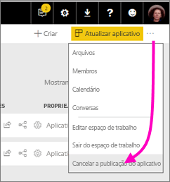

Essa ação desinstala o aplicativo em todos para os quais você o distribuiu e eles não terão mais acesso ao aplicativo. Ela não exclui o espaço de trabalho do aplicativo ou seu conteúdo.

## Perguntas frequentes sobre os aplicativos do Power BI
### Qual a diferença entre os espaços de trabalho de aplicativo e os espaços de trabalho de grupo?
Com esta versão, renomeamos todos os espaços de trabalho de grupo para espaços de trabalho de aplicativo. Você pode publicar um aplicativo através de qualquer um desses espaços de trabalho. A funcionalidade permanece, em sua maior parte, semelhante aos espaços de trabalho de grupo. Nos próximos meses, planejamos os seguintes aprimoramentos para os espaços de trabalho de aplicativo: 

* A criação de espaços de trabalho de aplicativo não criará entidades correspondentes no Office 365, como acontece com os espaços de trabalho de grupo. Portanto, você pode criar qualquer quantidade de espaços de trabalho de aplicativo sem se preocupar sobre diferentes grupos do Office 365 sendo criados nos bastidores (você ainda pode usar um grupo do Office 365 do OneDrive for Business para armazenar seus arquivos). 
* Atualmente, você pode adicionar apenas indivíduos às listas de membros e administradores. Em breve você poderá adicionar vários grupos de segurança do AD ou grupos modernos a essas listas para permitir o gerenciamento mais fácil.  

### Qual a diferença entre os aplicativos e os pacotes de conteúdo organizacional?
Os aplicativos são uma evolução e simplificação dos pacotes de conteúdo, com algumas diferenças importantes. 

* Depois que os usuários corporativos instalam um pacote de conteúdo, ele perde sua identidade agrupada: transforma-se apenas em uma lista de dashboards e relatórios intercalados com outros dashboards e relatórios. Os aplicativos, por outro lado, mantêm o agrupamento e a identidade, mesmo após a instalação. Isso facilita para que os usuários corporativos continuem a acessá-los ao longo do tempo.
* Você pode criar vários pacotes de conteúdo de qualquer espaço de trabalho, mas um aplicativo tem uma relação de 1:1 com seu espaço de trabalho. Acreditamos que isso torna os aplicativos mais fáceis de entender e manter a longo prazo. Consulte a seção de roteiro do blog do Power BI para obter mais informações sobre como estamos planejando melhorar essa área. 
* Ao longo do tempo, pretendemos descontinuar os pacotes de conteúdo organizacional, portanto, é recomendável que você crie aplicativos de agora em diante.  

### E sobre os membros somente leitura nos grupos?
Em grupos, você pode adicionar membros somente leitura que só podem exibir o conteúdo. O principal problema com essa abordagem era que você não podia adicionar grupos de segurança como membros. 

Com os aplicativos, você pode publicar uma versão somente leitura do seu espaço de trabalho de aplicativo para grandes públicos, incluindo grupos de segurança. Você pode testar as alterações aos dashboards e relatórios no aplicativo sem afetar os usuários finais. É recomendável usar aplicativos dessa maneira no futuro. A longo prazo, planejamos descontinuar membros somente leitura de espaços de trabalho também.  

## Próximas etapas
* [Instalar e usar aplicativos no Power BI](service-install-use-apps.md)
* [Aplicativos do Power BI para serviços externos](service-connect-to-services.md)
* [Portal de administração do Power BI](https://docs.microsoft.com/en-us/power-bi/service-admin-portal)
* Dúvidas? [Experimente perguntar à Comunidade do Power BI](http://community.powerbi.com/)
