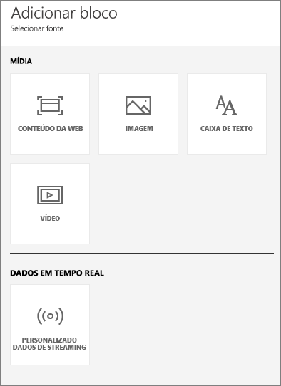
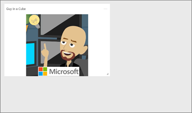
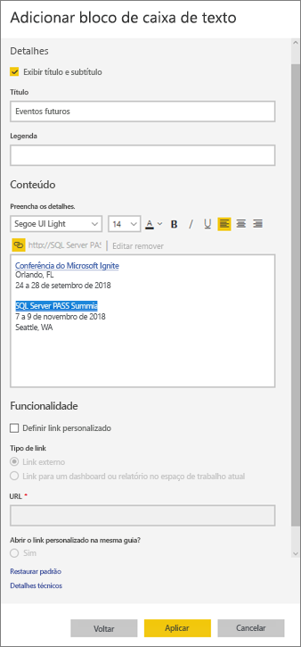
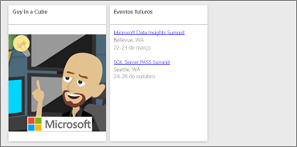
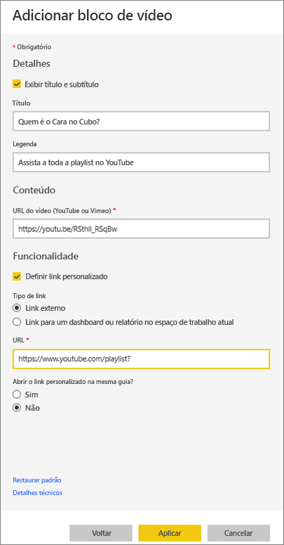
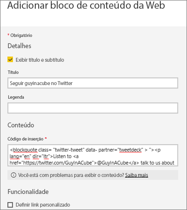
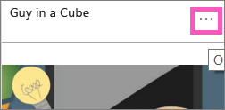
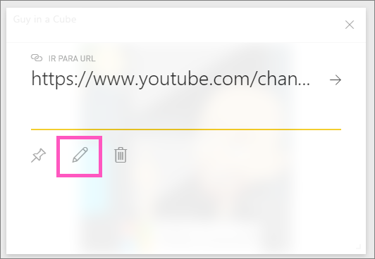

# <a name="add-image-text-video-and-more-to-your-dashboard"></a>Adicionar imagem, texto, vídeo e muito mais no seu dashboard
<iframe width="560" height="315" src="https://www.youtube.com/embed/e2PD8m1Q0vU" frameborder="0" allowfullscreen></iframe>


## <a name="add-tile"></a>Adicionar bloco
O controle **Adicionar bloco** permite que você adicione diretamente uma imagem, uma caixa de texto, um vídeo, dados de streaming ou código da Web a seu dashboard.

1. Selecione **Adicionar bloco** na barra de menus superior. Dependendo das limitações de espaço, você poderá ver apenas o sinal de adição .
   
    
2. Selecione qual tipo de bloco adicionar: **Imagem**, **Caixa de texto**, **Vídeo** ou **Conteúdo da Web** ou **Dados de streaming personalizados**.
   
    

## <a name="add-an-image"></a>Adicionar uma imagem
Digamos que você deseja o logotipo de sua empresa em seu painel, ou alguma outra imagem. Você precisará salvar o arquivo de imagem online e vincular-se a ela. Certifique-se de que não haja necessidade de credenciais especiais para acessar o arquivo de imagem. Por exemplo, o OneDrive e o SharePoint exigem autenticação, portanto, as imagens armazenadas lá não podem ser adicionadas a um painel dessa maneira.  

1. Selecione **Imagem** > **Avançar**.
2. Adicione informações da imagem à janela **Adicionar bloco de imagem**.
   
    
   
   * para exibir um título acima da imagem, selecione *Exibir título e subtítulo* e digite um título e/ou subtítulo.
   * insira a URL da imagem
   * para tornar o bloco um hiperlink, selecione **Definir link personalizado** e insira a URL.  Quando seus colegas clicarem nesse título ou nessa imagem, eles serão levados para essa URL.
   * Selecione **Aplicar**.  No painel, redimensione e mova a imagem, conforme necessário.
     
     

## <a name="add-a-text-box-or-dashboard-heading"></a>Adicionar um título de painel ou caixa de texto
1. Selecione **Caixa de texto > Avançar**.
   
   > **OBESERVAÇÃO**: para adicionar um título do painel, digite o título na caixa de texto e aumentar a fonte.
   > 
2. Formate a caixa de texto:
   
   * para exibir um título acima da caixa de texto, selecione **Exibir título e subtítulo** e digite um título e/ou subtítulo.
   * insira e formate o conteúdo da caixa de texto.  
   * Opcionalmente, defina um link personalizado para o título. Um link personalizado pode ser um site externo ou um painel ou relatório no espaço de trabalho. No entanto, nesse exemplo, adicionamos hiperlinks na própria caixa de texto e deixaremos a opção **Definir link personalizado** desmarcada.

     
   
3. Selecione **Aplicar**.  No painel, redimensione e mova a caixa de texto, conforme necessário.
   
   

## <a name="add-a-video"></a>Adicionar um vídeo
Quando você adiciona um bloco de vídeo do YouTube ou Vimeo a seu painel, o vídeo é reproduzido diretamente no painel.

1. Selecione **Vídeo > Avançar**.
2. Adicione informações do vídeo ao painel **Adicionar bloco de vídeo**.
   
    
   
   * para exibir um título e subtítulo na parte superior do bloco de vídeo, selecione *Exibir título e subtítulo* e digite um título e/ou subtítulo. Neste exemplo, vamos adicionar um subtítulo e, em seguida, torná-lo um hiperlink para a playlist inteira no YouTube.
   * insira a URL do vídeo
   * Adicione um hiperlink para o título e subtítulo.  Depois que seus colegas assistirem o vídeo inserido, talvez você queira que eles exibam a playlist inteira no YouTube – adicione um link para sua playlist aqui.
   * Selecione **Aplicar**.  No painel, redimensione e mova o bloco de vídeo, conforme necessário.
     
      
3. Selecione o bloco de vídeo para reproduzir o vídeo.
4. Selecione o subtítulo para visitar a playlist no YouTube.

## <a name="add-streaming-data"></a>Adicionar dados de streaming
<iframe width="560" height="315" src="https://www.youtube.com/embed/kOuINwgkEkQ" frameborder="0" allowfullscreen></iframe>

## <a name="add-web-content"></a>Adicionar conteúdo da Web
Cole ou digite qualquer conteúdo HTML.  O Power BI adiciona o conteúdo, como um bloco, ao painel. Insira o código de inserção manualmente ou copie/cole de sites como o Twitter, o YouTube, o embed.ly e muito mais.

1. Selecione **Conteúdo da Web > Avançar**.
2. Adicione as informações ao painel **Adicionar bloco de conteúdo da Web**.
   
    
   
   * para exibir um título acima do bloco, selecione *Exibir título e subtítulo* e digite um título e/ou um subtítulo.
   * insira o código de inserção. Neste exemplo, estamos copiando e colando um feed do Twitter.
3. Selecione **Aplicar**.  No painel, redimensione e mova o bloco de conteúdo da Web, conforme necessário.
     
      

## <a name="tips-for-embedding-web-content"></a>Dicas para incorporar o conteúdo da Web
* Para iframes, use uma fonte segura. Se você inserir o código de inserção do iframe e obter um bloco em branco, verifique se está usando **http** para a fonte iframe.  Nesse caso, altere-a para **https**.
  
  ```
  <iframe src="https://xyz.com">
  ```
* Edite as informações de largura e de altura. Esse código de inserção incorpora um vídeo e define o player de vídeo para 560 x 315 pixels.  Esse tamanho não mudará conforme você redimensiona o bloco.
  
  ```
  <iframe width="560" height="315"
  src="https://www.youtube.com/embed/Cle_rKBpZ28" frameborder="0"
   allowfullscreen></iframe>
  ```
  
  Se você quiser que o player seja redimensionado para se ajustar ao tamanho de bloco, defina a largura e a altura como 100%.
  
  ```
  <iframe width="100%" height="100%"
  src="https://www.youtube.com/embed/Cle_rKBpZ28" frameborder="0"
   allowfullscreen></iframe>
  ```
* Esse código insere um tweet e mantém (como links separados no painel) links para: o podcast **AFK**, para a página do Twitter do **@GuyInACube**, **Seguir**, **#analytics**, **responder**, **retweetar** e **curtir**.  Selecionar o bloco propriamente dito leva você até o podcast no Twitter.
  
  ```
  <blockquote class="twitter-tweet" data-partner="tweetdeck">
  <p lang="en" dir="ltr">Listen to
  <a href="https://twitter.com/GuyInACube">@GuyInACube</a> talk to
  us about making videos about Microsoft Business Intelligence
  platform
  <a href="https://t.co/TmRgalz7tv">https://t.co/TmRgalz7tv </a>
  <a href="https://twitter.com/hashtag/analytics?src=hash">
  #analytics</a></p>&mdash; AFTK Podcast (@aftkpodcast) <a
  href="https://twitter.com/aftkpodcast/status/693465456531771392">
  January 30, 2016</a></blockquote> <script async src="//platform.twitter.com/widgets.js" charset="utf-8"></script>
  ```

## <a name="edit-a-tile"></a>Editar um bloco
Para fazer alterações em um bloco...

1. Passe o mouse sobre o canto superior direito do bloco e selecione as reticências.
   
    
2. Selecione o ícone de edição para reabrir o painel **Detalhes do bloco** e faça as alterações.
   
    

## <a name="considerations-and-troubleshooting"></a>Considerações e solução de problemas
* Para facilitar ainda mais a movimentação do bloco em seu painel de controle, adicione um título e/ou um subtítulo.
* Se você quiser inserir algum conteúdo de um site, mas se o site não fornecer o código de inserção para copiar e colar, confira embed.ly para obter ajuda sobre a geração do código de inserção.

## <a name="next-steps"></a>Próximas etapas
[Blocos de dashboard](service-dashboard-tiles.md)

Mais perguntas? [Experimente a Comunidade do Power BI](http://community.powerbi.com/).

