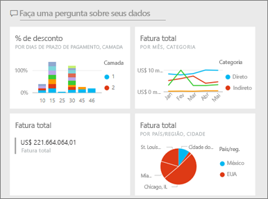
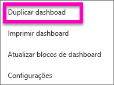
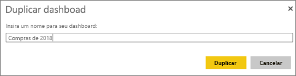
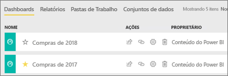

# Criar uma cópia de um dashboard no serviço do Power BI

 Há vários motivos diferentes para fazer uma cópia de um dashboard. Talvez você queira fazer alterações e testar seu desempenho em relação ao original ou criar versões ligeiramente diferentes para distribuir para cada colega, região ou equipe. Talvez um colega goste muito do design do seu dashboard e deseja usá-lo para criar relatórios para os gerentes dele. Outro motivo seria se você tiver um novo banco de dados com a mesma estrutura de dados e tipos de dados e desejasse reutilizar o dashboard que você já criou. Isso também pode ser feito mas requer algum trabalho no Power BI Desktop. 

Dashboards são criados (e copiados) usando o serviço do Power BI e podem ser exibidos no Power BI Mobile e Power BI Embedded.  Dashboards não estão disponíveis no Power BI Desktop. 

Para fazer uma cópia de um dashboard, você deve ser o *criador* do dashboard. Os dashboards que foram compartilhados com você como aplicativo não podem ser duplicados.

1. Abra o dashboard.
2. No canto superior direito, selecione as reticências (...) e escolha **Duplicar dashboard**.
   
   
3. Dê um nome ao dashboard e selecione **Duplicar**. 
   
   
4. O novo dashboard será salvo no mesmo espaço de trabalho que o original. 
   
   

5.    Abra o novo dashboard e edite conforme necessário. Aqui estão algumas coisas que talvez você queira fazer a seguir:    
    a. [Mover, renomear, redimensionar ou até mesmo excluir blocos](service-dashboard-edit-tile.md).  
    b. Editar detalhes do bloco e hiperlinks selecionando as reticências (...) do bloco e escolhendo **Editar detalhes**.  
    c. [Adicionar novos blocos na barra de menus do dashboard](service-dashboard-add-widget.md) (**Adicionar bloco**)  
    d. Fixar novos blocos [de P e R](service-dashboard-pin-tile-from-q-and-a.md) ou [de relatórios](service-dashboard-pin-tile-from-report.md).  
    e. Renomear o dashboard, ativar ou desativar a P e R e definir o fluxo do bloco do painel Configurações do dashboard.  (selecionar o menu suspenso de reticências (...) do dashboard e escolher **Configurações**)  
    f. Compartilhar seu dashboard diretamente com seus colegas ou como parte de um aplicativo do Power BI. 

## Próximas etapas
* [Dicas para projetar um ótimo dashboard](service-dashboards-design-tips.md) 

Mais perguntas? [Experimente a Comunidade do Power BI](http://community.powerbi.com/)

