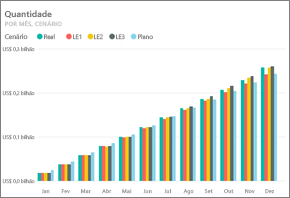
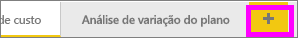
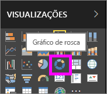
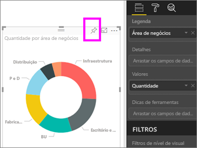
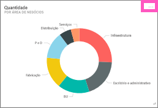
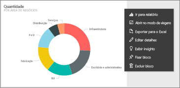
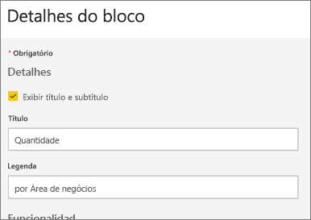
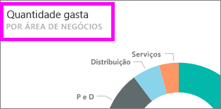
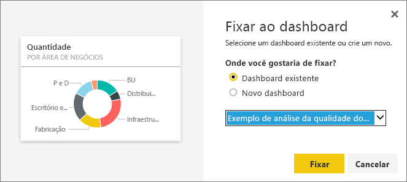

# Editar ou remover um bloco do dashboard

## Dashboard *proprietários* versus dashboard *consumidores*
Quando você cria ou é proprietário de um dashboard, você tem várias opções para alterar a aparência e o comportamento padrão dos blocos nesse dashboard. Use as configurações e estratégias a seguir para criar a experiência de *consumo* de dashboard para seus colegas.  Selecionar um bloco abrirá o relatório subjacente, uma URL personalizada ou um dashboard diferente? Talvez você [adicionará um bloco que exibe um vídeo ou dados de streaming](service-dashboard-add-widget.md)? E você pode até mesmo [criar um bloco que contém segmentações interativas](service-dashboard-pin-live-tile-from-report.md). Como um *criador*, você tem várias opções. 

<iframe width="560" height="315" src="https://www.youtube.com/embed/lJKgWnvl6bQ" frameborder="0" allowfullscreen></iframe>

Este artigo aborda o seguinte.

* [Criar uma visualização e fixá-la em um dashboard](#create)
* [Mover um bloco](#move)
* [Redimensionar um bloco](#resize)
* [Renomear um bloco](#rename)
* [Adicionar um hiperlink a um bloco](#hyperlink)
* [Fixar um bloco em um dashboard diferente](#different)
* [Excluir um bloco](#delete)
  
 > [!TIP]
 > Para alterar a visualização mostrada no próprio bloco, exclua o bloco e adicione um novo [bloco de dashboard](service-dashboard-tiles.md).
 > 

 ### Pré-requisitos
 1. Para acompanhar, abra o serviço do Power BI (não o Power BI Desktop) e [baixe o exemplo de Análise de Gastos de TI](sample-it-spend.md). Quando a mensagem de "Êxito" for exibida, selecione **Ir para o dashboard**.

- - -

## Criar uma nova visualização e fixá-la no dashboard
1. No dashboard Análise de Gastos de TI, selecione o bloco "Valor" para abrir o relatório.

    

2. Abra o relatório no modo de exibição de Edição, selecionado **Editar Relatório** da barra de menu superior.

3. Adicione uma nova página de relatório selecionando o sinal de mais (+) na parte inferior do relatório.

    

4. No painel CAMPOS, selecione **Fato > Valor** e **Área de Negócios > Área de Negócios**.
 
5. No painel VISUALIZAÇÕES, selecione o ícone de Gráfico de rosca para converter a visualização em um Gráfico de rosca.

    

5. Selecione o ícone de fixar e fixe o gráfico de rosca no dashboard de exemplo de Análise de Gastos de TI.

   

6. Quando a mensagem de "Êxito" for exibida, selecione **Ir para o dashboard**. Será solicitado que você salve suas alterações. Selecione **Salvar**.

- - -

## Mover o bloco
No dashboard, localize o novo bloco. Selecione e mantenha o bloco para arrastá-la a um novo local na tela do painel.

- - -

## Redimensionar o bloco
Você pode fazer muitos tamanhos diferentes de bloco - de unidades e bloco 1x1 até 5x5. Selecione e arraste a alça (no canto inferior direito) para redimensionar o bloco.

- - -
## O menu de reticências (...)

1. Selecione as reticências (...) no canto superior direito do bloco. 
   
   

2. Passe o mouse sobre o bloco "Conta" e selecione as reticências para exibir as opções. As opções disponíveis variarão por tipo de bloco.  Por exemplo, as opções disponíveis para um bloco dinâmico são diferentes das opções disponíveis para um bloco de visualização padrão. Além disso, se um dashboard tiver sido compartilhado com você (e você não for o proprietário), você terá menos opções.

   

3. Selecione **Editar detalhes** para abrir a janela "Detalhes do bloco". 

    Altere o título e o comportamento padrão do bloco.  Por exemplo, você pode decidir que, quando um *consumidor* seleciona um bloco, em vez de abrir o relatório que foi usado para criar esse bloco, um novo dashboard é exibido em vez disso.  
   

### Renomear o bloco
Na parte superior da janela "Detalhes do bloco", altere **Título** para **Valor gasto**.

### Alterar o hiperlink padrão
Por padrão, selecionar um bloco geralmente levará você ao relatório em que ele foi criado ou para a P e R (se o bloco tiver sido criado na P e R). Para vincular a uma página da Web, a outro dashboard ou relatório (no mesmo espaço de trabalho), a um relatório do SSRS ou a outro conteúdo online, adicione um link personalizado.

1. Sob o título Funcionalidade, selecione **Definir link personalizado**.

2. Selecione **Link para um dashboard ou relatório no espaço de trabalho atual** e selecione-o no menu suspenso.  Neste exemplo, você selecionou o dashboard de exemplo de Recursos Humanos. Se você ainda não tiver esse exemplo no espaço de trabalho, você poderá adicioná-la e voltar a esta etapa ou selecionar um dashboard diferente. 

    

3. Selecione **Aplicar**.

4. O novo título é exibido no bloco.  Além disso, quando você seleciona o bloco, o Power BI abre o dashboard Recursos Humanos. 

    

### Fixar o bloco em um painel diferente
1. No menu suspenso de reticências, selecione **Fixar bloco** .
2. Decida em que local fixar uma duplicata deste bloco em um dashboard existente ou em um novo dashboard. 
   
   
3. Selecione **Fixar**.

### Excluir o bloco
1. Para remover permanentemente um bloco de um dashboard, selecione **Excluir bloco**  no menu suspenso de reticências. 

2. Excluir um bloco não excluirá a visualização subjacente. Abra o relatório subjacente, selecionando o bloco "Valor". Abra a última página em seu relatório para ver que a visualização original não foi excluída do relatório. 

- - -
## Próximas etapas
[Blocos de Dashboard no Power BI](service-dashboard-tiles.md)

[Dashboards no Power BI](service-dashboards.md)

[Power BI – conceitos básicos](service-basic-concepts.md)

Mais perguntas? [Experimente a Comunidade do Power BI](http://community.powerbi.com/)

