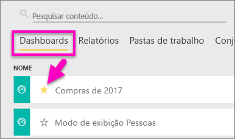
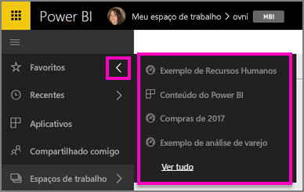
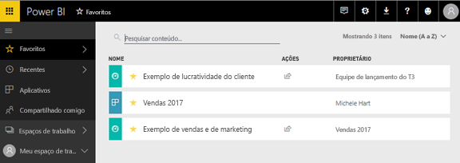
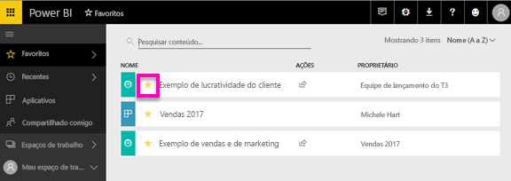

# Criar dashboards no serviço do Power BI
Quando você adicionar um dashboard a *Favoritos*, poderá acessá-lo de todos os espaços de trabalho.  Os favoritos normalmente são aqueles que você visita com mais frequência.

> [!NOTE]
> Este tópico se aplica ao serviço do Power BI, e não ao Power BI Desktop.
> 
> 

Também é possível selecionar um único dashboard como um [Dashboard em destaque](service-dashboard-featured.md) no Power BI.

## Adicionar um dashboard como um *favorito*
Assista à Amanda adicionar favoritos ao seu espaço de trabalho e, em seguida, siga as instruções passo a passo abaixo do vídeo para testar por conta própria.

<iframe width="560" height="315" src="https://www.youtube.com/embed/G26dr2PsEpk" frameborder="0" allowfullscreen></iframe>

1. Abra um dashboard que você usa com frequência. Até mesmo os dashboards que foram compartilhados com você podem ser um *favorito*.
2. No canto superior direito do serviço do Power BI, selecione **Favoritos** ou o ícone de estrela .
   
   
   
   Você também pode adicionar um dashboard aos favoritos na guia **Dashboards** do seu espaço de trabalho.
   
   

## Trabalhando com *favoritos*
1. Para ver os cinco favoritos mais recentes, em qualquer espaço de trabalho, selecione a seta à direita de **Favoritos**.  Deste local, você pode selecionar um dashboard favorito para abri-lo. Apenas os cinco favoritos mais recentes são listados (em ordem alfabética). Se você tem mais de cinco favoritos, selecione **Ver todos** para abrir a tela Favoritos (consulte o item 2 abaixo). 
   
   
2. Para ver **todos** os dashboards que você adicionou como favoritos, no painel de navegação esquerdo, selecione **Favoritos** ou o ícone de Favoritos .  
   
    
   
   Nele, é possível selecionar um dashboard para abri-lo ou compartilhar um dashboard com seus colegas.

## Remover um dashboard de Favoritos
Você não usa mais um dashboard com tanta frequência como costumava?  É possível removê-los de Favoritos. Quando você remove um dashboard dos favoritos, ele é removido dos seus Favoritos, mas não do Power BI.

1. No painel de navegação esquerdo, selecione **Favoritos** para abrir a tela **Favoritos**.
   
   
2. Selecione a estrela amarela ao lado do dashboard para removê-lo dos favoritos.

> **OBSERVAÇÃO**: você pode também remover um dashboard dos favoritos no próprio dashboard. No canto superior direito do dashboard você verá uma estrela amarela e a palavra **remover de Favoritos**. Selecione uma delas para remover esse dashboard da sua lista de favoritos. 
> 
> 

## Próximas etapas
[Introdução ao Power BI](service-get-started.md)

[Power BI – conceitos básicos](service-basic-concepts.md)

Mais perguntas? [Experimente a Comunidade do Power BI](http://community.powerbi.com/)

