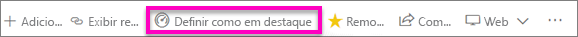
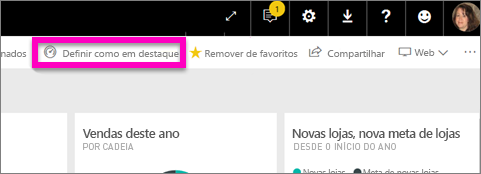
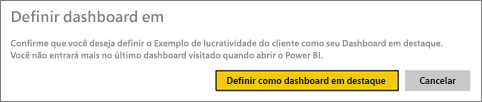
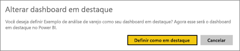
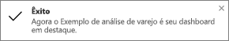
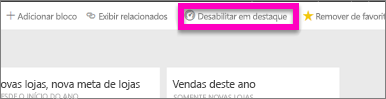

# Dashboards em destaque no Power BI
## Criar um Dashboard em destaque
Muitos de vocês têm um dashboard que é visitado mais do que qualquer outro.  Pode ser o dashboard que você usa para administrar seus negócios, ou talvez ele contenha uma agregação de blocos de vários dashboards e relatórios diferentes.

Ao selecionar um dashboard como *em destaque*, todas as vezes que você abrir o serviço do Power BI, ele será aberto com esse dashboard exibido.  

> **OBSERVAÇÃO**: você também pode selecionar alguns dashboards e defini-los como *favoritos*. Veja [Dashboards favoritos](service-dashboard-favorite.md).
> 
> 

Se você ainda não tiver definido um dashboard como Em destaque, o Power BI será aberto no último dashboard que foi usado.  

### Para definir um dashboard como **um dashboard em destaque**
Veja Amanda criar um dashboard em destaque e depois siga as instruções abaixo do vídeo para testá-lo por conta própria.

<iframe width="560" height="315" src="https://www.youtube.com/embed/G26dr2PsEpk" frameborder="0" allowfullscreen></iframe>

1. Abra o dashboard que você deseja definir como *Em destaque*. 
2. Na barra de navegação superior, você verá **Definir como em destaque** ou apenas o ícone Em destaque . Selecione um.
   
    
3. Confirme a seleção.
   
    

## Alterar o Dashboard em destaque
É claro que, se mudar de ideia mais tarde, você poderá definir um novo dashboard como o dashboard em destaque.

1. Siga as etapas 1 e 2 acima.
   
    
2. Selecione **Definir como em destaque**. Remover o destaque de um dashboard não o remove do espaço de trabalho.  
   
    

## Remover o dashboard Em destaque
Se você decidir que não deseja nenhum dashboard definido como em destaque, aqui está como remover a definição em destaque de um dashboard.

1. Abra o dashboard que está definido atualmente como em destaque.
2. Na barra de menu superior, selecione **Desabilitar em destaque**.
   
    

## Próximas etapas
[Adicionar um dashboard como favorito](service-dashboard-favorite.md)

Mais perguntas? [Experimente a Comunidade do Power BI](http://community.powerbi.com/)

