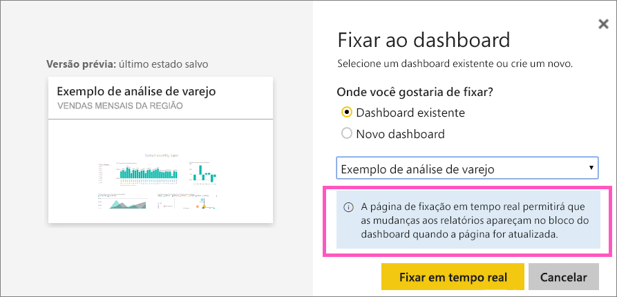

# Fixar uma página inteira do relatório, como um bloco dinâmico, em um painel do Power BI
Outra maneira de adicionar um novo [bloco do dashboard](service-dashboard-tiles.md) é fixar uma página inteira do relatório.  Essa é uma maneira fácil de fixar mais de uma visualização por vez.  Além disso, quando você fixa uma página inteira, os blocos são *dinâmicos*, sendo possível interagir com eles diretamente no painel. E as alterações feitas a qualquer uma das visualizações no editor de relatórios, como adicionar um filtro ou alterar os campos usados no gráfico, também são refletidas no bloco do painel.  

> [!NOTE]
> Não é possível fixar blocos de relatórios que são compartilhados com você.
> 
> 

## Fixar uma página do relatório
Veja Amanda fixar uma página dinâmica do relatório em um dashboard e siga as instruções passo a passo abaixo do vídeo para testá-lo por conta própria.

<iframe width="560" height="315" src="https://www.youtube.com/embed/EzhfBpPboPA" frameborder="0" allowfullscreen></iframe>

1. Abra um relatório no [Modo de Exibição de Edição](service-interact-with-a-report-in-editing-view.md).
2. Sem nenhuma visualização selecionada, na barra de menus, selecione **Fixar esta Página em Tempo Real**.
   
    
3. Fixe o bloco em um painel existente ou em um novo painel. Observe o texto realçado: *Fixar esta página em tempo real permite que as alterações nos relatórios sejam exibidas no bloco do painel quando a página é atualizada.*
   
   * Painel existente: selecione o nome do painel no menu suspenso. Painéis que foram compartilhados com você não aparecerão na lista suspensa.
   * Novo painel: digite o nome do novo painel.
     
     
4. Selecione **Fixar em tempo real**. Uma mensagem de Êxito (próximo ao canto superior direito) informa que a página foi adicionada, como um bloco, ao painel.

## Abrir o dashboard para ver o bloco dinâmico fixado
1. No painel de navegação, selecione o painel com o novo bloco dinâmico. Nele, você pode executar ações como [renomear, redimensionar, vincular e mover](service-dashboard-edit-tile.md) a página de relatório fixada.  
2. Interagir com os blocos dinâmicos.  Na captura de tela abaixo, selecionando uma barra no gráfico de colunas há um filtro cruzado e realçado entre outras visualizações do bloco.
   
    

## Próximas etapas
[Dashboards no Power BI](service-dashboards.md)

Mais perguntas? [Experimente a Comunidade do Power BI](http://community.powerbi.com/)

