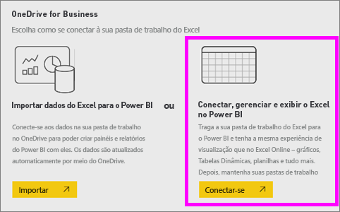
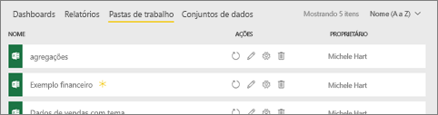
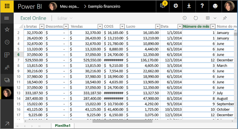
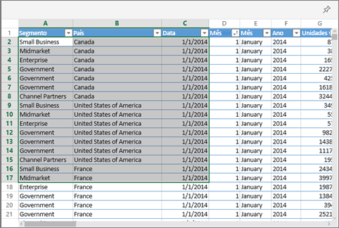
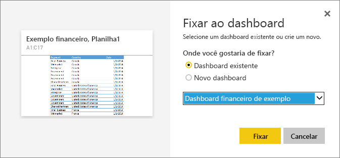

# Fixar um bloco em um painel do Power BI a partir do Excel
Antes de fixar um bloco da sua pasta de trabalho do Excel, conecte-a ao serviço do Power BI (app.powerbi.com). Essencialmente, conectar uma pasta de trabalho gera uma versão somente leitura vinculada dessa pasta de trabalho no serviço do Power BI e permite fixar intervalos aos dashboards. É possível até fixar uma planilha inteira em um dashboard.  
Se uma pasta de trabalho foi compartilhada com você, será possível exibir os blocos fixados pelo proprietário, mas você não poderá criar blocos de dashboard. 

Para obter informações mais aprofundadas sobre como o Excel e o Power BI funcionam em conjunto, consulte [Obter dados de arquivos de pasta de trabalho do Excel](http://go.microsoft.com/fwlink/?LinkID=521962).

Assista a Will demonstrar várias maneiras de importar dados e de conectar-se a pastas de trabalho do Excel.

<iframe width="560" height="315" src="https://www.youtube.com/embed/l8JoB7w0zJA" frameborder="0" allowfullscreen></iframe>

## Conectar sua pasta de trabalho do Excel ao Power BI a partir do OneDrive para Empresas
Ao escolher **Conectar**, sua pasta de trabalho será exibida no Power BI, exatamente como apareceria no Excel Online. Mas, ao contrário do Excel Online, você terá alguns ótimos recursos para ajudá-lo a fixar elementos de suas planilhas diretamente nos dashboards.

Não é possível editar a pasta de trabalho no Power BI. Mas se precisar fazer algumas alterações, você poderá selecionar o ícone de lápis na guia **Pastas de trabalho** do seu espaço de trabalho e, em seguida, escolher para editar a pasta de trabalho no Excel Online ou abri-la no Excel do seu computador. Todas as alterações feitas são salvas na pasta de trabalho no OneDrive.

1. Carregue sua pasta de trabalho no OneDrive para Empresas.

2. No Power BI, [conecte-se a essa pasta de trabalho](service-excel-workbook-files.md) selecionando **Obter Dados > Arquivos > OneDrive – Business** e navegando até o local onde você salvou o arquivo do Excel. Selecione o arquivo e escolha **Conectar > Conectar**.

    

3. No Power BI, a pasta de trabalho é adicionada à guia **Pastas de trabalho** do seu espaço de trabalho.  O ícone  indica que esta é uma pasta de trabalho do Excel, e um asterisco amarelo indica que ela é nova.
    
    
4. Abra a pasta de trabalho no Power BI selecionando o nome dela.

    As alterações feitas à pasta de trabalho no Power BI não são salvas e não afetam a pasta de trabalho original no OneDrive para Empresas. Se você classificar, filtrar ou alterar os valores no Power BI, essas alterações não poderão ser salvas ou fixadas. Se você precisa fazer alterações que serão salvas, selecione **Editar** do canto superior direito para abri-lo para edição no Excel Online ou Excel. As alterações feitas dessa maneira podem levar alguns minutos para atualizar os blocos nos painéis.
   
    

## Fixar um intervalo de células em um dashboard
Uma maneira de adicionar um novo [bloco de dashboard](service-dashboard-tiles.md) é por meio de uma pasta de trabalho do Excel no Power BI. Os intervalos podem ser fixados de pastas de trabalho do Excel que foram salvas em seu OneDrive para Empresas ou em outra biblioteca de documentos compartilhados pelo grupo. Os intervalos podem conter dados, tabelas, gráficos, Tabelas Dinâmicas, Gráficos Dinâmicos e outras partes do Excel.

1. Realce as células que você gostaria de fixar em um painel.
   
    
2. Selecionar o ícone de  Excluir. 
3. Fixe o bloco em um painel existente ou em um novo painel. 
   
   * Painel existente: selecione o nome do painel no menu suspenso.
   * Novo painel: digite o nome do novo painel.
   
    
4. Selecione **Fixar**. Uma mensagem de Êxito (perto do canto superior direito) informa que o intervalo foi adicionado, como um bloco, ao painel. 
   
    
5. Selecione **Ir para o dashboard**. Neste local, você poderá [renomear, redimensionar, vincular e mover](service-dashboard-edit-tile.md) a visualização fixada. Por padrão, selecionar o bloco fixado abre a pasta de trabalho no Power BI.

## Fixar um gráfico dinâmico ou toda uma tabela em um painel
Siga as etapas acima, mas em vez de selecionar um intervalo de células, selecione uma tabela inteira ou uma tabela dinâmica.

Para fixar uma tabela, selecione todo o intervalo da tabela e inclua os cabeçalhos.  Para fixar uma tabela dinâmica, inclua todas as partes visíveis dela, inclusive filtros, se forem usados.

 

Um bloco criado de uma tabela ou uma tabela dinâmica mostrará a tabela inteira.  Se você adicionar/remover/filtrar linhas ou colunas na pasta de trabalho original, elas também serão adicionadas/removidas/filtradas no bloco.

## Exibir a pasta de trabalho vinculada ao bloco
A seleção de um bloco de pasta de trabalho abre a pasta de trabalho vinculada no Power BI. Como o arquivo de pasta de trabalho está localizado no OneDrive para Empresas do proprietário, a exibição da pasta de trabalho exige que você tenha permissões de Leitura para a pasta de trabalho. Se você não tiver permissão, receberá uma mensagem de erro.  

 

## Considerações e solução de problemas
Recursos sem suporte: Power BI usa os Serviços do Excel para recuperar os blocos da pasta de trabalho. Portanto, como não há suporte para alguns recursos na API REST dos Serviços do Excel, eles não serão vistos nos blocos do Power BI. Por exemplo: minigráficos, formatação condicional de conjunto de ícones e segmentações de tempo. Para obter uma lista completa de recursos sem suporte, veja [Recursos sem suporte na API REST dos Serviços do Excel](http://msdn.microsoft.com/library/office/ff394477.aspx)

## Próximas etapas
[Compartilhar um dashboard que contém links para uma pasta de trabalho do Excel](service-share-dashboard-that-links-to-excel-onedrive.md)

[Obter dados das pastas de trabalho do Excel](service-excel-workbook-files.md)

Mais perguntas? [Experimente a Comunidade do Power BI](http://community.powerbi.com/)

