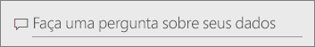
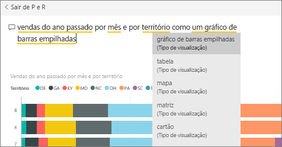
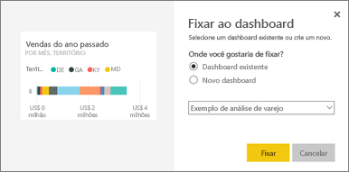
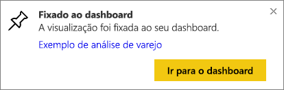
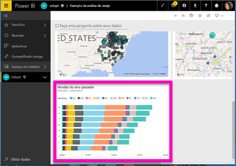
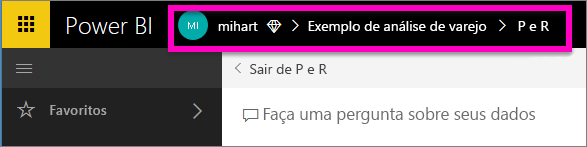

# Fixar um bloco em um dashboard de P e R
## Como fixar um bloco de P e R
P e R é a ferramenta de geração de relatórios ad hoc do Power BI. Precisa encontrar uma visão particular? Faça uma pergunta sobre os dados e receba uma resposta na forma de uma visualização.

P e R está disponível em painéis e relatórios. Neste artigo, abriremos P e R de um painel. Estão disponíveis painéis no serviço do Power BI, mas não no Power BI Desktop. Para acompanhar, abra o [painel de exemplo da Análise de Varejo](sample-retail-analysis.md).
> 
> 

1. Abra um [dashboard](service-dashboards.md) que tenha pelo menos um bloco fixado de um relatório. Quando você faz uma pergunta, o Power BI procura a resposta em qualquer conjunto de dados que tenha um bloco fixado a esse dashboard.  Para saber mais, veja [obter dados](service-get-data.md).
2. Na caixa de pergunta, na parte superior do painel, comece a digitar o que você deseja saber sobre os dados.  
   
3. Por exemplo, ao digitar “vendas do ano passado por mês e território”...  
   
   
   a caixa de perguntas oferece sugestões.
4. Para adicionar o gráfico ao dashboard como um bloco, selecione o pino  no lado superior direito da tela.
5. Fixe o bloco em um painel existente ou em um novo painel. 

   

   * Painel existente: selecione o nome do painel no menu suspenso. Suas opções serão limitadas apenas aos painéis no espaço de trabalho atual.
   * Novo dashboard: digite o nome do novo dashboard e ele será adicionado ao seu espaço de trabalho atual.
6. Selecione **Fixar**.
   
   Uma mensagem de êxito (perto do canto superior direito) informa que a visualização foi adicionada, como um bloco, ao dashboard.  
   
   
7. Selecione **Ir para o dashboard** para ver o novo bloco. Nele, é possível [renomear, redimensionar, adicionar um hiperlink, reposicionar o bloco e muito mais](service-dashboard-edit-tile.md) no dashboard. 
   
   

## Considerações e solução de problemas
* Quando você começa a digitar uma pergunta, o P e R imediatamente começa a procurar a melhor resposta de todos os conjuntos de dados associados com o painel atual.  O “dashboard atual” é o dashboard listado na barra de navegação superior. Por exemplo, essa pergunta está sendo feita no dashboard de **exemplo Análise de Varejo**, que faz parte do espaço de trabalho de aplicativo **mihart**.
  
  
* **Como a P e R sabe quais conjuntos de dados deverão ser usados**?  O P e R tem acesso a todos os conjuntos de dados que têm visualizações fixadas para esse painel.

## Próximas etapas
[Renomear, redimensionar, adicionar um hiperlink, reposicionar o bloco e muito mais](service-dashboard-edit-tile.md)    
[Exibir seu bloco do dashboard no Modo de foco](service-focus-mode.md)     
[Voltar a P e R no Power BI](service-q-and-a.md)  
Mais perguntas? [Experimente a Comunidade do Power BI](http://community.powerbi.com/)

