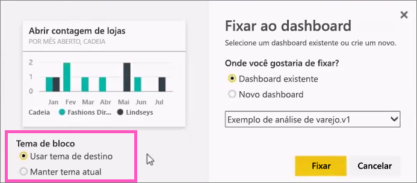

# Fixar um bloco em um painel do Power BI por meio de um relatório
## Fixando blocos de um relatório
Uma maneira de adicionar um novo [bloco do dashboard](service-dashboard-tiles.md) é por meio de um [relatório do Power BI](service-reports.md). Na verdade, você pode adicionar vários novos blocos de um relatório.  Cada um desses blocos, quando clicado, é um link de volta para o relatório.

E páginas inteiras do relatório podem ser fixadas a um painel.  Isso também é conhecido como fixar um bloco *dinâmico* .  *Dinâmico* porque você pode interagir com o bloco no painel e porque, ao contrário de blocos de visualização individual, as alterações feitas no relatório são sincronizadas com o painel. Leia mais sobre isso a seguir.

Não é possível fixar blocos de relatórios compartilhados com você ou do Power BI Desktop. 

> **DICA**: algumas visualizações usam imagens de tela de fundo. A anexação poderá não funcionar se a imagem de tela de fundo for muito grande.  Tente reduzir o tamanho da imagem ou usar a compactação de imagem.  
> 
> 

## Fixar um bloco por meio de um relatório
Veja Amanda criar um dashboard fixando visuais e imagens de um relatório do Power BI.

<iframe width="560" height="315" src="https://www.youtube.com/embed/lJKgWnvl6bQ" frameborder="0" allowfullscreen></iframe>

Agora crie seu próprio dashboard usando um dos relatórios de exemplo do Power BI.

1. Passe o mouse sobre a visualização que você deseja fixar e selecione o ícone de  pino. O Power BI abre a tela **Fixar no painel** .
   
     
2. Decida se você fixará em um painel existente ou em um novo painel.
   
   * Painel existente: selecione o nome do painel no menu suspenso. Painéis que foram compartilhados com você não aparecerão na lista suspensa.
   * Novo painel: digite o nome do novo painel.
3. Em alguns casos, o item fixado pode ter um *tema* já aplicado.  Por exemplo, visuais fixados de uma pasta de trabalho do Excel. Nesse caso, selecione o tema para aplicar ao bloco.
4. Selecione **Fixar**.
   
   Uma mensagem de Êxito (perto do canto superior direito) informa que a visualização foi adicionada, como um bloco, ao painel.
   
   
5. No painel de navegação, selecione o painel com o novo bloco. Selecione o bloco para voltar ao relatório. Se preferir, [edite a exibição e o comportamento do bloco](service-dashboard-edit-tile.md).

## Fixar uma página inteira do relatório
Outra opção é fixar uma página inteira do relatório a um painel. Essa é uma maneira fácil de fixar mais de uma visualização por vez.  Além disso, quando você fixa uma página inteira, os blocos são *dinâmicos*, sendo possível interagir com eles diretamente no painel. E as alterações feitas a qualquer uma das visualizações no editor de relatórios, como adicionar um filtro ou alterar os campos usados no gráfico, também são refletidas no bloco do painel.  

Para obter mais informações, veja [Fixar uma página inteira do relatório](service-dashboard-pin-live-tile-from-report.md)

## Próximas etapas
[Dashboards no Power BI](service-dashboards.md)

[Blocos de Dashboard no Power BI](service-dashboard-tiles.md)

[Relatórios no Power BI](service-reports.md)

[Atualizar dados no Power BI](refresh-data.md)

[Conceitos básicos do Power BI](service-basic-concepts.md)

Mais perguntas? [Experimente a Comunidade do Power BI](http://community.powerbi.com/)

